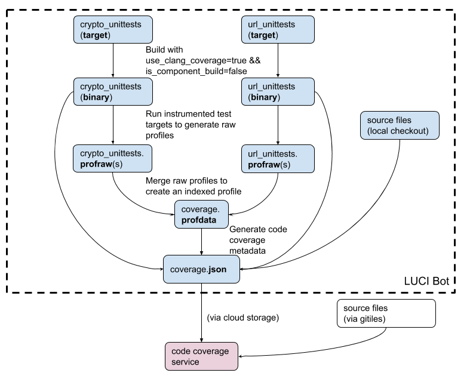

# Code coverage in Chromium

Table of contents:
- [Coverage Script](#coverage-script)
- [Workflow](#workflow)
  * [Step 0 Download Tooling](#step-0-download-tooling)
  * [Step 1 Build](#step-1-build)
  * [Step 2 Create Raw Profiles](#step-2-create-raw-profiles)
  * [Step 3 Create Indexed Profile](#step-3-create-indexed-profile)
  * [Step 4 Create Coverage Reports](#step-4-create-coverage-reports)
- [Contacts](#contacts)
- [FAQ](#faq)

Chromium uses Clang source-based code coverage, this [documentation] explains
how to use Clang’s source-based coverage features in general.

In this doc, we first introduce a code coverage script that can be used to
generate code coverage reports for Chromium code in one command, and then dive
into details to describe the code coverage reports generation workflow.

## Coverage Script
The [coverage script] automates the process described below and provides a
one-stop service to generate code coverage reports in just one command.

This script is currently supported on Linux, Mac, iOS and ChromeOS platforms.

Here is an example usage:

```
$ gn gen out/coverage \
    --args='use_clang_coverage=true is_component_build=false'
$ python tools/code_coverage/coverage.py \
    crypto_unittests url_unittests \
    -b out/coverage -o out/report \
    -c 'out/coverage/crypto_unittests' \
    -c 'out/coverage/url_unittests --gtest_filter=URLParser.PathURL' \
    -f url/ -f crypto/
```
The command above builds `crypto_unittests` and `url_unittests` targets and then
runs each with the command and arguments specified by the `-c` flag. For
`url_unittests`, it only runs the test `URLParser.PathURL`. The coverage report
is filtered to include only files and sub-directories under `url/` and `crypto/`
directories.

Aside from automating the process, this script provides additional features to
view code coverage breakdown by directories and by components, for example:

Directory View:

![code coverage report directory view]

Component View:

![code coverage report component view]

## Workflow
This section presents the workflow of generating code coverage reports using two
unit test targets in Chromium repo as an example: `crypto_unittests` and
`url_unittests`, and the following diagram shows a step-by-step overview of the
process.



### Step 0 Download Tooling
Generating code coverage reports requires llvm-profdata and llvm-cov tools.
Currently, these two tools are not part of Chromium’s Clang bundle,
[coverage script] downloads and updates them automatically, you can also
download the tools manually ([link]).

### Step 1 Build
In Chromium, to compile code with coverage enabled, one needs to add
`use_clang_coverage=true` and `is_component_build=false` GN flags to the args.gn
file in the build output directory. Under the hood, they ensure
`-fprofile-instr-generate` and `-fcoverage-mapping` flags are passed to the
compiler.

```
$ gn gen out/coverage \
    --args='use_clang_coverage=true is_component_build=false'
$ gclient runhooks
$ ninja -C out/coverage crypto_unittests url_unittests
```

### Step 2 Create Raw Profiles
The next step is to run the instrumented binaries, and when the program exits it
will write a raw profile for each process. Because Chromium runs tests in
multiple processes, and the number of processes spawned can be as many as a few
hundred, which results in the generation of a few hundred gigabytes’ raw
profiles, to limit the number of raw profiles, `%Nm` pattern in
`LLVM_PROFILE_FILE` environment variable is used to run tests in multi-process
mode, where `N` is the number of raw profiles. With `N = 4`, the total size of
the raw profiles are limited to a few gigabytes.

```
$ export LLVM_PROFILE_FILE=”out/report/crypto_unittests.%4m.profraw”
$ ./out/coverage/crypto_unittests
$ ls out/report/
crypto_unittests.3657994905831792357_0.profraw
...
crypto_unittests.3657994905831792357_3.profraw
```

### Step 3 Create Indexed Profile
Raw profiles must be indexed before generating code coverage reports, and this
is done using the `merge` command of `llvm-profdata` tool, which merges multiple
raw profiles (.profraw) and index them to create a single profile (.profdata).

At this point, all the raw profiles can be thrown away because their information
are already contained in the indexed profile.

```
$ llvm-profdata merge -o out/report/coverage.profdata \
    out/report/crypto_unittests.3657994905831792357_0.profraw
...
out/report/crypto_unittests.3657994905831792357_3.profraw
out/report/url_unittests.714228855822523802_0.profraw
...
out/report/url_unittests.714228855822523802_3.profraw
$ ls out/report/coverage.profdata
out/report/coverage.profdata
```

### Step 4 Create Coverage Reports
Finally, `llvm-cov` is used to render code coverage reports. There are different
report generation modes, and all of them require the indexed profile, all the
built binaries and all the exercised source files to be available.

For example, following command can be used to generate per-file line-by-line
code coverage report:

```
$ llvm-cov show -output-dir=out/report -format=html \
    -instr-profile=out/report/coverage.profdata \
    -object=out/coverage/url_unittests \
    out/coverage/crypto_unittests
```

For more information on how to use llvm-cov, please refer to the [guide].

## Contacts

### Reporting problems
For any breakage report and feature requests, please [file a bug].

### Mailing list
For questions and general discussions, please join [chrome-code-coverage group].

## FAQ

### Can I use `is_component_build=true` for code coverage build?

Yes, code coverage instrumentation works with both component and non-component
builds. Component build is usually faster to compile, but can be up to several
times slower to run with code coverage instrumentation. For more information,
see [crbug.com/831939].

### I am getting some warnings while using the script, is that fine?

Usually that is not a critical issue, but in general we tend not to have any
warnings. Please check the list of [known issues], and if there is a similar
bug, leave a comment with the command you run, the output you get, and Chromium
revision you use. Otherwise, please [file a new issue] providing the same
information.

### How do crashes affect code coverage?

If a crash of any type occurs (Segmentation Fault, CHECK failure, ASan error),
the crashing process will not dump coverage information necessary to generate
code coverage report. For single-process applications (e.g. fuzz targets), that
means no coverage will be reported at all. For multi-process applications, the
report will be incomplete.

### Is it possible to obtain code coverage from a full Chromium build?

Yes, with some important caveats. It is possible to build `chrome` target with
code coverage instrumentation enabled. However, there are some inconveniences
involved:

* Linking may take a while
* The binary is huge (~4GB)
* The browser "works", but is noticeably slow and laggy
* The sandbox needs to be disabled (`--no-sandbox`)
* Coverage can be incomplete for child processes

For more information, please see [crbug.com/834781].


[chrome-code-coverage group]: https://groups.google.com/a/google.com/forum/#!forum/chrome-code-coverage
[coverage script]: https://cs.chromium.org/chromium/src/tools/code_coverage/coverage.py
[code coverage report directory view]: images/code_coverage_directory_view.png
[code coverage report component view]: images/code_coverage_component_view.png
[crbug.com/831939]: https://crbug.com/831939
[crbug.com/834781]: https://crbug.com/834781
[documentation]: https://clang.llvm.org/docs/SourceBasedCodeCoverage.html
[file a bug]: https://bugs.chromium.org/p/chromium/issues/entry?components=Tools%3ECodeCoverage
[file a new issue]: https://bugs.chromium.org/p/chromium/issues/entry?components=Tools%3ECodeCoverage
[guide]: http://llvm.org/docs/CommandGuide/llvm-cov.html
[known issues]: https://bugs.chromium.org/p/chromium/issues/list?q=component:Tools%3ECodeCoverage
[link]: https://storage.googleapis.com/chromium-browser-clang-staging/
