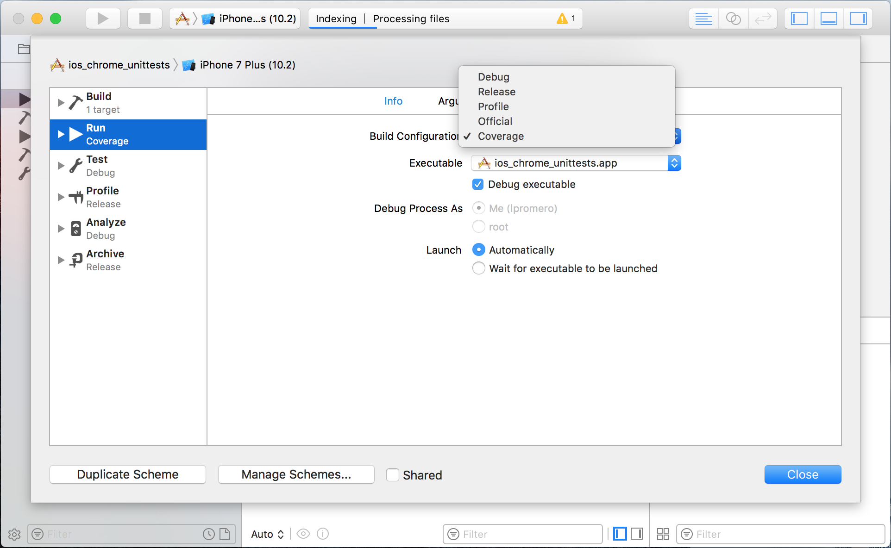
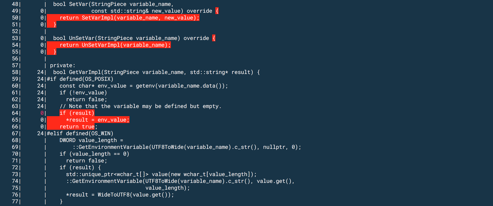
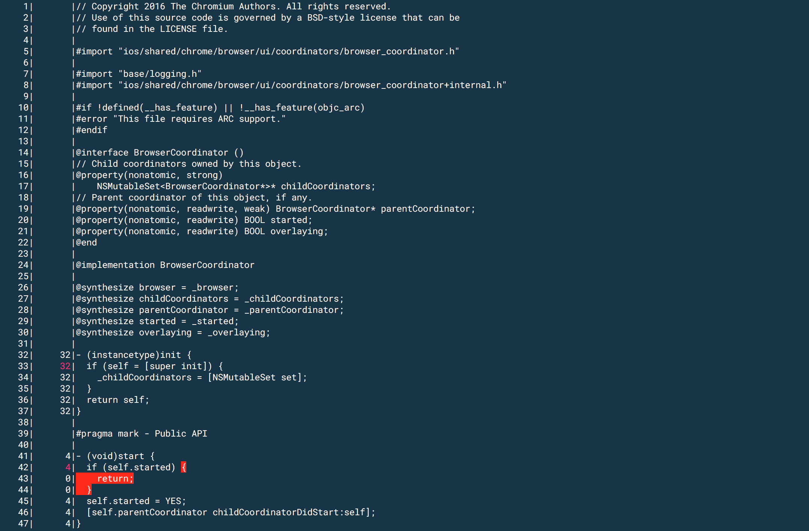
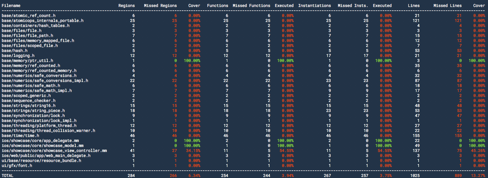
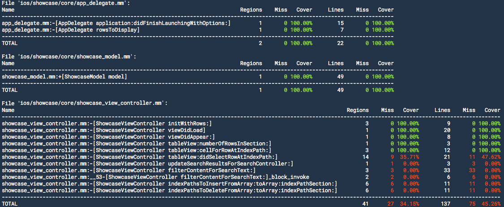

# Generate code coverage data

1.  Build a test target for coverage:

    ```
    ninja -C out/Coverage-iphonesimulator ios_chrome_unittests
    ```

    Targets that support code coverage need to call
    `coverage_util::ConfigureCoverageReportPath()`.
    If you don't use `setup-gn.py`, you can set the gn argument
    `ios_enable_coverage` to `true`.

1.  Run the test target. If using Xcode, don't forget to set `Coverage` in the
    target's scheme:

    

1.  Find the `coverage.profraw` in the `Documents` folder of the app. You can
    look in the console output of the instrumented target. For example:

    ```
    Coverage data at /Users/johndoe/Library/Developer/CoreSimulator/Devices/
    82D642FA-FC18-4EDB-AFE0-A17454804BE4/data/Containers/Data/Application/
    E6B2B898-CE13-4958-93F3-E8B500446381/Documents/coverage.profraw
    ```

1.  Create a `coverage.profdata` file out of the `coverage.profraw` file:

    ```
    xcrun llvm-profdata merge \
        -o out/Coverage-iphonesimulator/coverage.profdata \
        path/to/coverage.profraw
    ```

1.  To see the **line coverage** for *all the instrumented source files*:

    ```
    xcrun llvm-cov show \
        out/Coverage-iphonesimulator/ios_chrome_unittests.app/ios_chrome_unittests \
        -instr-profile=out/Coverage-iphonesimulator/coverage.profdata \
        -arch=x86_64
    ```

    

    To see the **line coverage** for a *specific instrumented source
    file/folder* (e.g.
    `ios/chrome/browser/ui/coordinators/browser_coordinator.mm`):

    ```
    xcrun llvm-cov show \
        out/Coverage-iphonesimulator/ios_chrome_unittests.app/ios_chrome_unittests \
        -instr-profile=out/Coverage-iphonesimulator/coverage.profdata \
        -arch=x86_64 ios/chrome/browser/ui/coordinators/browser_coordinator.mm
    ```

    

    To see a **complete report**:

    ```
    xcrun llvm-cov report \
        out/Coverage-iphonesimulator/ios_chrome_unittests.app/ios_chrome_unittests \
        -instr-profile=path/to/coverage.profdata -arch=x86_64
    ```

    

    To see a **report** for a *folder/file* (e.g. `ios/chrome/browser` folder):

    ```
    xcrun llvm-cov show \
        out/Coverage-iphonesimulator/ios_chrome_unittests.app/ios_chrome_unittests \
        -instr-profile=path/to/coverage.profdata -arch=x86_64 ios/chrome/browser
    ```

    
