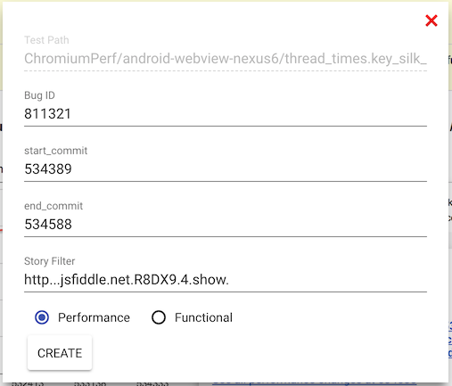

# Bisecting Performance Regressions

[TOC]

## What are performance bisects?

The perf tests on chromium's continuous build are very long-running, so we
cannot run them on every revision. Further, separate repositories like v8
and skia sometimes roll multiple performance-sensitive changes into chromium
at once. For these reasons, we need a tool that can bisect the root cause of
performance regressions over a CL range, descending into third_party
repositories as necessary. This is what the performance bisect bots do.

The team is currently working on a new version of performance biscect called
[pinpoint](https://docs.google.com/document/d/1FKPRNU2kbPJ15p6XHO0itCjYtfvCpGt2IHblriTX1tg/edit)

## Starting a perf bisect

Performance bisects are tightly integrated with the
[Chrome Performance Dashboard](https://chromeperf.appspot.com/alerts) and
[monorail](https://bugs.chromium.org/p/chromium/issues/list). Users kick off
perf bisects on the perf dashboard and view results in monorail.

You can kick off a perf bisect anywhere you see a performance graph on the perf
dashboard (except for some tests which don't bisect, because they do not run on
the [chromium.perf waterfall](https://build.chromium.org/p/chromium.perf/waterfall)).

### To get to a graph, use one of the following methods:

  * From a perf sheriff-filed bug, follow the link in #1 that looks like
    `https://chromeperf.appspot.com/group_report?bug_id=XXXXXX`. Check the
    boxes next to alerts in the table to display graphs.
  * From the [alerts page](https://chromeperf.appspot.com/alerts), check the
    box next to an alert and click the `Graph` button.
  * From the [report page](https://chromeperf.appspot.com/report), use the menu
    to navigate to the graph you want.

### To kick off a bisect from the graph:

  1. Click on a data point in the graph.
  2. In the tooltip that shows up, click the `BISECT` button.
  3. Make sure to enter a Bug ID in the dialog that comes up.
  4. Click the `START BISECT` button.

### What are all the boxes in the form?

  * **Bisect bot**: The name of the configuration in the perf lab to bisect on.
    This has been prefilled to match the bot that generated the graph as
    closely as possible.
  * **Metric**: The metric of the performance test to bisect. This defaults to
    the metric shown on the graph. It shows a list of other related metrics
    (for example, if average page load time increased, the drop down will show
    a list of individual pages which were measured).
  * **Story filter**: This is a flag specific to
    [telemetry](https://github.com/catapult-project/catapult/blob/master/telemetry/README.md).
    It tells telemetry to only run a specific test case, instead of running all
    the test cases in the suite. This dramatically reduces bisect time for
    large test suites. The dashboard will prefill this box based on the graph
    you clicked on. If you suspect that test cases in the benchmark are not
    independent, you can try bisecting with this box cleared.
  * **Bug ID**: The bug number in monorail. It's very important to fill in
    this field, as this is where bisect results will be posted.
  * **Earlier revision**: The chromium commit pos to start bisecting from. This
    is prefilled by the dashboard to the start of the revision range for the
    point you clicked on. You can set it to an earlier commit position to
    bisect a larger range.
  * **Later revision**: The chromium commit pos to bisect to. This is prefilled
    by the dashboard to the end of the revision range for the point you clicked
    on. You can set it to a later commit pos to bisect a larger range.
  * **Launch on staging bots**: This is an internal feature, which allows the
    bisect team to launch a bisect on a test configuration. You likely don't
    want to check this box unless instructed by the bisect team.
  * **Bisect mode**: use "mean" to bisect the mean value of the performance
    test. See below for "return_code".

## Bisecting test failures

The perf bisect bots can also be used to bisect performance test failures.
See details in [Triaging Data Stoppage Alerts](triaging_data_stoppage_alerts.md).

## Interpreting the results

The bisect bot will output a comment on the bug you input into the dialog when
bisection is complete. See the
[Understanding the Bisect Results](addressing_performance_regressions.md#Understanding-the-bisect-results)
section of the Addressing Performance Regressions doc for details on how to
interpret the results.

## Getting more debugging data

The bisect outputs some additional data which might be useful for really tough
regressions or confusing results.

### Traces

Chrome traces are generated by most bisects and uploaded to cloud storage, but
they're not very visible in the UI. We plan to address this in
[pinpoint](https://docs.google.com/document/d/1FKPRNU2kbPJ15p6XHO0itCjYtfvCpGt2IHblriTX1tg/edit),
but in the short term here are the steps to get the traces from a bisect:

  1. The bisect comment should have a "Debug Info" link that looks like this:
     `https://chromeperf.appspot.com/buildbucket_job_status/8980436717323504240`
     Click it.
  2. In the debug info, you should see a "Buildbot link" that looks like this:
     `https://build.chromium.org/p/tryserver.chromium.perf/builders/android_nexus7_perf_bisect/builds/4097`
     Click it.
  3. There will be several steps on the buildbot status page named "Bisecting
     Revision". Each has an annotation like "Revision: chromium@474894" so you
     can tell which revision it ran. Pick the commit position you want the
     trace from (usually the one at your CL and the one immediately before).
     Click the arrow by "> Nested step(s) for: Bisecting revision..." on those
     steps.
  4. In the nested steps, you'll see several steps titled "Bisecting
     revision.Performance Test X of Y". These are the actual perf test runs.
     Click the "stdout" link for one of these steps.
  5. In the output, do a text search for "View generated trace files online"
     and you'll see a link to a trace that looks like this:
     `https://console.developers.google.com/m/cloudstorage/b/chrome-telemetry-output/o/trace-file-id_0-2017-05-05_05-41-49-83206.html`

Here are some screenshots showing what to click on:

