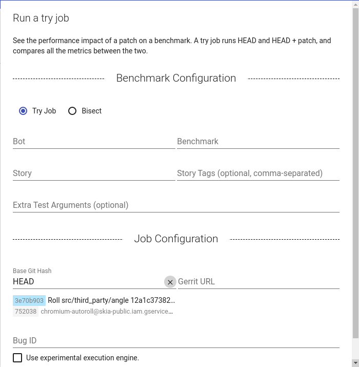

# Perf Try Bots

[TOC]

## What is a perf try job?

Chrome has a performance lab with dozens of device and OS configurations. You
can run performance tests on an unsubmitted CL on these devices using Pinpoint. The specified CL will be run against tip-of-tree with and without the CL applied.

## Supported platforms

The platforms available in the lab change over time. To see the currently supported platofrms, click the "configuration" dropdown on the dialog.

## Supported benchmarks

All the telemetry benchmarks are supported by the perf trybots. To get a full
list, run `tools/perf/run_benchmark list`.

To learn more about the benchmark, you can read about the
[system health benchmarks](https://docs.google.com/document/d/1BM_6lBrPzpMNMtcyi2NFKGIzmzIQ1oH3OlNG27kDGNU/edit?ts=57e92782),
which test Chrome's performance at a high level, and the
[benchmark harnesses](https://docs.google.com/spreadsheets/d/1ZdQ9OHqEjF5v8dqNjd7lGUjJnK6sgi8MiqO7eZVMgD0/edit#gid=0),
which cover more specific areas.

## Starting a perf try job

Visit [Pinpoint](https://pinpoint-dot-chromeperf.appspot.com) and click the perf try button in the bottom right corner of the screen.

You should see the following dialog popup:

**Build Arguments**| **Description**
--- | ---
Bug Id | (optional) A bug ID.
Gerrit URL | The patch you want to run the benchmark on.
Configuration | The configuration to run the test on.
Browser | (optional) The specific browser to use for the test.

**Test Arguments**| **Description**
--- | ---
Benchmark | A telemetry benchmark, eg. system_health.common_desktop
Story | (optional) A specific story from the benchmark to run.
Extra Test Arguments | (optional) Extra arguments for the test, eg. --extra-chrome-categories="foo,bar"

**Values Arguments**| **Description**
--- | ---
Chart | (optional) Please ignore.
TIR Label | (optional) Please ignore.
Trace | (optional) Please ignore.
Statistic | (optional) Please ignore.
