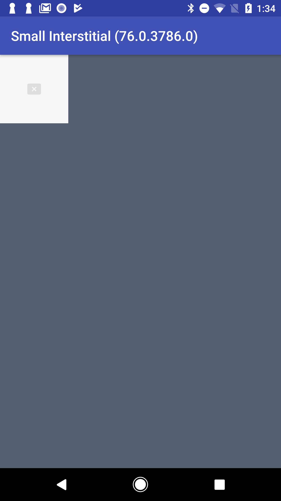
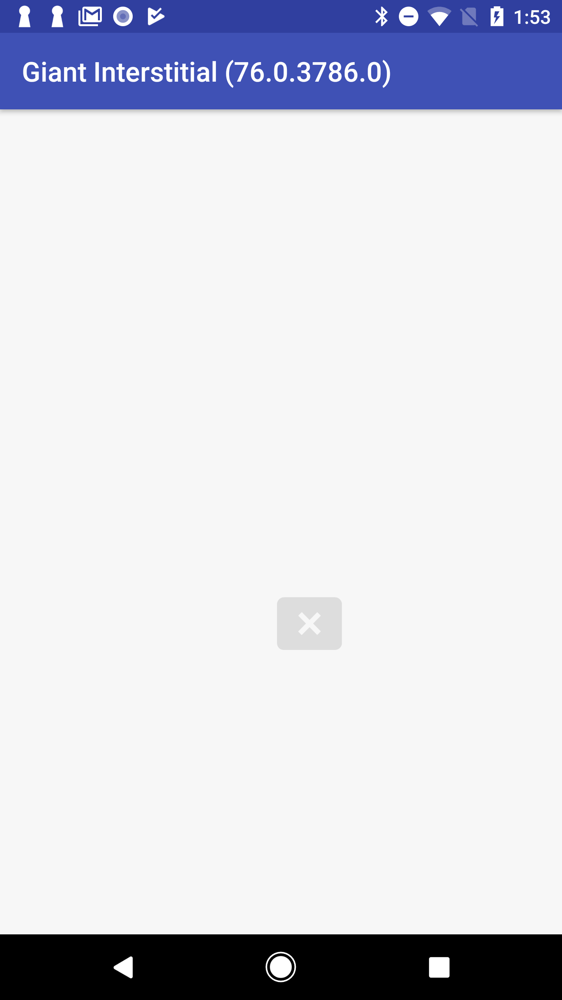
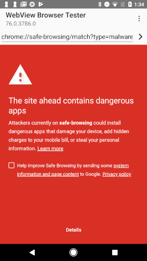

# Differences in support/behavior compared to Chrome

## Quiet interstitials

The main interstitials in Chrome are **Loud** interstitials, which are blocking
pages that show detailed informational text to users and are (usually) red in
background color. WebView supports these interstitials when we believe WebView
is the predominant part of the application UI (such as in browser apps).

When we suspect WebView is a smaller (or otherwise less prominent) part of the
application UI, we show a gray **Quiet** interstitial, which is meant to feel
like a less-scary error page.

There are **Small**, **Medium**, and **Giant** Quiet interstitials. Medium
interstitials are when we have enough space to show textual information, Small
interstitials are when there's not enough space, and Giant interstitials are
whenever part of the WebView hangs out of the viewport.

| Small interstitial | 4 Medium interstitials | Giant interstitial (hanging off bottom right of viewport) |
|---|---|---|
|  |  |  |

## Network error

WebView returns a particular network error to the application when the user
clicks "back to safety." This is to stay consistent with expectations of legacy
applications (to communicate the page failed to load).

## Callback API

WebView supports the `onSafeBrowsingHit()` callback, allowing applications to
implement custom interstitials. This also involves exposing [threat type
constants](/android_webview/java/src/org/chromium/android_webview/AwSafeBrowsingConversionHelper.java),
to indicate what threat WebView observed.

## Sometimes, no "back to safety" button

WebView will not show a "back to safety" button on the interstitial if there's
no previous page in the history, or if we're showing a Quiet interstitial.

| With "back to safety" button (like Chrome) | No "back to safety" button (WebView only) |
|---|---|
|  |  |
