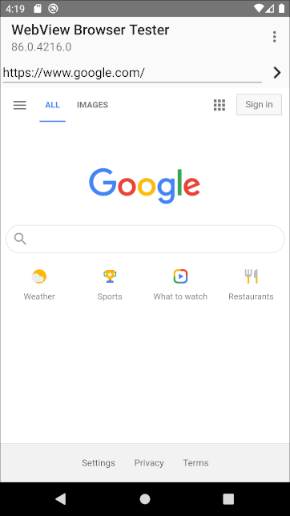

# System WebView Shell



WebView team maintains a "shell"&mdash;a thin interface over the WebView
APIs&mdash;to exercise WebView functionality. The System WebView Shell (AKA
"shell browser," "WebView shell") is a standalone app implemented [in
chromium](/android_webview/tools/system_webview_shell/). While often used for
manual testing, we also use the shell for automated tests (see our [layout and
page cycler tests](./test-instructions.md#layout-tests-and-page-cycler-tests)).

*** note
This relies on the WebView installed on the system. So if you're trying to
verify local changes to WebView, or run against a specific WebView build, you
must **install WebView first.**
***

*** promo
**Tip:** the shell displays the WebView version (the corresponding [chromium version
number](https://www.chromium.org/developers/version-numbers)) in the title bar
at the top. This can be helpful for checking which WebView version is installed
& selected on the device.
***

## Setting up the build

WebView shell only requires `target_os = "android"`. The simplest option is to
just reuse the same out/ folder and GN args you would normally use for WebView
or Chrome for Android.

*** note
**For the emulator:** the emulator comes with WebView shell preinstalled with a
different signing key, so installation will fail with
`INSTALL_FAILED_UPDATE_INCOMPATIBLE: Package ... signatures do not match
previously installed version`. You can workaround this in your GN args with
`system_webview_shell_package_name = "org.chromium.my_webview_shell"`.

Your local build will install alongside the preinstalled WebView shell. You may
hide the preinstalled shell by running `adb root` followed by `adb shell pm
disable org.chromium.webview_shell` in your terminal (copy-paste the command
as-written, **don't** use the package name from the GN arg above).
***

## Building the shell

```sh
$ autoninja -C out/Default system_webview_shell_apk
```

## Installing the shell

```sh
# Build and install
$ out/Default/bin/system_webview_shell_apk install
```

## Running the shell

```sh
# Launch a URL from the commandline, or open the app from the app launcher
$ out/Default/bin/system_webview_shell_apk launch "https://www.google.com/"

# For more commands:
$ out/Default/bin/system_webview_shell_apk --help
```

*** note
**Note:** `system_webview_shell_apk` does not support modifying CLI flags. See
https://crbug.com/959425. Instead, you should modify WebView's flags by
following [commandline-flags.md](./commandline-flags.md).
***

## Troubleshooting

### INSTALL\_FAILED\_UPDATE\_INCOMPATIBLE: Package ... signatures do not match previously installed version

This may be happening because the shell is preinstalled on your device (ex. this
is the case on all emulators). **The easiest way** to workaround this is to
[change the shell's package name in a local build](#building-for-the-emulator).

If you don't want to (or can't) change the package name, then you may be able to
modify your device's system image. See the [manual steps for removing system
apps](removing-system-apps.md) and replace **com.google.android.webview** with
**org.chromium.webview_shell**.
