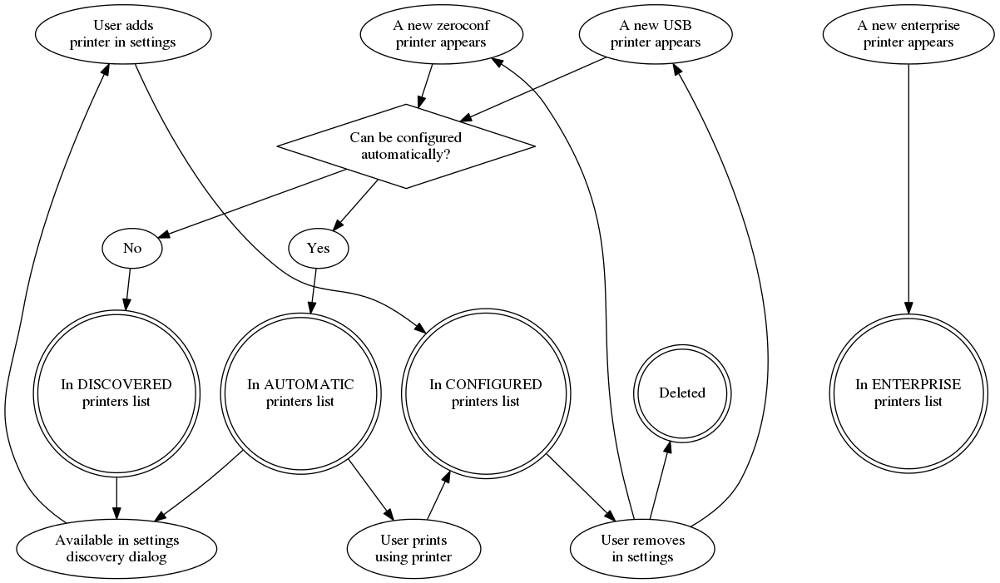

# CUPS Printer Management in ChromeOS

One of the goals of CUPS printing in ChromeOS is to provide as smooth an
experience as possible to users who wish to print to CUPS printers.  This means
we want to avoid extra setup steps where they are not necessary, and provide
help to the user when setup steps are necessary.  This document covers several
different ways we might discover printers, and how they integrate into the
printing flows.

## Categorizing printers
The fact that CUPS supports many printing modalities means that we have a
mishmash of ways we could print.  Within ChromeOS, we divide CUPS printers into
4 categories:

*  *Saved* printers - These are printers that are saved as a part of a users'
   settings and are synced across devices.  They show up in the list of printers
   in printer settings.

*  *Enterprise* printers - Printers that are provided by an enterprise
   environment.  These are synced one-way to ChromeOS devices.  If you work for
   a company/attend a school using ChromeOS, these are the printers that your
   administrator set up for you ahead of time.  (These are currently called
   "Recommended" printers in some APIs).

*  *Automatic* printers - Printers that this user has never printed to, but we
   believe the user *could* print to without needing to go through any manual
   setup steps.  Examples include Zeroconf printers and USB printers that either
   do not need a PPD or for which we have identified with high confidence an
   available PPD that can be installed if the user wants to print to this
   device.  If a user uses one of these printers, we automatically migrate it to
   be a Saved printer, as the user has shown that this is a printer of
   interest to them.

*  *Discovered* printers - Printers that have been detected, but that we believe
   will need user intervention to set up properly.  Examples would be an
   advertised zeroconf printer that can't be identified, or an unknown USB
   printer.

The flow of printers through theses states is illustrated here:

In terms of usage, the categories combine in these ways:

*Automatic* and *Discovered* printers appear in the settings Discovery dialog as
available printers to be added.

*Saved* printers appear in the list of printers in the settings dialog. The
plan of record is that we do *not* support user-configurability for *Enterprise*
printers, which means these will either not appear in settings, or appear there
in an uneditable way.

*Saved*, *Enterprise*, and *Automatic* printers appear in the print preview
dialog as available targets for printing.

## Code structure

### CupsPrintersManager

Defined in `chome/browser/ash/printing/cups_printers_manager.[cc|h]`.

The `CupsPrintersManager` class is the top-level object responsible for
providing information about available printers of all 4 types to all consumers.
It is a BrowserContextKeyedService; only one exists for the duration of the
browser session. It's destroyed at the end of the current browser session.

It provides this information both via an Observer interface, for consumers that
require live updates to changes in availability, and also via a simpler "Give me
all the printers of this type" interface for simpler consumers that just need to
know the state of the world at a given point in time.  `CupsPrintersManager` is
also where the logic to determine whether a given detected printer is
automatically configurable (and thus belongs in the *Automatic* category) or not
(and thus belongs in the *Discovered* category).

There are 4 primary consumers of `CupsPrintersManager` information:

* The ChromeOS Print Backend implementation
  (`printing/backend/print_backend_chromeos.cc`).  This is the ChromeOS
  implementation of the backend print API used by Chrome.
* The PrintPreview dialog proxy
  (`chrome/browser/ui/webui/print_preview/local_printer_handler_chromeos.cc`).
  This is mostly a thread workaround to access the stuff in the print backend.
* The ChromeOS printers settings
  page. (`chrome/browser/ui/webui/settings/chromeos/cups_printers_handler.cc`
  and related code).  This is the primary place the user manages available
  printers.
* `CupsPrintJobManager`.  Requires printer information for the display and
  management of print job notifications.

Currently the needs of these sites are served by a combination of
`PrintersManager` and direct access to `Detector` classes.  Going forward, we
should make `CupsPrintersManager` the combined interface used by all of these
sites.

### SyncedPrintersManager

`SyncedPrintersManager` (nee `PrintersManager`) is a KeyedService Defined in
`chome/browser/ash/printers_sync_manager.[cc|h]`.
`SyncedPrintersManager` manages the persistent data about printers that is
synced across devices.  It serves as a two-way bridge between the sync systems
and `CupsPrintersManager` for both Saved and Enterprise printers.
Essentially, when the user changes their Saved printers list,
`SyncedPrintersManager` is what makes sure that propagates upstream, and when
changes from upstream come in, `SyncedPrintersManager` is responsible for
notifying `CupsPrintersManager` of the changes.

`SyncedPrintersManager` carries the additional responsibility for caching which
print destinations have been created in CUPS in the current session.  CrOS
differs from most CUPS installations in that configuration information lives in
the user profile, and is only made available to CUPS as needed.  In other words,
when a user wants to print, at that point Chrome tells CUPS to create the
relevant print queue, if needed.  Print queues don’t persist across logins, and
are recreated as needed.

Additionally, although recreating the same print queue with the same options is
theoretically a null operation, cupsd can get somewhat unhappy if you attempt to
create the same destination too many times quickly.  Thus, we need to cache
which destinations have been created in the current session.
This responsibility is given to  `CupsPrintersManager`.

### PrinterDetectors

Defined in `chome/browser/ash/printing/printer_detector.h` `PrinterDetector`
provides an interface implemented by subsystems that can automatically detect
the existence of printers.

These detections are used in two ways.  First, detected printers that are not
previously-known Saved printers become either Automatic or Discovered
printers, depending on whether or not we believe they can be configured
automatically.

Details for the existing PrinterDetector implementations follow.

#### USBPrinterDetector

Defined in `chome/browser/ash/printing/usb_printer_detector.[cc|h]`, this
interacts with the USB subsystem to turn USB device detection events into
printers.  Both cold- and hot-plugged printers are supported.

#### ZeroconfPrinterDetector

Defined in `chome/browser/ash/printing/zeroconf_printer_detector.[cc|h]`,
this interacts with the DNS-SD and mDNS systems to detect printers that
advertise themselves on the local network.
