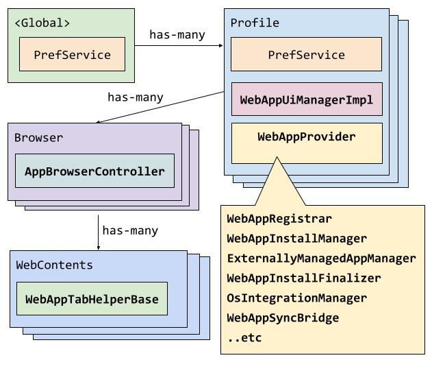

# Web Apps

This directory holds the core of Chromium's web app system. For a quick code
starting point see [WebAppProvider::Start()](web_app_provider.h), this is the
entry point where everything web app related begins.


## What are web apps?

Simply put web apps are sites that the user installs onto their machine
mimicking a native app install on their respective operating system.

### User entry points

Sites that meet our install promotion requirements will have an install prompt
appear in the omnibox on the right.
 - Example site: https://developers.google.com/
Users can also install any site they like via `Menu > More tools > Create
shortcut...`.

Users can see all of their web apps on chrome://apps (viewable on non-ChromeOS).

### Developer interface

Sites customise how their installed site integrates at the OS level using a
[web app manifest](https://www.w3.org/TR/appmanifest/).
See developer guides for in depth overviews:
 - https://web.dev/progressive-web-apps/
 - https://web.dev/codelab-make-installable/

## Terms & Phrases

### Manifest, or WebManifest

This refers to the the document described by the [appmanifest](https://www.w3.org/TR/appmanifest/) spec, with some extra features described by [manifest-incubations](https://wicg.github.io/manifest-incubations/index.html). This document describes metadata and developer configuration of an installable webapp.

For code representations of the manifest see [the list](docs/manifest_representations.md).

### Manifest Link

A manifest link is something that looks like this in a html document:
```html
<link rel="manifest" href="manifest.webmanifest">
```
This link ties the manifest to the document, and subsequently used in the spec algorithms defined in [appmanifest](https://www.w3.org/TR/appmanifest/) or [manifest-incubations](https://wicg.github.io/manifest-incubations/index.html) to describe the webapp and determine if it is installable.

### Installable

If a document or page is considered "installable", then the user agent can create some form of installed web app for that page. To be installable, [web_app::CanCreateWebApp](https://source.chromium.org/search?q=web_app::CanCreateWebApp) must return true, where:
* The user profile must allow webapps to be installed
* The web contents of the page must not be crashed
* The last navigation on the web contents must not be an error (like a 404)
* The url must be `http`, `https`, or `chrome-extension`

This is different than [promotable](#promotable) below, which determines if Chrome will promote installation of the page.

### Promotable

A document is considered "promotable" if it fulfils a set of criteria. This criteria may change to further encourage a better user experience for installable web apps. There are also a few optional checks that depend on the promotability checker. This general criteria as of 2021/04/20:
* The document contains a manifest link.
* The linked manifest can be [processed](https://www.w3.org/TR/appmanifest/#processing) according to the spec and is valid.
* The processed manifest contains the fields:
  * `name`
  * `start_url`
  * `icons` with at least one icon with a valid response that is a parsable image.
  * `display` field that is not `"browser"`
* "Serviceworker check": The `start_url` is 'controlled' (can be served by) a [serviceworker](https://developers.google.com/web/ilt/pwa/introduction-to-service-worker). **Optionally turned off**
* "Engagement check": The user has engaged with, or interacted with, the page or origin a certain amount (currently at least one click and some seconds on the site). **Optionally turned off**

Notes:
* Per spec, the document origin and the `start_url` origin must match.
* Per spec, the `start_url` origin does not have to match the `manifest_url` origin
* The `start_url` could be different than the `document_url`.

### Manifest id
The `id` specified in manifest represents the identity of the web app. The manifest id is processed following the algorithm described in [appmanifest specification](https://www.w3.org/TR/appmanifest/#id-member) to produce the app's identity. In web app system, the app's [identity](https://www.w3.org/TR/appmanifest/#dfn-identity) is [hashed](https://source.chromium.org/chromium/chromium/src/+/main:chrome/browser/web_applications/web_app_helpers.cc;l=69;drc=cafa646efbb6f668d3ba20ff482c1f729159ae97) to be stored to [WebApp->app_id()](https://source.chromium.org/chromium/chromium/src/+/main:chrome/browser/web_applications/web_app.h;l=43;drc=cafa646efbb6f668d3ba20ff482c1f729159ae97;bpv=1;bpt=1).

The app identity is verified in manifest updating process, if an app gets a manifest with [mismatched identity](https://source.chromium.org/chromium/chromium/src/+/main:chrome/browser/web_applications/manifest_update_task.cc;l=315?q=manifest_update_task&ss=chromium%2Fchromium%2Fsrc), the update process is aborted.
### Scope

Scope refers to the prefix that a WebApp controls. All paths at or nested inside of a WebApp's scope is thought of as "controlled" or "in-scope" of that WebApp. This is a simple string prefix match. For example, if `scope` is `/my-app`, then the following will be "in-scope":
* `/my-app/index.html`
* `/my-app/sub/dir/hello.html`
* `/my-app-still-prefixed/index.html` (Note: if the scope was `/my-app/`, then this would not be out-of-scope)

And the following will "out-of-scope":
* `/my-other-app/index.html`
* `/index.html`

### Display Mode

The `display` of a webapp determines how the developer would like the app to look like to the user. See the [spec](https://www.w3.org/TR/appmanifest/#display-modes) for how the `display` member is processed in the manifest and what the display modes mean.

### User Display Mode

In addition to the developer-specified [`display`](#display-mode), the user can specify how they want a WebApp to be displayed, with the only option being whether to "open in a window" or not. Internally, this is expressed in the same display mode enumeration type as [`display`](#display-mode), but only the `kStandalone` and `kBrowser` values are used to specify "open in a window" and "do not open in a window", respectively.

#### Effective Display Mode
The psuedocode to determine the ACTUAL display mode a WebApp is displayed is:

```js
if (user_display_mode == kStandalone)
  return developer_specified_display_mode;
else
  return kBrowser; // Open in a tab.
```

#### Open-in-window
This refers to the user specifying that a WebApp should open in the developer specified display mode.

#### Open-in-browser-tab
This refers to the user specifying that a WebApp should NOT open in a window, and thus the WebApp, if launched, will just be opened in a browser tab.

### Placeholder app
There are some webapps which are managed by external sources - for example, the enterprise policy force-install apps, or the system web apps for ChromeOS. These are generally not installed by user interaction, and the WebAppProvider needs to install something for each of these apps.

Sometimes, the installation of these apps can fail because the install url is not reachable (usually a cert or login needs to occur, and the url is redirected). When this happens, the system [can](https://source.chromium.org/search?q=ExternalInstallOptions::install_placeholder) install a "placeholder" app, which is a fake application that, when launched navigates to the install url of the application, given by the external app manager.

When any web contents, either in-(placeholder)-app or in the browser, successfully [navigates](https://source.chromium.org/search?q=WebAppTabHelper::ReinstallPlaceholderAppIfNecessary) to a install url that the placeholder app is installed for, the web app installation is restarted for the true app, and after that installation succeeds the placeholder app is uninstalled.

### Locally Installed
When signing into a non-ChromeOS device, all web apps are installed but not **locally installed**. This means that OS integration is not triggered (so there are no platform shortcuts created), install icons will still show up for the app websites, and the app icon will appear greyed out on chrome://apps.

For an app to become locally installed, the user must do one of the following:
* Navigate to `chrome://apps`, find the greyed-out icon of the app, right click on it, and select "Install".
* Follow any of the normal installation routes to install that app (e.g. visit the app page in the browser and interact with the omnibox install icon)

This was done because on non-ChromeOS devices it was considered a bad user experience to fully install all of the profile's web apps (creating platform shortcuts, etc), as this might not be expected by the user.

## What makes up Chromium's implementation?

The task of turning web sites into "apps" in the user's OS environment has many parts to it. Before going into the parts, here is where they live:

[](https://docs.google.com/drawings/d/1TqUF2Pqh2S5qPGyA6njQWxOgSgKQBPePKPIH_srGeRk/edit?usp=sharing)

* The `WebAppProvider` core system lives on the `Profile` object.
* The `WebAppUiManagerImpl` also lives on the `Profile` object (to avoid deps issues).
* The `AppBrowserController` (typically `WebAppBrowserController` for our interests) lives on the `Browser` object.
* The `WebAppTabHelper` lives on the `WebContents` object.

While most on-disk storage is done in the [`WebAppSyncBridge`](#webappsyncbridge), the system also sometimes uses the `PrefService`. Most of these prefs live on the `Profile` (`profile->GetPrefs()`), but some prefs are in the global browser prefs (`g_browser_process->local_state()`). See the [storage](#storage) section below for more info.

There is a presentation that also goes over the class structure and dependency diagram [here](https://docs.google.com/presentation/d/1bJfUFPMh7J_Avw3J4HBvAN2RWnV4T9LOXr0JSAgQAvg/pub), but it may be out of date.

Here is more info for some (but not all) of the key parts:

### [`WebAppProvider`](web_app_provider.h)

This is a per-profile object housing all the various web app subsystems. This is
the "main()" of the web app implementation where everything starts.


### [`WebApp`](web_app.h)

This is the representation of an installed web app in RAM. Its member fields
largely reflect all the ways a site can configure their
[web app manifest](https://www.w3.org/TR/appmanifest/) plus miscellaneous
internal bookkeeping and user settings.


### [`WebAppRegistrar`](web_app_registrar.h)

This is where all the [`WebApp`](web_app.h)s live in memory and what many other
subsystems query to look up any given web app's fields. Mutations to the
registry have to go via [`WebAppSyncBridge`](web_app_sync_bridge.h).

Why is it full of `GetAppXYZ()` getters for every field instead of just
returning a `WebApp` reference? Because web apps used to be backed by
`Extension`s and in that mode there were no `WebApp`s; instead everything was
stored on an `Extension`.

### [`WebAppSyncBridge`](web_app_sync_bridge.h)

This is "bridge" between the WebAppProvider system's in-memory representation of web apps and the sync system's database representation (along with sync system functionality like add/remove/modify operations). This integration is a little complex and deserves it's own document, but it basically:
* Stores all WebApps into a database and updates the database if any fields change.
* Updates the system when there are changes from the sync system.
  * Installs new apps, uninstalls apps the user uninstalled elsewhere, updates metadata like user display mode preference, etc.
* Tells the sync system if there are local changes (installs, uninstalls, etc).

There is also a slide in a presentation [here](https://docs.google.com/presentation/d/e/2PACX-1vQxYZoCyhZ4xHS4pVuBC9YoE0O-QpW2Wj3scl6jtr3TEYheeod5Ch4b7OVEQEj_Hc6PM1RBGzovug3C/pub?start=false&loop=false&delayms=3000&slide=id.g59d9cb05b6_6_5) which illustrates how this system works, but it may be out of date.

Note: This only stores per-web-app data, and that data will be deleted if the web app is uninstalled. To store data that persists after uninstall, or applies to a more general scope than a single web app, then the `PrefService` can be used, either on the `Profile` object (per-profile data, `profile->GetPrefs()`) or on the browser process (`g_browser_process->local_state()`). Example of needing prefs:
* Storing if an app was previously installed as a preinstalled app in the past.
* Information is needed during chrome startup before profiles are loaded.
* A feature needs to store global data - e.g. "When was the last time we showed the in-product-help banner for any webapp?"

### [`WebAppInstallManager`](web_app_install_manager.h)

This is where web apps are created, updated and removed. The install manager
spawns [`WebAppInstallTask`](web_app_install_task.h)s for each "job".

Installation comes in many different forms from a simple "here's all the
[info](web_app_install_info.h) necessary please install it" to
"please install the site currently loaded in this web contents and fetch all the
manifest data it specifies" with a few inbetweens.


### [`ExternallyManagedAppManager`](externally_managed_app_manager.h)

This is for all installs that are not initiated by the user. This includes
[preinstalled apps](preinstalled_web_app_manager.h),
[policy installed apps](policy/web_app_policy_manager.h) and
[system web apps](../ash/system_web_apps/system_web_app_manager.h).

These all specify a set of [install URLs](external_install_options.h)
which the `ExternallyManagedAppManager` synchronises the set of currently
installed web apps with.


### [`WebAppInstallFinalizer`](web_app_install_finalizer.h)

This is the tail end of the installation process where we write all our web app
metadata to [disk](web_app_database.h) and deploy OS integrations (like
[desktop shortcuts](web_app_shortcut.h) and
[file handlers](web_app_file_handler_manager.h)) using the
[`OsIntegrationManager`](os_integration_manager.h).

This also manages the uninstallation process.

### [`WebAppUiManager`](../ui/web_applications/web_app_ui_manager_impl.h)

Sometimes we need to query window state from chrome/browser/ui land even though
our BUILD.gn targets disallow this as it would be a circular dependency. This
[abstract class](web_app_ui_manager.h) + [impl](web_app_ui_manager_impl.h)
injects the dependency at link time (see
[`WebAppUiManager::Create()`](https://source.chromium.org/search?q=WebAppUiManager::Create)'s
declaration and definition locations).

## Storage

TODO

## Deep Dives

* [Installation Sources & Pipeline](docs/installation_pipeline.md)
* [Operating system integration](docs/os_integration.md)
* TODO: Uninstallation
* TODO: Manifest Update

## Testing

See [the testing docs](docs/testing.md).

## Debugging

Use [chrome://web-app-internals](chrome://web-app-internals) to inspect internal
web app state. For Chromium versions prior to M93 use
[chrome://internals/web-app](chrome://internals/web-app).
