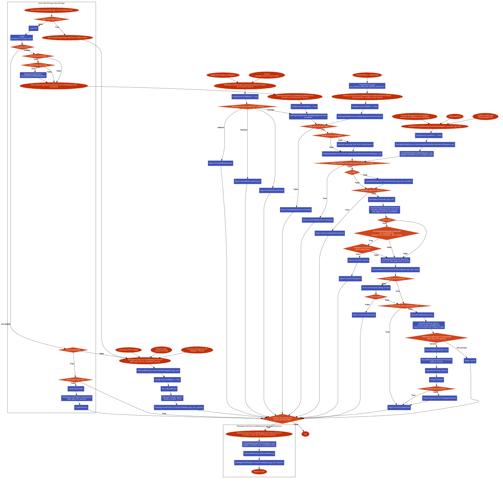

# [Web Apps](../README.md) - Installation

Installing a webapp can come from a variety of channels. This section serves to enumerate them all and show how they fit together in the installation pipeline. 

Generally, installations all go through the following flow:
1. Method call in WebAppInstallationManager.
1. A WebAppInstallTask being queued and run, doing a variety of checks and operations.
1. A call into WebAppInstallFinalizer, which:
   1. Triggers any OS integration operations required (creating shortcuts, registering file handlers, etc)
   1. Saves the WebApp to the database.

The ExternallyManagedAppManager adds a few steps before this, and will sometimes (for placeholder apps) skip the WebAppInstallationManager and directly call into the WebAppInstallFinalizer.

To see a detailed flowchart, see the the [flowchart](#flowchart) below.

## Installation Sources

There are a variety of installation sources and expectations tied to those sources.

### Omnibox install icon
User-initiated installation. To make the omnibox install icon visible, the document must:
* Be [promotable](../README.md#promotable) and [installable](../README.md#installable).
* NOT be inside of the scope of an installed WebApp with an [effective display mode](../README.md#effective-display-mode) display mode that isn't `kBrowser`.

Triggers an install view that will show the name & icon to the user to confirm install.

Calls [`WebAppInstallManager::InstallWebAppFromManifest`](https://source.chromium.org/search?q=function:WebAppInstallManager::InstallWebAppFromManifest), providing just the `WebContents` of the installable page.

Fails if, after the user clicks :
* After clicking on the install icon, the `WebContents` is no longer [promotable](../README.md#promotable), skipping engagement checks.
* The user rejects the installation dialog.

### 3-dot menu option "Install {App_Name}..."
User-initiated installation. To make the install menu option visible, the document must:
* Be [promotable](../README.md#promotable) and [installable](../README.md#installable).
* NOT be inside of the scope of an installed WebApp with an [effective display mode](../README.md#effective-display-mode) display mode that isn't `kBrowser`.

Triggers an install view that will show the name & icon to the user to confirm install.

Calls [`WebAppInstallManager::InstallWebAppFromManifestWithFallback`](https://source.chromium.org/search?q=WebAppInstallManager::InstallWebAppFromManifestWithFallback) with the `WebContents` of the installable page.

Fails if:
* The user rejects the installation dialog.

Notably, this option does not go through the same exact pathway as the [omnibox install icon](#omnibox-install-icon), as it shares the call-site as the "Create Shortcut" method below. The main functional difference here is that if the site becomes no longer [promotable](../README.md#promotable) in between clicking on the menu option and the install actually happening, it will not fail and instead fall back to a fake manifest and/or fake icons based on the favicon. Practically, this option doesn't show up if the site is [promotable](../README.md#promotable). Should it share installation pathways as the the [omnibox install icon](#omnibox-install-icon)? Probably, yes.

### 3-dot menu option "Create Shortcut..."
User-initiated installation. This menu option is always available, except for internal chrome urls like chrome://settings.

Prompts the user whether the shortcut should "open in a window". If the user checks this option, then the resulting WebApp will have the [user display](../README.md#user-display-mode) set to `kStandalone` / open-in-a-window.

The document does not need to have a manifest for this install path to work. If no manifest is found, then a fake one is created with `start_url` equal to the document url, `name` equal to the document title, and the icons are generated from the favicon (if present).

Calls [`WebAppInstallManager::InstallWebAppFromManifestWithFallback`](https://source.chromium.org/search?q=WebAppInstallManager::InstallWebAppFromManifestWithFallback) with the `WebContents` of the page.

Fails if:
* The user rejects the shortcut creation dialog.

### ChromeOS Management API
Checks [promotability](../README.md#promotable) before installing, skipping engagement and serviceworker checks

Calls [`WebAppInstallManager::InstallWebAppFromManifest`](https://source.chromium.org/search?q=WebAppInstallManager::InstallWebAppFromManifest), providing just the `WebContents` of the installable page.

TODO: Document when this API is called & why.

### Externally Managed Apps
There are a number of apps that are managed externally. This means that there is an external manager keeps it's own list of web apps that need to be installed for a given external install source.

See the [`web_app::ExternalInstallSource`](https://source.chromium.org/search?q=web_app::ExternalInstallSource) enum to see all types of externally managed apps. Each source type should have an associated "manager" that gives the list of apps to `ExternallyManagedAppProvider::SynchronizeInstalledApps`.

These installations are customizable than user installations, as these external app management surfaces need to specify all of the options up front (e.g. create shortcut on desktop, open in window, run on login, etc). Thus the install function [`WebAppInstallManager::InstallWebAppWithParams`](https://source.chromium.org/search?q=WebAppInstallManager::InstallWebAppWithParams) is called here, with the params generated by [`web_app::ConvertExternalInstallOptionsToParams`](https://source.chromium.org/search?q=web_app::ConvertExternalInstallOptionsToParams).

The general installation flow of an externally managed app is:
1. A call to [`ExternallyManagedAppProvider::SynchronizeInstalledApps`](https://source.chromium.org/search?q=ExternallyManagedAppProvider::SynchronizeInstalledApps)
1. Finding all apps that need to be uninstalled and uninstalling them, find all apps that need to be installed and:
1. Queue an `ExternallyManagedAppInstallTask` to install each app sequentially.
1. Each task loads the url for the app.
1. If the url is successfully loaded, then call [`WebAppInstallManager::InstallWebAppWithParams`](https://source.chromium.org/search?q=WebAppInstallManager::InstallWebAppWithParams), and continue installation on the normal pipeline (described above, and [flowchart](#flowchart) below).
1. If the url fails to fully load (usually a redirect if the user needs to sign in or corp credentials are not installed), and the external app manager specified a [placeholder app was required](https://source.chromium.org/search?q=ExternalInstallOptions::install_placeholder) then:
   1. Synthesize a web app with `start_url` as the document url, and `name` as the document title
   1. Install that webapp using [`WebAppInstallManager::InstallWebAppFromInfo`](https://source.chromium.org/search?q=WebAppInstallManager::InstallWebAppFromInfo). This is **not** part of the regular install pipeline, and basically directly saves the webapp into the database without running OS integration.

These placeholder apps are not meant to stay, and to replace them with the intended apps, the following occurs:
1. The WebAppProvider system listens to every page load.
1. If a [navigation is successful](https://source.chromium.org/search?q=WebAppTabHelper::ReinstallPlaceholderAppIfNecessary) to a url that the placeholder app is installed for, then
   1. The installation is started again with a call to [`WebAppInstallManager::InstallWebAppWithParams`](https://source.chromium.org/search?q=WebAppInstallManager::InstallWebAppWithParams).
   1. If successful, the placeholder app is uninstalled.

### Sync

When the sync system receives an WebApp to install, it calls [`WebAppInstallManager::EnqueueInstallAppFromSync`](https://source.chromium.org/search?q=WebAppInstallManager::EnqueueInstallAppFromSync), which starts the normal installation pipeline. One major difference is if the installation fails for any reason (manifest is invalid or fails to load, etc), then a backup installation happens with a call to [`WebAppInstallTask::InstallWebAppFromInfoRetrieveIcons`](https://source.chromium.org/search?q=WebAppInstallTask::InstallWebAppFromInfoRetrieveIcons). This:
1. Attempts to get icon data for the install url.
1. Filters and generates missing icons from the favicon, if there was one.
1. Calls `WebAppInstallFinalizer` to finalize the install.
  1. If the platform is not ChromeOS, then the app will not become [locally installed](../README.md#locally-installed). This means that OS integration will not be triggered, no platform shortcuts created, etc.
  1. If the platform is ChromeOS, it will become [locally installed](../README.md#locally-installed), and all OS integrations will be triggered (just like a normal user-initiated install.)

#### Retry on startup
Sync installs have a few extra complications:
* They need to be immediately saved to the database & be installed eventually.
* Many are often queued up during a new profile sign-in, and it's not uncommon for the user to quit before the installation queue finishes.

Due to this, unlike other installs, a special [`WebApp::is_from_sync_and_pending_installation`](https://source.chromium.org/search?q=WebApp::is_from_sync_and_pending_installation) ([protobuf](https://source.chromium.org/chromium/chromium/src/+/main:chrome/browser/web_applications/proto/web_app.proto;l=110;bpv=1;bpt=1?q=web_app.proto%20is_from_sync_and_pending_installation&ss=chromium)) variable is saved in the database. WebApps with this set to true are treated as not fully installed, and are often left out of app listings. This variable is reset back to `false` when the app is finished installing.

To handle the cases above, on startup when the database is loaded, any WebApp with `is_from_sync_and_pending_installation` of `true` will be re-installed inside of [`WebAppSyncBridge::MaybeInstallAppsFromSyncAndPendingInstallation`](https://source.chromium.org/search?q=WebAppSyncBridge::MaybeInstallAppsFromSyncAndPendingInstallation)

## Installation State Modifications

### Installing locally
On non-ChromeOS devices, an app can be [not locally installed](../README.md#locally-installed). To become locally installed, the user can follow a normal install method (install icon will show up), or they can interact with the app on `chrome://apps`.

The `chrome://apps` code is unique here, and instead of re-installing the app, in manually sets the locally_installed bit to true in [`AppLauncherHandler::HandleInstallAppLocally`](https://source.chromium.org/search?q=AppLauncherHandler::HandleInstallAppLocally), and triggers OS integration in [`AppLauncherHandler::InstallOsHooks`](https://source.chromium.org/search?q=AppLauncherHandler::HandleInstallAppLocally)

### Creating Shortcuts
Similarly to above, in `chrome://apps` the user can "Create Shortcuts..." for a web app. This should overwrite any shortcuts already created, and basically triggers OS integration to install shortcuts again in [`AppLauncherHandler::HandleCreateAppShortcut`](https://source.chromium.org/search?q=AppLauncherHandler::HandleCreateAppShortcut)

## Flowchart

For reference, this is a flowchart of the installation pipeline as of 2021/04/20: 
Or see https://app.code2flow.com/0JJ8c5nNY4hL for an interactive version.