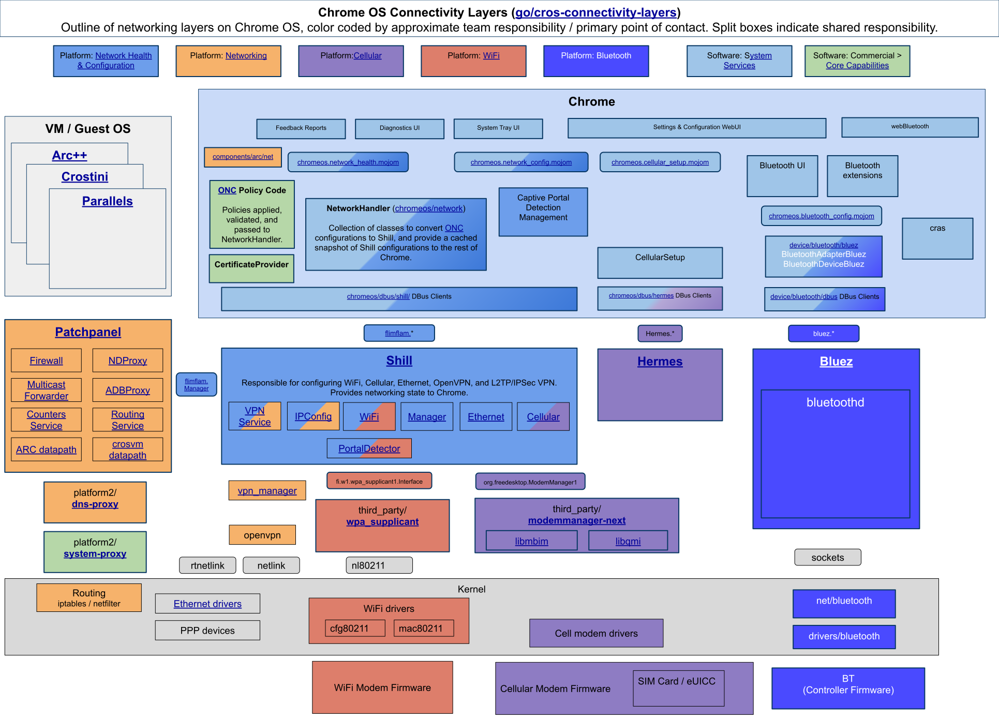

# Chrome OS Network - Chrome Layer

Chrome OS networking consists of several key components, shown in the diagram
below:

{width="1200" height="864"}

This document describes the Chrome layer (light blue rectangle above). This
layer is implemented within `//chromeos/ash/components/network`. To describe
this layer, we highlight three primary processes:

*   ***Chrome.*** Contains all system UI (e.g., settings) and processes inputs
    from the user as well as enterprise policies. Chrome sits atop the
    dependency tree and makes calls to the other components via D-Bus APIs.
*   ***Shill.*** Daemon process responsible for making network connections.
    Shill is the source of truth for which connection mediums are available and
    connected, as well as for properties of available networks.
*   ***Hermes.*** Daemon process responsible for configuring eSIM profiles.
    Hermes allows users to initiate SM-DS scans as well as communicate with
    SM-DP+ servers to install and uninstall profiles.

Shill and Hermes interface with several other components (e.g., ModemManager,
wpa_supplicant), but these are beyond the scope of this README since these
interactions are encapsulated from Chrome.

TODO(crbug.com/1164001): As part of [Chrome OS source directory migration](https://docs.google.com/document/d/1g-98HpzA8XcoGBWUv1gQNr4rbnD5yfvbtYZyPDDbkaE/edit),
the migration of codes for Chrome OS networking is in-progress and being moved
from `//chromeos/network` to `//chromeos/ash/components/network` for now.

## Background

Before diving into the Chrome layer's details, we provide some background
information about the D-Bus APIs exposed by Shill and Hermes.

### Shill

Source: [platform2/shill](https://source.chromium.org/chromiumos/chromiumos/codesearch/+/main:src/platform2/shill/)

Shill is responsible for setting up network interfaces, connecting to networks
via these interfaces, persisting network metadata to disk, and providing support
for VPNs.

Shill exposes 5 key interfaces used by Chrome:

*   [`flimflam.Manager`](https://source.corp.google.com/chromeos_public/src/platform2/shill/dbus_bindings/org.chromium.flimflam.Manager.dbus-xml):
    Allows Chrome to enable/disable a technology (e.g., turning Wi-Fi on or
    off), perform a scan (e.g., look for nearby Wi-Fi networks), and configure a
    network (e.g., attempt to set up a Wi-Fi network with a password).
*   [`flimflam.Device`](https://source.corp.google.com/chromeos_public/src/platform2/shill/dbus_bindings/org.chromium.flimflam.Device.dbus-xml):
    A Shill "Device" refers to a connection medium (Wi-Fi, Cellular, and
    Ethernet are all Shill Devices). This interface allows Chrome to get or set
    properties of each connection medium as well as perform operations on each
    connection medium (e.g., unlocking the Cellular Device when it has a locked
    SIM).
*   [`flimflam.Service`](https://source.corp.google.com/chromeos_public/src/platform2/shill/dbus_bindings/org.chromium.flimflam.Service.dbus-xml):
    A Shill "Service" refers to an individual network (a Wi-Fi network or a
    cellular SIM are Shill services). This interface allows Chrome to get or set
    properties for a given network as well as initiate connections and
    disconnections.
*   [`flimflam.Profile`](https://source.corp.google.com/chromeos_public/src/platform2/shill/dbus_bindings/org.chromium.flimflam.Profile.dbus-xml):
    A Shill "Profile" refers to a grouping of services corresponding to a
    logged-in user. Chrome OS allows configuration of networks as part of the
    "default" (i.e., shared) Profile which is available to all users or as part
    of individual (i.e., per-user) Profiles.
*   [`flimflam.IPConfig`](https://source.corp.google.com/chromeos_public/src/platform2/shill/dbus_bindings/org.chromium.flimflam.IPConfig.dbus-xml):
    Allows Chrome to configure IP addresses (e.g., DNS and DHCP).

### Hermes

Source: [platform2/hermes](https://source.chromium.org/chromiumos/chromiumos/codesearch/+/main:src/platform2/hermes/)

Hermes is responsible for communicating with Embedded Universal Integrated
Circuit Cards (EUICCs) on a Chrome OS device. A EUICC can colloquially be
understood as an eSIM slot built into the device. Each EUICC has a unique
identifier called an EUICCID (or EID for short).

Hermes processes both "pending" profiles (i.e., those which have been registered
to an EID but not yet installed) as well as "installed" profiles, which have
been downloaded to a EUICC.

Hermes exposes 3 key interfaces used by Chrome:

*   [`Hermes.Manager`](https://source.chromium.org/chromiumos/chromiumos/codesearch/+/main:src/platform2/hermes/dbus_bindings/org.chromium.Hermes.Manager.xml): Allows Chrome to retrieve the list of all EUICCs and to
    observe changes to this list.
*   [`Hermes.Euicc`](https://source.chromium.org/chromiumos/chromiumos/codesearch/+/main:src/platform2/hermes/dbus_bindings/org.chromium.Hermes.Euicc.xml):
    Allows Chrome to request pending or installed profiles for a given EUICC;
    additionally, exposes functionality for installing and uninstalling
    profiles.
*   [`Hermes.Profile`](https://source.chromium.org/chromiumos/chromiumos/codesearch/+/main:src/platform2/hermes/dbus_bindings/org.chromium.Hermes.Profile.xml): Allows Chrome to enable or disable an individual profile.
    A profile must be enabled in order to be used for a connection.

## TODO: Finish README
