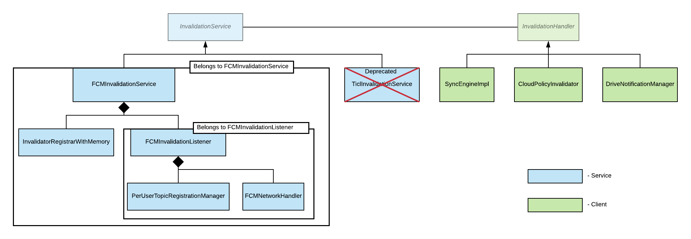

# Invalidations Component

### Introduction
Let's start with an example.  On Chrome OS there exists a concept called
"policy" - one can think of them as dynamic flags that change Chrome's
behaviour.  They are changed on the Admin Panel from where they get propagated
to Chrome OS devices.  There is a scheduled "poll job" that fetches those
policies every N hours, but preferably we would like to have the latest policy
in matter of minutes/seconds.  We could shorten the polling interval to 1
minute, but that would put a very high unnecessary load on the servers.  To
solve this problem we introduce a concept called "invalidation" where the server
notifies the devices when their policy changes and then they fetch the new
policy - note that this way the devices only fetch the policy when needed.

Invalidation Service - the word comes from cache invalidation. Imagine you have
a database which has some objects in it. Cache is just a quick access copy of
those objects. When an object changes in the database so should the copy of that
object in cache.

If we consider the client device as a cache then whenever some object changes in
the server, so should the copy of this object in the client device. All the
invalidation related interaction between client device and server is done
through Invalidation Service.

**Invalidation** (message to invalidate some object) is sent and received using
a publish/subscribe service. We have a couple of those publish/subscribe
services, some of which are Tango - [go/tango](http://go/tango) and Fandango -
[go/fandango](http://go/fandango).

In general the whole thing looks as follows:

***

### InvalidationHandler

**InvalidationHandler** - is a client of InvalidationService (see below).
Everyone who wants to use InvalidationService to receive Invalidation
(notification of change in some object) needs to implement
**InvalidationHandler** to receive those messages. **InvalidationHandler** has
the following methods (the list is not full):

* **OnIncomingInvalidation** - is called from InvalidationService to notify
about incoming Invalidation.

At the end of documentation, one can find the additional material for adding
**InvalidationHandler**.

***

### InvalidationService

Class **InvalidationService** is just an interface which provides the following
methods (the list is not exhaustive).

* **RegisterInvalidationHandler** - allows InvalidationHandler to register
itself as a observer for Invalidations. **InvalidationService** will only
dispatch messages to registered handlers.

* **UpdateRegisteredInvalidationIds** - allows InvalidationHandler to change the
ids of Objects it is interested in receiving Invalidations for.

* **UnregisterInvalidationHandler** - when InvalidationHandler unregisters it
stops receiving Invalidations.

***

### FCMInvalidationService

**FCMInvalidationService** - is the implementation of InvalidationService that
uses [Fandango](http://go/fandango) as its publish/subscribe service.

**FCMInvalidationService** is the main entry point for InvalidationHandler. This
is where InvalidationHandler registers/unregisters itself in
InvalidationService, and registers Objects to invalidate. When a message comes,
**FCMInvalidationService** calls OnIncomingInvalidation for the receiving
InvalidationHandler.

Actually **FCMInvalidationService** just provides the abstraction above for
InvalidationHandler, while in fact it just manages
InvalidatorRegistrarWithMemory and FCMInvalidationListener, who do the actual
work.

***

### InvalidatorRegistrarWithMemory

**InvalidatorRegistrarWithMemory** stores registered InvalidationHandlers,
stores objects to invalidate and stores mapping between objects and
InvalidationHandlers to know which InvalidationHandlers are interested in which
objects. When a message comes from FCMInvalidationListener,
**InvalidatorRegistrarWithMemory** dispatches that message (Invalidation) to the
receiving InvalidationHandler.

***

### FCMInvalidationListener

**FCMInvalidationListener** just gets the list of topics to subscribe from
FCMInvalidationService, and when **FCMInvalidationListener** receives
Invalidations on those topics, it just passes them up to FCMInvalidationService.

And again the description above is just a good abstraction of
**FCMInvalidationListener** for FCMInvalidationService, while in fact
**FCMInvalidationListener** manages PerUserTopicRegistrationManager and
FCMNetworkHandler who do the actual work.

***

### PerUserTopicRegistrationManager

**PerUserTopicRegistrationManager** manages subscriptions to topics. Topics in
this case are objects we are interested in invalidating.

***

### FCMNetworkHandler

**FCMNetworkHandler** is the class responsible for communication via GCM
channel. Provides the following functionality:

* Retrieves the auth token required for the subscription. When this token is
received, it is passed to PerUserTopicRegistrationManager which subscribes to
topics with the given auth token.

* Receives messages from GCM driver and passes them up to
FCMInvalidationListener, where they are converted to Invalidations.

***

### TiclInvalidationService (deprecated)

TiclInvalidationService - is the implementation of InvalidationService that uses
[Tango](http://go/tango) as its publish/subscribe service.

***

## For those who want to add InvalidationHandler

### Public vs. Private topics

FCMInvalidationService has a different registration process for public and
private topics. When registering with a public topic, publish/subscribe service
will fan out all outgoing messages to all devices subscribed to this topic. For
example: If a device subscribes to "DeviceGuestModeEnabled" public topic all
instances subscribed to this topic will receive all outgoing messages addressed
to topic "DeviceGuestModeEnabled". But if 2 devices with different InstanceID
subscribe to private topic "BOOKMARK", they will receive different set of
messages addressed to pair ("BOOKMARK", InstanceID) respectively.

### Project Id

In the UML diagram above there are 3 classes that inherit from
InvalidationHandler:

* SyncEngineImpl

* CloudPolicyInvalidator

* DriveNotificationManager

There is a notion of SenderId which is different for every InvalidationHandler.
SenderId is used when registering to topics, to receive a topic of a particular
sender. So for example server side logic of CloudPolicy posts messages using
SenderId of "1013309121859", and client side logic which is
CloudPolicyInvalidator should register to topics using the SenderId
"1013309121859".

### InvalidationService for profile and for device

Usually InvalidationService is bound to a profile which can be spinned up using
**ProfileInvalidationProviderFactory**, but sometimes there is no profile as in
the special case of CloudPolicyInvalidator. CloudPolicyInvalidator is interested
in receiving Invalidations on policies. Chrome OS team defines 2 types of
policies - User and Device. Device policies should be received even when there
is no one signed in to a Chrome OS device, thus there is no profile. For this
reason there is a special class **AffiliatedInvalidationServiceProvider** which
spawns InvalidationService even when there is no profile.
