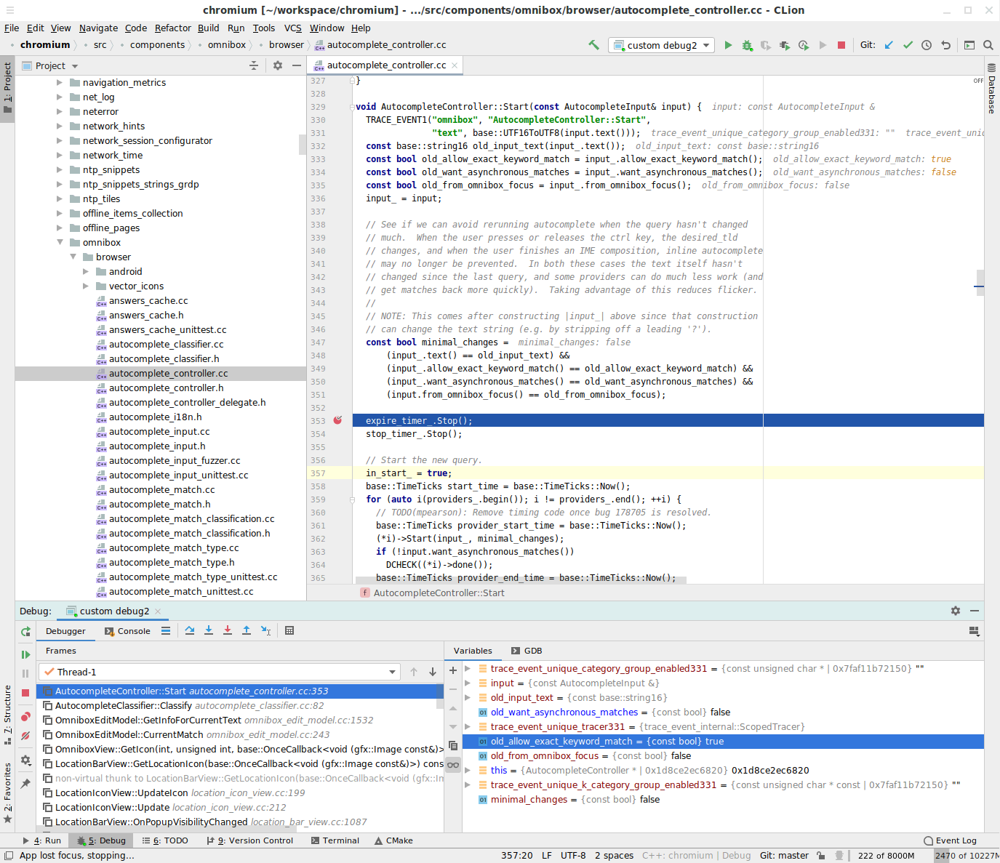

# CLion Dev

CLion is an IDE

Prerequisite:
[Checking out and building the chromium code base](README.md#Checking-Out-and-Building)

[TOC]

## Setting up CLion
1. Install CLion
    - Googlers only: See
      [go/intellij-getting-started](https://goto.google.com/intellij-getting-started)
      for installation and license authentication instructions

1. Run CLion
1. Increase CLion's memory allocation

    This step will help performance with large projects
    1. Option 1
        1. At the startup dialogue, in the bottom right corner, click
           `Configure`
        1. Setup `Edit Custom VM Options`:
            ```
            -Xss2m
            -Xms1g
            -Xmx10g
            ...
            ```
        1. (Optional) Setup `Edit Custom Properties`:
            ```
            idea.max.intellisense.filesize=12500
            ```
    1. Option 2; 2017 and prior versions may not include the options to setup
    your `VM Options` and `Properties` in the `configure` menu. Instead:
        1. `Create New Project`
        1. `Help` > `Edit Custom VM Options`
        1. (Optional) `Help` > `Edit Custom Properties`

## Chromium in CLion
1. Import project
    - At the startup dialog, select `Import Project` and select your `chromium`
      directory; this should be the parent directory to `src`. Selecting `src`
      instead would result in some CLion IDE files appearing in your repository.
1. (Optional) Modify the `CMakeLists.txt` file
    1. Open the `CMakeLists.txt` file
    1. Replace the `include_directories` with the following. This will help
       with navigating between files.
       ```
       include_directories(${CMAKE_CURRENT_SOURCE_DIR}/src)
       ```
    1. (Optional) Replace the `add_executable` files to include a single file.
       Doing this might improve CLion performance. Leaving at least 1 file is
       required in order for CLion to provide code completion, navigation, etc.
       The file should now look like:
       ```
       cmake_minimum_required(VERSION 3.10)
       project(chromium)

       set(CMAKE_CXX_STANDARD 14)

       include_directories(${CMAKE_CURRENT_SOURCE_DIR}/src)

       add_executable(chromium src/components/omnibox/browser/document_provider.cc)
       ```

## Building, Running, and Debugging within CLion
1. Edit the `custom build targets` settings
    1. `ctrl+shift+a` > `custom build targets`
    1. Click the `+` button to create a new target.
    1. Click the `...` button next to the `Build` field
    1. Click the `+` button in the new panel
    1. Configure the fields:
       ```
       Program: <absolute path to depot_tools/ninja>
       Arguments: -C src/out/Default -j 1000 chrome
       ```
    1. (Optional) Repeat for Debug or other build configurations.
1. Create a run configuration
    1. `Run` > `Edit Configurations`
    1. Click `+` in the top left and select `Custom Build Application`
    1. Set the `Target` field to one of the targets configured in step 1
    1. Click 'Select other` option for the `Executable` field and select the
    chrome build e.g. `out/Default/chrome`
    1. (Optional) Repeat for Debug or other build configurations. The built
    targets and executables should match; i.e. don't build `out/Debug `but
    execute `out/Default/chrome`.
1. `Run` > `Run` (`shift+f10`) or `Run` > `Debug` (`shift+f9`) (screenshot)
    

## Optional Steps

### Create terminal cli or desktop entry
To make it easier to startup CLion or open individual files:
1. Open the actions menu (`ctrl+shift+a`)
1. Type `create desktop entry` and press `enter`
1. Open the actions menu and enter `create command-line launcher`

### Mark directories as `Library Files`
To speed up CLion, optionally mark directories such as `src/third_party` as
`Library Files`
1. Open the `Project` navigation (`alt+1`)
1. Select and right click the directories > `Mark directory as` >
   `Library Files`
1. See `https://blog.jetbrains.com/clion/2015/12/mark-dir-as/` for more details
