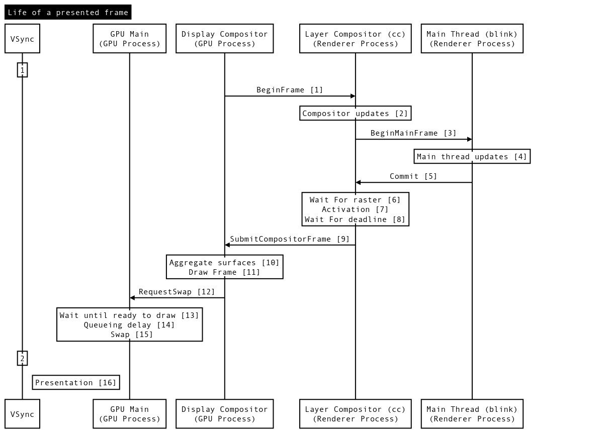

# Life of a frame

[Original google doc](https://docs.google.com/document/d/1y6ZlGc2uH4ZBIrpEVM_wmfHgyvrcQG3LPRzG32FuVkQ/edit?usp=sharing)

[TOC]

## Steps

### `[1]` BeginFrame
BeginImplFrame starts a compositor frame (with each vsync) that will wait up until a deadline for a BeginMainFrame plus activation to complete before it times out and draws any asynchronous animation and scroll/pinch updates.

### `[2]` Compositor updates
All updates on Impl thread such as scrolls and zoom animations.

### `[3]` BeginMainFrame
If there is main thread damage, BeginMainFrame will be sent and if there is no main thread damage steps [3], [4] and [5] will be skipped (SchedulerStateMachine::ShouldSendBeginMainFrame()).

### `[4]` MainThreadUpdates
All updates on main thread such as HandleInputEvents, Animate, StyleUpdate and LayoutUpdate.

### `[5]` Commit
Commits updates back to Impl thread for activation. Specifically, the main thread copies its own version of layertree onto the pending tree (pending_tree_) on the impl thread. The main thread is blocked during the copying process.

### `[6]` Wait for raster
Rasterization may occur asynchronously on separate threads, or even another process (OOP-R, or out-of-process rasterization). If rasterization cannot be finished before the deadline for activation, the pipeline will not perform the copying from pending tree to the active tree in step [7], and will instead proceed to step [8] with whatever is already in the active tree.

### `[7]` Activation
Activation is the process of pushing layer trees and properties from the pending tree to the active tree (active_tree_). Note that Impl thread can also directly manipulate the activate tree to reflect updates the impl thread makes in step [2]. 

### `[8]` Wait for deadline
The deadline for compositor frame submission is provided by the GPU process (Scheduler::BeginImplFrameWithDeadline()).

### `[9]` SubmitCompositorFrame
All activated updates will be submitted to the GPU process as a compositor frame that is produced based on the content of the active tree. If any of the steps [2], [3], [4], [5], [6] takes so long that the update that step is responsible for cannot be delivered to the active tree by deadline, the pipeline will proceed to submit with the existing active tree without said update. This is a possible source of a dropped frame.

### `[10]` AggregateSurfaces
After each client submitted CompositorFrame (or signalled that it DidNotProduceFrame) the Display Compositor can proceed with the draw. Note that if the DisplayScheduler hits a deadline it will still draw if any client has submitted a new CompositorFrame, even if it's still waiting on a response for other clients. Before the actual draw could happen SurfaceAggregator will recursively walk over compositor frames and replace SurfaceQuads (quads produced by SurfaceLayer) with contents of the embedded compositor frame. This step produces single CompositorFrame in the end that can be drawn by the Display Compositor.

### `[11]` Draw Frame
During draw Display Compositor will go over quads and render passes in the aggregated compositor frame and produce draw commands. For GLRenderer it's gl calls recorded by InProcessCommandBuffer and for SkiaRenderer it's recording of Deferred Display Lists (DDL).

### `[12]` RequestSwap
After commands were recorded they will be submitted to the GPU thread to replay along with SwapBuffers request to show the result on screen.

### `[13]` Wait until ready to draw
When the draw was submitted to GPU Main Thread some of the resources may be not ready yet. Chrome uses SyncTokens to ensure this type of synchronization. GPU Task submitted at step [12] won't be scheduled until all associated SyncTokens will be signaled.

### `[14]` Queueing delay
GPU Main Thread does all the GPU work and by the time display compositor is ready to draw it might still be busy doing other tasks (e.g raster for next frame). gpu::Scheduler uses cooperative multi-tasking and can't preempt the current task unless it yields, so the task submitted by the display compositor might have to wait until the current task (and potentially some other high priority tasks) are finished.

### `[15]` GPU draw
Finally tasks that DisplayCompositor posted to GPU Main thread executed and we replay draw commands recorded during Draw Frame [11]. For GLRenderer InProcessCommand buffer will be issuing recorded GL calls, for SkiaRenderer Skia will be replaying DDLs and issue commands to the GPU. This step is when we finally submit the job to the GPU (not GPU thread on CPU).

### `[16]` Swap
The GPU work has been submitted and we signal that we want to present the result (Submits commands to request displaying framebuffer and/or overlays after drawing new content into them). Depending on the platform this step can be blocking or not and take a substantial amount of time (eg. if we have too many queued swaps sometimes this will just block until the next vblank).

### `[17]` Presentation
This is when the GPU has finished all the work and the display controller started scanning out the results. The pixels are finally visible on the screen. Depending on the platform, before this could happen the system compositor might need to do its work. Unfortunately it's not possible to get the exact timestamp on every platform and Chrome makes best efforts to estimate it. This estimation can be something like the swap time (on mac where we don't have any better information), the completion time for work on the GPU aligned to the next vblank as a good estimate, or a signal from the OS with the exact time the content was displayed.
