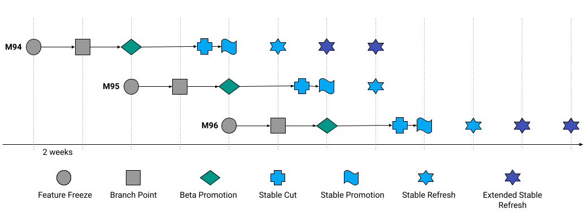
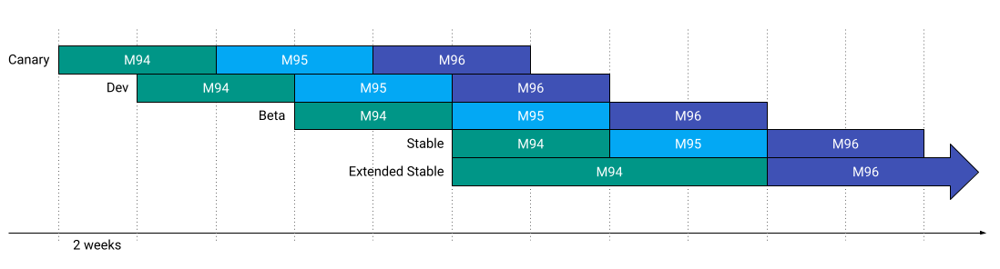
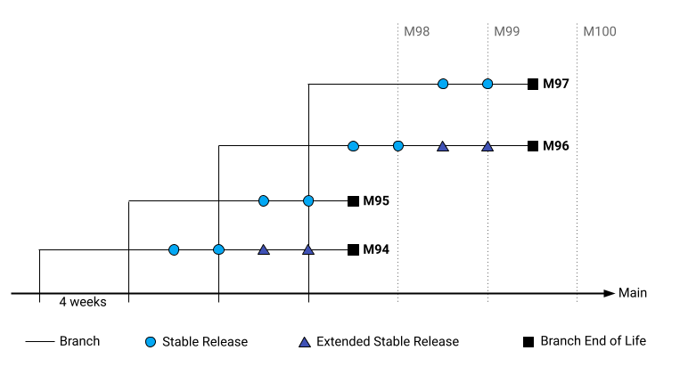

# Chrome Release Cycle

[TOC]

## Overview

Chrome ships a new milestone (major version) to the stable channel every four
weeks. The new milestone is developed on main for four weeks (beginning on
branch point for the previous milestone) before the milestone's branch is cut,
which is then stabilized for six weeks before being shipped to stable.

Chrome also maintains every other milestone branch for four additional weeks by
backporting important security fixes to create an extended stable channel,
where a new milestone is shipped every eight weeks. During the first four
weeks of this milestone, both stable and extended stable are shipped identical
releases; see the [channel lifecycle](#channel-lifecycle) to learn more.
The extended stable channel is only available to enterprises, who can enable it
via enterprise policies.

Biweekly updates (called refreshes) are shipped to both the stable and extended
stable channels to deploy security fixes and keep Chrome's
[patch gap](https://groups.google.com/a/chromium.org/g/security-dev/c/fbiuFbW07vI)
short. Selected regression fixes may also be included in stable channel
refreshes, but not extended stable refreshes.

## Release Cycle
The diagram below shows when our different development checkpoints occur as a
milestone proceeds through our release cycle:

* The primary development span (four weeks) of each milestone is not depicted
  above, though it is visible in the [channel lifecycle](#channel-lifecycle)
  below.
* You can find specific dates for each milestone's development checkpoints on
  our [release calendar](https://chromiumdash.appspot.com/schedule).
* Some dates will vary between different platforms; see the release calendar
  for specifics dates for each platform.
* Feature freeze and branch point dates are fixed, but release dates are
  subject to change based on a variety of factors (e.g. late-breaking
  regressions).
* Release dates are adjusted to avoid shipping new milestones to stable around
  major holidays to ensure proper coverage if issues arise. These adjustments
  are already depicted in our release schedule.

### Feature Freeze

All new features planned to launch in this milestone should be code complete
(all primary functionality implemented) by feature freeze. Features which are
not code complete by feature freeze should be punted to the following
milestone.

### Branch Point

The branch generated by the daily canary created at branch point is
designated as the milestone branch, which is then stabilized over the following
six weeks. All strings should be landed by branch point, and all beta blocking
bugs should be addressed as well.

Please consider [these guidelines](../release_branch_guidance.md) when landing
code around branch point.

### Beta Promotion

After two weeks of stabilization, the new milestone is shipped to the beta
channel for the first time. A new build is shipped to beta each following
week for three additional weeks so that the release spends four weeks total in
the beta channel.

### Stable Cut

Stable cut is the day that our stable release candidate build will be
generated. This build is then shipped to beta to gather user feedback for one
week. Any changes that land after stable cut may or may not be included in the
stable release, and thus all stable blocking issues must be fixed by stable
cut.

### Stable Promotion

After four weeks in the beta channel, the new milestone is shipped to the
stable channel for the first time. The rollout is staged over time so that any
early issues that arise can be addressed before they reach all users. The new
release generally reaches all users within one to two weeks unless major issues
arise that cannot be addressed quickly.

### Stable Refresh

The stable and extended stable channels are refreshed every two weeks. These
refreshes typically contain important security fixes as well as any urgent
regression fixes that may be available at the discretion of the release team.

## Channel Lifecycle

The diagram below shows how different milestones proceed through Chrome's
different release channels:

* As noted above, both stable and extended stable ship the same versions for
  the first four weeks of life, after which the two diverge.
* There is no extended beta channel; instead, the standard four week beta cycle
  is used to stabilize both stable and extended stable. Enterprises
  who choose to opt into the eight week extended stable should continue to run
  the beta channel as they do today in order to proactively identify issues
  that may impact their environments.

## Milestone Branch Support

The diagram below shows the lifespan of each milestone branch:

While a milestone branch is active, branch infrastructure (e.g. branch CQ) will
be kept active, and important security fixes will be considered for backport.
An endpoint which describes currently active branches and their respective
channels is under consideration, and if built will be available ahead of launch
of the new extended stable channel and the four week release cycle.
