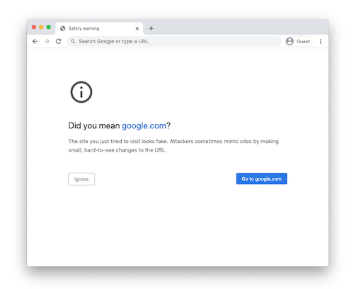
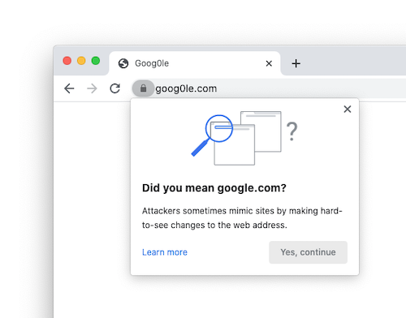

# "Lookalike" Warnings in Google Chrome

"Lookalike" domains are domains that are crafted to impersonate the URLs of
other sites in order to trick users into believing they're on a different site.
These domains are used in social engineering attacks, from phishing to retail
fraud.

In addition to [Google Safe Browsing](https://safebrowsing.google.com/)
protections, Chrome attempts to detect these lookalike domains using a number of
on-device heuristics. These heuristics compare the visited URL against domains
that the user has visited previously and other popular domains.

When Chrome detects a potential lookalike domain, it may block the page and show
a full-page warning, or it may show a warning overlay, depending on how certain
Chrome is that the site is a spoof. These warnings typically have a "Did you
mean ...?" message.

| High-confidence warnings               | Low-confidence warning        |
|:--------------------------------------:|:-----------------------------:|
|  |  |

## Examples of lookalike domains

Chrome's heuristics are designed to detect spoofing techniques in the wild. Some
example "lookalike" patterns include:

 * Domains that are a small edit-distance away from other domains, such as
   `goog0le.com`.
 * Domains that embed other domain names within their own hostname, such as
   `google.com.example.com`.
 * Domains that use IDN
   [homographs](https://chromium.googlesource.com/chromium/src/+/master/docs/idn.md),
   such as `goögle.com`.

This list is not exhaustive, and developers are encouraged to avoid using
domains that users without technical backgrounds may confuse for another site.

## Heuristics are imperfect

Like all heuristics, Chrome's heuristics are not always right. For instance,
attackers can choose lookalike domains that Chrome is unable to detect. Our
intent with Chrome's lookalike heuristics is not to make spoofing impossible,
but to force attackers to use less convincing lookalikes, allowing users to
notice spoofs more easily.

In addition to not catching all spoofs, Chrome's heuristics also label some
benign pages as lookalikes. We have several approaches to minimize these
mistakes:

 * Heuristics are tuned to minimize warnings on legitimate pages.
 * Users are never prohibited from visiting the site requested, and the warnings
   shown are designed to be helpful and informative, rather than scary.
 * We monitor what sites trigger the most warnings on a regular basis, and
   disable warnings on identified false positives.
 * For domains used internally, we provide an [Enterprise
   Policy](https://cloud.google.com/docs/chrome-enterprise/policies/?policy=LookalikeWarningAllowlistDomains)
   allowing businesses to selectively disable these warnings as needed for their
   users.
 * For several months following the roll-out of new heuristics, we accept
   appeals from site operators whose sites have been incorrectly flagged.
 * Heuristics launching in M88 or later will trigger a console message informing
   site owners of the issue for at least one release prior to triggering
   user-visible warnings.

## Appealing a Lookalike Warning

If you operate a site that erroneously triggers lookalike warnings in Chrome,
you can ask for a manual appeal. These appeals are evaluated manually, and we
can suppress the warning for all Chrome users when necessary.

In the case of compelling spoofs, we may ask you to demonstrate that you not
only own the site on which the warning is shown, but the site that Chrome
believes that your site is spoofing. We may also decline to suppress the warning
if the domain is only used internally (i.e. no external users are impacted).

Appeals for domains triggered by a given heuristic are generally considered for
the 6 months following the release of that heuristic. These six months are
designed to allow Chrome to detect most existing sites that trigger the
heuristic erroneously. After that time, we encourage developers to test their
new sites in Chrome to ensure that their new domain does not trigger warnings.

If you are a site operator and would like to request an appeal, please fill out
a
[request](https://bugs.chromium.org/p/chromium/issues/entry?template=Safety+Tips+Appeals).
