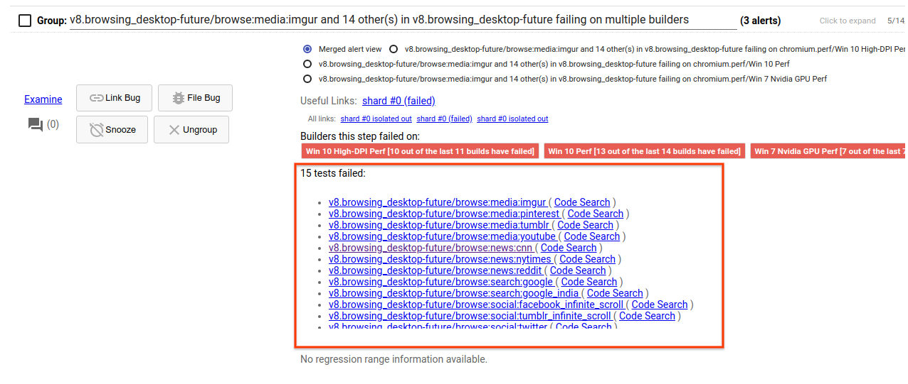
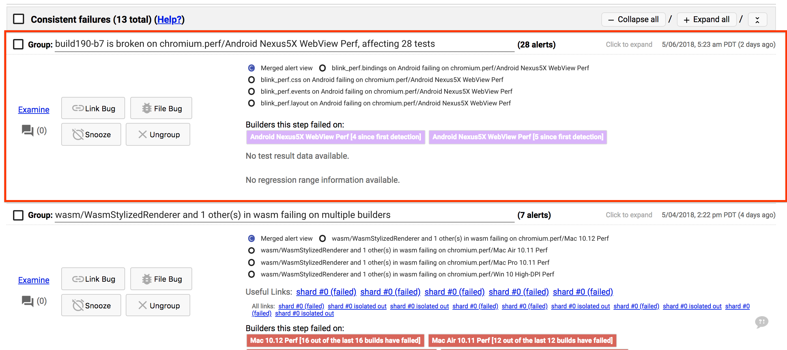
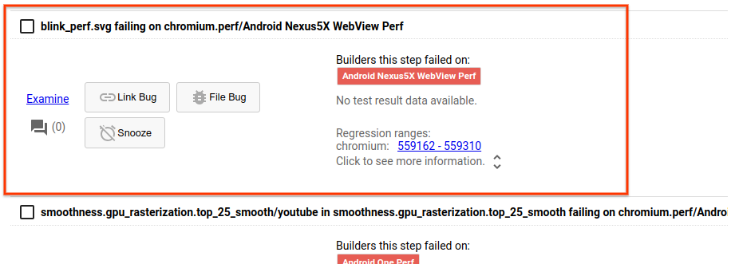

# How to handle an alert for a new problem

**Warning: this is the hardest part of being a sheriff.**

Each bug may take 10 minutes to an hour to address, but there are usually a manageable number of new bugs per shift (5 on a good shift, 15 on a bad one).

[TOC]

## High-level steps

1. Identify what type of failure the alert represents.

2. File a bug to track the failure with sufficient details to help the correct owner to fix the failure.

3. If possible, take some action to resolve the failure. If not, escalate the failure.

For more specifics, see the playbook below.

## Playbook for common scenarios

Note that this list is not at all comprehensive. If you encounter an alert that you're unsure how to handle, escalate the issue by asking [on chat](https://hangouts.google.com/group/80kY8Glh1AqcbQP92).

### One or more stories are failing

**How to recognize: **Usually, Sheriff-o-matic will automatically recognize the story failures and will list them explicitly in the dashboard. For example:

Sheriff-o-matic may occasionally fail to recognize a benchmark failure is due to story failures: because of this, it's worth double-checking [the test logs](https://chromium.googlesource.com/chromium/src/+/main/docs/speed/bot_health_sheriffing/how_to_access_test_logs.md#getting-a-list-of-stories-that-failed) for a general benchmark failure to verify that it's not due to a story failure.

**What action to take: **File a P1 bug, CCing the benchmark owner(s) (found [here](https://docs.google.com/spreadsheets/d/1xaAo0_SU3iDfGdqDJZX_jRV0QtkufwHUKH3kQKF3YQs/edit#gid=0)).

Add to the bug:

* A link to the failing test's log

* [Any relevant failure stack trace](https://chromium.googlesource.com/chromium/src/+/main/docs/speed/bot_health_sheriffing/how_to_access_test_logs.md#identifying-why-a-story-failed)

* The revision range at which the story started failing (most easily found [through the flakiness dashboard](https://chromium.googlesource.com/chromium/src/+/main/docs/speed/bot_health_sheriffing/what_test_is_failing.md))

Once the bug is filed, [disable the failing story](https://chromium.googlesource.com/chromium/src/+/main/docs/speed/bot_health_sheriffing/how_to_disable_a_story.md) and [launch a bisect over the revision range of the breakage](https://chromium.googlesource.com/chromium/src/+/main/docs/speed/bot_health_sheriffing/how_to_launch_a_functional_bisect.md), and snooze the alert for 24h to give the bisect time to finish. Once the story is disabled, lower its priority to P2 and assign the bug to the benchmark owner.

**[Canonical example](https://bugs.cromium.org/p/chromium/issues/detail?id=809063)**

### A bot is down

**How to recognize: **Sheriff-o-matic will surface an alert similar to "build29-m1 is broken on chromium.perf/Android Nexus5X WebView Perf, affecting 28 tests". Any boxes around links in the alert will be purple, indicating an infrastructure failure. For example:

**What action to take: **File a P1 bug and add the Infra>Labs component. For this type of bug, there's no need to CC the benchmark owner.

Add to the bug:

* The bot ID of the bot that's down (e.g. "build29-m1")

* A clear request to Infra > Labs (e.g. "Labs team, could you please take a look at this bot to see why tests aren't running?")

Once the bug is filed, [snooze the alert](https://chromium.googlesource.com/chromium/src/+/main/docs/speed/bot_health_sheriffing/how_to_snooze_an_alert.md) for 24 hours.

Sometimes, Infra>Labs may request additional help in debugging the problem. For example, they may notice that this bot repeatedly goes down and may ask for your help in figuring out why. If this happens and you're unsure what next step to take, reach out for help [on chat](https://hangouts.google.com/group/80kY8Glh1AqcbQP92).

**[Canonical example](https://bugs.chromium.org/p/chromium/issues/detail?id=821562)**

### A bot is unreachable

**How to recognize: **Sheriff-o-matic will surface an alert like "system_health.common_mobile is broken". When you open the test logs for the failing benchmark, they'll contain a message like "`DeviceUnreachableError: ZX1G422HK6`".

**What action to take: **Take the same actions as "A bot is down", but include in the bug an excerpt of the test logs indicating the failure.

**[Canonical example](https://bugs.chromium.org/p/chromium/issues/detail?id=739715)**

### Benchmark harness failure

**How to recognize: **Sheriff-o-matic will indicate that an entire benchmark is failing (i.e. no story failures will be listed). [The logs](https://chromium.googlesource.com/chromium/src/+/main/docs/speed/bot_health_sheriffing/how_to_access_test_logs.md) will contain a failure that's not attributable to any particular story. For example:

**What action to take: **File a P1 bug and add the Speed > Benchmarks component. If the failure is limited in scope to a single or a few benchmarks, CC the benchmark owner(s) (found [here](https://docs.google.com/spreadsheets/d/1xaAo0_SU3iDfGdqDJZX_jRV0QtkufwHUKH3kQKF3YQs/edit#gid=0)). If the failure is more widespread, there's no need to CC the benchmark owners.

Add to the bug:

* A link to the failing test's log

* [Any relevant failure stack trace](https://chromium.googlesource.com/chromium/src/+/main/docs/speed/bot_health_sheriffing/how_to_access_test_logs.md#identifying-why-a-story-failed)

* The revision range at which the story started failing. Because entire benchmark failures don't appear in the flakiness dashboard, you'll have to manually skim recent test run logs to identify when the failure started.

