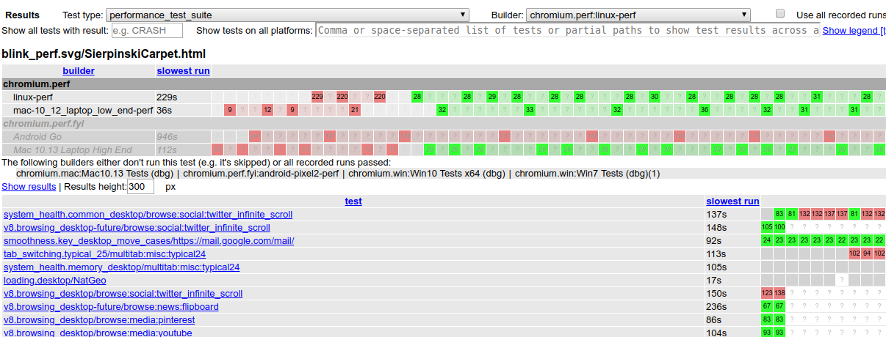

# How to determine what story is failing

**Important**: When making changes to this document, also update duplicate files under the [internal docs](http://goto.google.com/perf-bot-health-sheriffs).

The first step in addressing a test failure is to identify what stories are failing.

The easiest way to identify these is to use the [Flakiness dashboard](https://test-results.appspot.com/dashboards/flakiness_dashboard.html#testType=blink_perf.layout), which is a high-level dashboard showing test passes and failures. (Sheriff-o-matic tries to automatically identify the failing stories, but is often incorrect and therefore can't be trusted.) Open up the flakiness dashboard and select the benchmark and platform in question (pulled from the SOM alert) from the "Test type" and "Builder" dropdowns. You should see a view like this:

If the bot is running the new performance_test_suite than all stories will be
listed under test type 'performance_test_suite' and the associated builder.

Each row represents a particular story and each column represents a recent run, listed with the most recent run on the left. If the cell is green, then the story passed; if it's red, then it failed. Only stories that have failed at least once will be listed. You can click on a particular cell to see more information like revision ranges (useful for launching bisects) and logs.

With this view, you can easily see how often a given story is failing. Usually, any story that appears to be failing in over 20% of recent runs should be disabled.

You can also show older runs by clicking the "Use all recorded runs" checkbox, which can be useful if a test has been failing for a long time.

