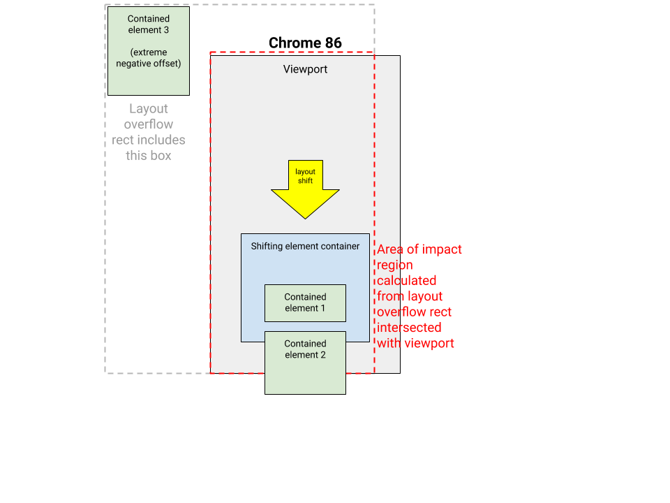
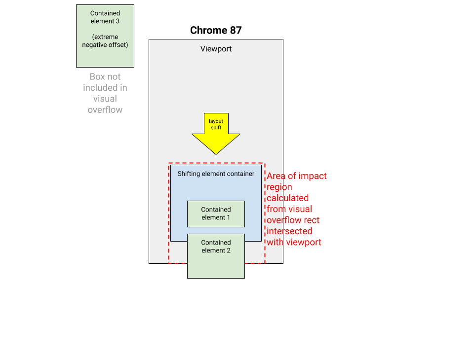

# Cumulative Layout Shift Changes in Chrome 87

## Changes in Chrome 87

In Chrome 86, a [problem was introduced](2020_10_cls.md) to the way the area of
the [impact fraction](https://web.dev/cls/#impact-fraction) is calculated
for layout shifts of nodes containing positioned content that overflows to the
other side of the viewport. In Chrome 87, the problem is fixed by using visual
rects to calculate the impact area instead of layout overflow rects (source code
for the change
[here](https://chromium-review.googlesource.com/c/chromium/src/+/2503330)).

Before change | After
------------- | -----
 | 

## How does this affect a site's metrics?

Sites which showed this regression in Chrome 86 should return to accurate layout
shift scores in Chrome 87.

## When were users affected?

Most users will be updated to Chrome 87 the week of November 17, 2020.
