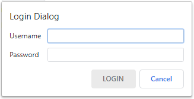

# Example: Creating a Simple Login Dialog

[TOC]

## Introduction

The goal of this example is to get you familiar with the basics of the Views
framework and things to watch out for when developing with Views.

We will be creating the following UI:




## Setting up files

To create this simple dialog, you would need to add the following files:

`login_bubble_dialog_example.h`

``` cpp
// Copyright 2020 The Chromium Authors. All rights reserved.
// Use of this source code is governed by a BSD-style license that can be
// found in the LICENSE file.

#ifndef LOGIN_BUBBLE_DIALOG_EXAMPLE_H_
#define LOGIN_BUBBLE_DIALOG_EXAMPLE_H_

#include "ui/views/bubble/bubble_border.h"
#include "ui/views/bubble/bubble_dialog_delegate_view.h"

class LoginBubbleDialogView : public views::BubbleDialogDelegateView {
 public:
  static void Show(views::View* anchor_view,
                   views::BubbleBorder::Arrow anchor_position);

  ~LoginBubbleDialogView() override;

 private:
  LoginBubbleDialogView(views::View* anchor_view,
                        views::BubbleBorder::Arrow anchor_position);
};

#endif  // LOGIN_BUBBLE_DIALOG_EXAMPLE_H_
```


`login_bubble_dialog_example.cc`

``` cpp
// Copyright 2020 The Chromium Authors. All rights reserved.
// Use of this source code is governed by a BSD-style license that can be
// found in the LICENSE file.

#include "login_bubble_dialog_example.h"

#include "ui/views/border.h"

// static
void LoginBubbleDialogView::Show(views::View* anchor_view,
                                 views::BubbleBorder::Arrow anchor_position) {
  BubbleDialogDelegateView::CreateBubble(
      new LoginBubbleDialogView(anchor_view, anchor_position))
      ->Show();
}

LoginBubbleDialogView::~LoginBubbleDialogView() = default;

LoginBubbleDialogView::LoginBubbleDialogView(
    views::View* anchor_view,
    views::BubbleBorder::Arrow anchor_position)
    : BubbleDialogDelegateView(anchor_view, anchor_position) {}
```

Make sure to add these files to the relevant build file of your project.

Calling `Show()` will create a simple dialog with OK and Cancel buttons and a
window close button. These UI elements are provided by default by the
`BubbleDialogDelegateView`.


## Creating the layout

To populate the login dialog, we first create a [`LayoutManager`](https://source.chromium.org/chromium/chromium/src/+/master:ui/views/layout/layout_manager.h) in the
dialog’s constructor.


`login_bubble_dialog_example.cc`


``` cpp
LoginBubbleDialogView::LoginBubbleDialogView(
    views::View* anchor_view,
    views::BubbleBorder::Arrow anchor_position)
    : BubbleDialogDelegateView(anchor_view, anchor_position) {
  ...
 const LayoutProvider* provider = LayoutProvider::Get();
  set_margins(
      provider->GetDialogInsetsForContentType(views::CONTROL, views::CONTROL));
  const int related_control_padding =
      provider->GetDistanceMetric(views::DISTANCE_RELATED_CONTROL_VERTICAL);
  const int label_padding =
      provider->GetDistanceMetric(views::DISTANCE_RELATED_LABEL_HORIZONTAL);

  GridLayout* layout = SetLayoutManager(std::make_unique<GridLayout>());
  ColumnSet* column_set = layout->AddColumnSet(0);
  column_set->AddColumn(GridLayout::LEADING, GridLayout::FILL,
                        GridLayout::kFixedSize, GridLayout::USE_PREF, 0, 0);
  column_set->AddPaddingColumn(0, label_padding);
  column_set->AddColumn(GridLayout::FILL, GridLayout::FILL, 1.0,
                        GridLayout::USE_PREF, 0, 0);
}
```


This creates a 2x2 [`GridLayout`](https://source.chromium.org/chromium/chromium/src/+/master:ui/views/layout/grid_layout.h)
with horizontal padding specified by the layout constant
`DISTANCE_RELATED_LABEL_HORIZONTAL`. The first column will hold the form’s
[`Label`](https://source.chromium.org/chromium/chromium/src/+/master:ui/views/controls/label.h)s and the second will hold the
[`Textfield`](https://source.chromium.org/chromium/chromium/src/+/master:ui/views/controls/textfield/textfield.h)s for user input.

To help with adding rows to the `GridLayout`, add the following scoped helper
and relevant headers.


`login_bubble_dialog_example.cc`

``` cpp
#include "base/strings/string16.h"
#include "ui/views/controls/label.h"
#include "ui/views/layout/grid_layout.h"
#include "ui/views/layout/layout_provider.h"
...
namespace {

// Adds a label textfield pair to the login dialog's layout.
views::Textfield* AddFormRow(views::GridLayout* layout,
                             const base::string16& label_text) {
  layout->StartRow(0, 0);
  views::Label* label =
      layout->AddView(std::make_unique<views::Label>(label_text));
  views::Textfield* textfield =
      layout->AddView(std::make_unique<views::Textfield>());
  textfield->SetAssociatedLabel(label);
  constexpr int kDefaultTextfieldWidth = 30;
  constexpr int kMinimumTextfieldWidth = 5;
  textfield->SetDefaultWidthInChars(kDefaultTextfieldWidth);
  textfield->SetMinimumWidthInChars(kMinimumTextfieldWidth);
  return textfield;
}

}  // namespace
...
```

This creates a new [`GridLayout`](https://source.chromium.org/chromium/chromium/src/+/master:ui/views/layout/grid_layout.h)
row for a given field in our form. The call to
[`SetAssociatedLabel()`](https://source.chromium.org/chromium/chromium/src/+/master:ui/views/controls/textfield/textfield.h;l=250;drc=291180454e079aa5c3677dc3f3eaf619a1cf1d42)
sets the accessible label relationship between the
[`Label`](https://source.chromium.org/chromium/chromium/src/+/master:ui/views/controls/label.h) and the [`Textfield`](https://source.chromium.org/chromium/chromium/src/+/master:ui/views/controls/textfield/textfield.h)
and copies the `Label`’s accessible name to the `Textfield`.


## Dealing with localized text

Next we need to create localized text constants for the bubble dialog title,
button label, username and password.
[UI Localization document](https://www.chromium.org/developers/design-documents/ui-localization)
will guide you on how to create these string constants.

Create the following string constants:

* `IDS_LOGIN_DIALOG_TITLE`
* `IDS_LOGIN_DIALOG_OK_BUTTON_LABEL`
* `IDS_LOGIN_DIALOG_USERNAME_ACCESSIBLE_NAME`
* `IDS_LOGIN_DIALOG_PASSWORD_ACCESSIBLE_NAME`

Add the following to the bubble dialog header and implementation files.


`login_bubble_dialog_example.h`


``` cpp
#include "ui/views/controls/textfield/textfield.h"
...
class LoginBubbleDialogView : public views::BubbleDialogDelegateView {
  ...
 private:
  ...
  views::Textfield* username_ = nullptr;
  views::Textfield* password_ = nullptr;
};
```


`login_bubble_dialog_example.cc`


``` cpp
#include "ui/base/l10n/l10n_util.h"
...
LoginBubbleDialogView::LoginBubbleDialogView(
    views::View* anchor_view,
    views::BubbleBorder::Arrow anchor_position)
    : BubbleDialogDelegateView(anchor_view, anchor_position) {
  ...
  SetTitle(l10n_util::GetStringUTF16(IDS_LOGIN_DIALOG_TITLE));
  SetButtonLabel(ui::DIALOG_BUTTON_OK, l10n_util::GetStringUTF16(
      IDS_STARTER_DIALOG_OK_BUTTON_LABEL));
  ...
  username_ = AddFormRow(layout, l10n_util::GetStringUTF16(
      IDS_LOGIN_DIALOG_USERNAME_ACCESSIBLE_NAME));

  layout->AddPaddingRow(0, related_control_padding);

  password_ = AddFormRow(layout, l10n_util::GetStringUTF16(
      IDS_LOGIN_DIALOG_PASSWORD_ACCESSIBLE_NAME));
  password_->SetTextInputType(ui::TEXT_INPUT_TYPE_PASSWORD);
}
```


This adds the username and password fields to the form and sets the username
with default focus.


## Handling user input

To respond to a click on the login button, we define a callback that gets
passed in by the caller. Update the code as follows.


`login_bubble_dialog_example.h`


``` cpp
#include "base/strings/string16.h"
...
class LoginBubbleDialogView : public views::BubbleDialogDelegateView {
 public:
  using OnSubmitCallback = base::OnceCallback<void(base::string16 username,
                                                   base::string16 password)>;

  static void Show(View* anchor_view,
                   BubbleBorder::Arrow anchor_position,
                   OnSubmitCallback accept_callback);
  ...

 private:
 LoginBubbleDialogView(View* anchor_view,
                        BubbleBorder::Arrow anchor_position,
                        OnSubmitCallback accept_callback);
...
}
```


`login_bubble_dialog_example.cc`


``` cpp
#include "base/bind.h"
#include "base/callback_forward.h"
...
// static
void LoginBubbleDialogView::Show(View* anchor_view,
                                 BubbleBorder::Arrow anchor_position,
                                 OnSubmitCallback accept_callback) {
  BubbleDialogDelegateView::CreateBubble(
      new LoginBubbleDialogView(anchor_view, anchor_position,
                                std::move(accept_callback)))
      ->Show();
}
...

LoginBubbleDialogView::LoginBubbleDialogView(
    View* anchor_view,
    BubbleBorder::Arrow anchor_position,
    OnSubmitCallback accept_callback)
    : BubbleDialogDelegateView(anchor_view, anchor_position) {
  ...
  const auto on_submit = [](const LoginBubbleDialogView* bubble_view,
                            OnSubmitCallback accept_callback) {
    std::move(accept_callback)
        .Run(bubble_view->username_->GetText(),
             bubble_view->password_->GetText());
  };
  SetAcceptCallback(base::BindOnce(on_submit, base::Unretained(this),
                                   std::move(accept_callback)));
  ...
}
```

Now the dialog will call the `accept_callback` after the login button has been
clicked before the dialog closes.


## Form validation & dialog updates

Next we want to disable the bubble dialog’s login button until both the
username and password fields have been populated.

We achieve this by having the `LoginBubbleDialogView` inherit from
[`TextfieldController`](https://source.chromium.org/chromium/chromium/src/+/master:ui/views/controls/textfield/textfield_controller.h),
and on each [`Textfield`](https://source.chromium.org/chromium/chromium/src/+/master:ui/views/controls/textfield/textfield.h)
update it checks to make sure that both fields are populated before enabling
the login button.

Modify the code as follows:


`login_bubble_dialog_example.h`


``` cpp
#include "ui/views/controls/textfield/textfield_controller.h"
...
class LoginBubbleDialogView : public views::BubbleDialogDelegateView,
                              public views::TextfieldController {
 public:
  ...
  // TextfieldController:
  void ContentsChanged(Textfield* sender,
                       const base::string16& new_contents) override;
  ...
};
```


`login_bubble_dialog_example.cc`


``` cpp
views::Textfield* AddFormRow(LoginBubbleDialogView* bubble,
                             views::GridLayout* layout,
                             const base::string16& label_text) {
  ...
  textfield->set_controller(bubble);
  return textfield;
}
...

void LoginBubbleDialogView::ContentsChanged(
    views::Textfield* sender,
    const base::string16& new_contents) {
  SetButtonEnabled(ui::DIALOG_BUTTON_OK, !username_->GetText().empty() &&
                                             !password_->GetText().empty());
  DialogModelChanged();
}

LoginBubbleDialogView::LoginBubbleDialogView(
    views::View* anchor_view,
    views::BubbleBorder::Arrow anchor_position,
    LoginBubbleDialogController* controller)
    : BubbleDialogDelegateView(anchor_view, anchor_position),
      controller_(controller) {
  SetButtonEnabled(ui::DIALOG_BUTTON_OK, false);
  ...
  username_ = AddFormRow(
      this, layout,
      l10n_util::GetStringUTF16(IDS_LOGIN_DIALOG_USERNAME_ACCESSIBLE_NAME));

  layout->AddPaddingRow(0, related_control_padding);

  password_ = AddFormRow(
      this, layout,
      l10n_util::GetStringUTF16(IDS_LOGIN_DIALOG_PASSWORD_ACCESSIBLE_NAME));
  password_->SetTextInputType(ui::TEXT_INPUT_TYPE_PASSWORD);
}
```


## Result

The final code should resemble the following:


`login_bubble_dialog_example.h`


```
// Copyright 2020 The Chromium Authors. All rights reserved.
// Use of this source code is governed by a BSD-style license that can be
// found in the LICENSE file.

#ifndef LOGIN_BUBBLE_DIALOG_EXAMPLE_H_
#define LOGIN_BUBBLE_DIALOG_EXAMPLE_H_

#include "base/strings/string16.h"
#include "ui/views/bubble/bubble_border.h"
#include "ui/views/bubble/bubble_dialog_delegate_view.h"
#include "ui/views/controls/textfield/textfield.h"
#include "ui/views/controls/textfield/textfield_controller.h"

class LoginBubbleDialogView : public BubbleDialogDelegateView,
                              public TextfieldController {
 public:
  using OnSubmitCallback = base::OnceCallback<void(base::string16 username,
                                                   base::string16 password)>;

  static void Show(View* anchor_view,
                   BubbleBorder::Arrow anchor_position,
                   OnSubmitCallback accept_callback);

  ~LoginBubbleDialogView() override;

  // TextfieldController:
  void ContentsChanged(Textfield* sender,
                       const base::string16& new_contents) override;

 private:
  LoginBubbleDialogView(View* anchor_view,
                        BubbleBorder::Arrow anchor_position,
                        OnSubmitCallback accept_callback);

  Textfield* username_ = nullptr;
  Textfield* password_ = nullptr;
};

#endif  // LOGIN_BUBBLE_DIALOG_EXAMPLE_H_
```


`login_bubble_dialog_example.cc`


```
// Copyright 2020 The Chromium Authors. All rights reserved.
// Use of this source code is governed by a BSD-style license that can be
// found in the LICENSE file.

#include "login_bubble_dialog_example.h"

#include "base/bind.h"
#include "base/callback_forward.h"
#include "base/strings/string16.h"
#include "ui/base/l10n/l10n_util.h"
#include "ui/views/border.h"
#include "ui/views/controls/label.h"
#include "ui/views/layout/grid_layout.h"
#include "ui/views/layout/layout_provider.h"

namespace {

// Adds a label textfield pair to the login dialog's layout.
Textfield* AddFormRow(LoginBubbleDialogView* bubble,
                      GridLayout* layout,
                      const base::string16& label_text) {
  layout->StartRow(0, 0);
  Label* label = layout->AddView(std::make_unique<Label>(label_text));
  Textfield* textfield = layout->AddView(std::make_unique<Textfield>());
  textfield->SetAssociatedLabel(label);
  textfield->set_controller(bubble);
  constexpr int kDefaultTextfieldWidth = 30;
  constexpr int kMinimumTextfieldWidth = 5;
  textfield->SetDefaultWidthInChars(kDefaultTextfieldWidth);
  textfield->SetMinimumWidthInChars(kMinimumTextfieldWidth);
  return textfield;
}

}  // namespace

// static
void LoginBubbleDialogView::Show(View* anchor_view,
                                 BubbleBorder::Arrow anchor_position,
                                 OnSubmitCallback accept_callback) {
  BubbleDialogDelegateView::CreateBubble(
      new LoginBubbleDialogView(anchor_view, anchor_position,
                                std::move(accept_callback)))
      ->Show();
}

LoginBubbleDialogView::~LoginBubbleDialogView() = default;

void LoginBubbleDialogView::ContentsChanged(
    Textfield* sender,
    const base::string16& new_contents) {
  SetButtonEnabled(ui::DIALOG_BUTTON_OK, !username_->GetText().empty() &&
                                             !password_->GetText().empty());
  DialogModelChanged();
}

LoginBubbleDialogView::LoginBubbleDialogView(
    View* anchor_view,
    BubbleBorder::Arrow anchor_position,
    OnSubmitCallback accept_callback)
    : BubbleDialogDelegateView(anchor_view, anchor_position) {
  SetButtonEnabled(ui::DIALOG_BUTTON_OK, false);

  const auto on_submit = [](const LoginBubbleDialogView* bubble_view,
                            OnSubmitCallback accept_callback) {
    std::move(accept_callback)
        .Run(bubble_view->username_->GetText(),
             bubble_view->password_->GetText());
  };
  SetAcceptCallback(base::BindOnce(on_submit, base::Unretained(this),
                                   std::move(accept_callback)));

  SetTitle(l10n_util::GetStringUTF16(IDS_EXAMPLE_LOGIN_DIALOG_TITLE));
  SetButtonLabel(
      ui::DIALOG_BUTTON_OK,
      l10n_util::GetStringUTF16(IDS_EXAMPLE_LOGIN_DIALOG_OK_BUTTON_LABEL));

  const LayoutProvider* provider = LayoutProvider::Get();
  set_margins(
      provider->GetDialogInsetsForContentType(views::CONTROL, views::CONTROL));
  const int related_control_padding =
      provider->GetDistanceMetric(views::DISTANCE_RELATED_CONTROL_VERTICAL);
  const int label_padding =
      provider->GetDistanceMetric(views::DISTANCE_RELATED_LABEL_HORIZONTAL);
  GridLayout* layout = SetLayoutManager(std::make_unique<GridLayout>());
  ColumnSet* column_set = layout->AddColumnSet(0);
  column_set->AddColumn(GridLayout::LEADING, GridLayout::FILL,
                        GridLayout::kFixedSize, GridLayout::USE_PREF, 0, 0);
  column_set->AddPaddingColumn(0, label_padding);
  column_set->AddColumn(GridLayout::FILL, GridLayout::FILL, 1.0,
                        GridLayout::USE_PREF, 0, 0);

  username_ =
      AddFormRow(this, layout,
                 l10n_util::GetStringUTF16(
                     IDS_EXAMPLE_LOGIN_DIALOG_USERNAME_ACCESSIBLE_NAME));

  layout->AddPaddingRow(0, related_control_padding);

  password_ =
      AddFormRow(this, layout,
                 l10n_util::GetStringUTF16(
                     IDS_EXAMPLE_LOGIN_DIALOG_PASSWORD_ACCESSIBLE_NAME));
  password_->SetTextInputType(ui::TEXT_INPUT_TYPE_PASSWORD);
}

}  // namespace examples
}  // namespace views
```

The generated UI would be:


## Run the Example

The example code can be run inside Views example app. You can find the code
inside the Views example at
[`ui/views/examples/login_bubble_dialog_example.cc`](https://source.chromium.org/chromium/chromium/src/+/master:ui/views/examples/login_bubble_dialog_example.cc).
You can try out this example by running the following command:

``` shell
$ autoninja -C out\Default views_examples
$ out\Default\views_examples --enable-examples="Login Bubble Dialog"
```

