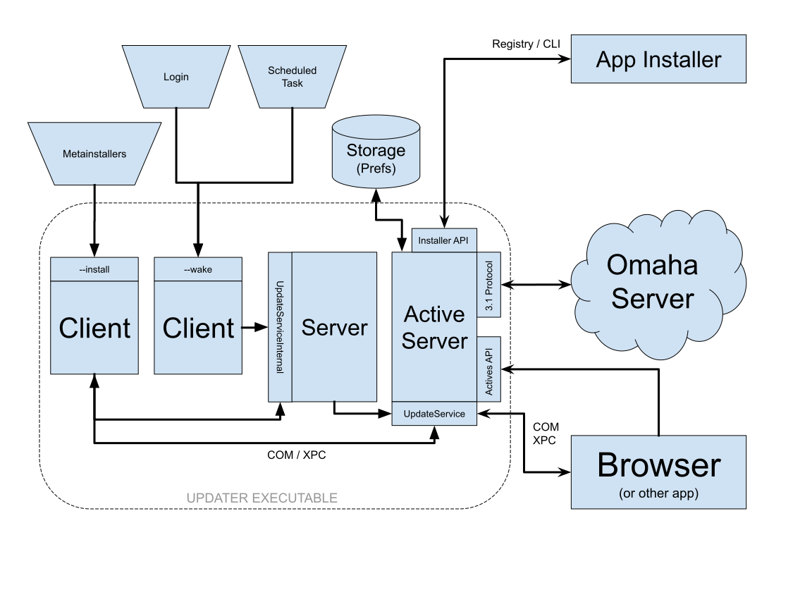
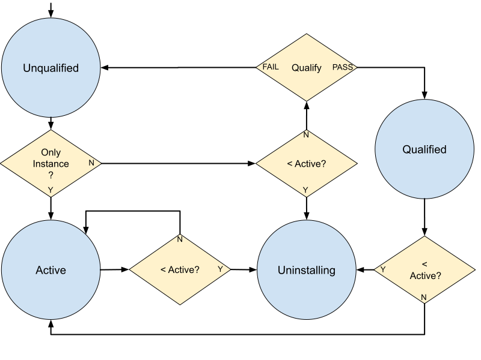

# Chromium Updater Design Document

This is the design document for [Chromium Updater](https://source.chromium.org/chromium/chromium/src/+/main:chrome/updater/).

[TOC]

## Objective
The objective is to create an updater for desktop client software using Chromium
code and tools. The updater is an open-source drop-in replacement for Google
Update/Omaha and can be customized by 3rd party embedders for updating
non-Google client software.

The desktop platforms include Windows, macOS, Linux.

## Overview
The updater is responsible for:
*   Installing applications. (On applicable platforms.)
*   Automatically and silently keeping those applications (and itself)
    up-to-date.
*   Providing those applications with services to manage their installation.
*   Providing update servers with anonymous telemetry about those applications.
*   Detecting the uninstallation of those applications, and automatically
    removing itself when all other applications have been uninstalled.

The behavior of the updater is mostly platform-independent. However, platform-
specific modules exist to translate cross-platform concepts (such as IPC
interfaces) to platform-specific technologies (such as COM or XPC).
Additionally, some updater behavior related to installs and uninstalls are
tailored to platform conventions.

The updater is layered atop //components/update\_client, which implements a
cross-platform mechanism to interact with an Omaha server for the purpose of
updating CRXs. //components/update\_client is also used by the component and
extension updaters in Chrome.

To keep applications up-to-date, the updater periodically polls an Omaha server,
communicating the state of installed applications, and receiving update
instructions. It applies updates the server instructs it to, and then reports
the results of the operation back to Omaha servers.

## Detailed Design
Once installed, the updater operates as a collection of processes that are
launched on-demand and orchestrate their operations over IPC. The *server
process* hosts an engine that conducts most of the work of updating software,
and it is driven by *client processes* that issue commands to it and potentially
display UI to the user.



The updater may be installed *per-user* or *system-wide*. If installed per-user,
the updater can only update applications owned by that user, whereas a system-
wide updater can update applications owned by any entity on the system. In
multi-user systems, it is efficient for software such as the browser to be
installed system-wide, owned by root (or the system user) and run by individual
users, but this requires the updater to maintain root privileges in order to
update it. Therefore, in a system-wide installation, the server process runs as
root (or at high integrity). A system-wide installation of the updater and any
number of per-user installations of the updater can coexist and operate
independently on the same system.

Different versions of the updater can coexist even within the same installation
of the updater, but only one such instance is *active*. Inactive versions of the
updater periodically attempt to *qualify* themselves by running self-tests and
(if they pass) take over as the active updater; or uninstall themselves as out
of date once a newer version of the updater has activated.

The functionality of the server process is split into two interfaces:
*   UpdateService, which is served only by the active instance and may be called
    by any client. When an instance activates, it replaces IPC registrations so
    that UpdateService routes to it.
*   UpdateServiceInternal, which is served by all instances but may only be
    called by updater clients of the same version.

Where necessary, the updater acquires a single cross-process lock to prevent
races between activations and ongoing update operations.

### Installing the Updater
Instances of the updater are installed in one of the following ways:
*   A user runs an installer for the updater with the intent of installing an
    application. The updater will install itself, and then use itself to install
    the application. (This is the primary flow on Windows.)
*   An application installs the updater as part of its own installation,
    first-run experience, or repair/recovery. (This is the primary flow on
    macOS.)
*   The updater downloads an update for itself and installs it.

#### Updater Installer Types
The updater is distributed via the following installer types:
*   Online Installers
*   Offline Installers

##### Online Installers
An online installer installs the updater and then acts as a client process and
commands the server process to install the application the user desired.

Online installers are composed of three parts: a *tag*, a *metainstaller*, and
an *updater resource*. The metainstaller is a lightweight executable that
uncompresses its updater resource into a safe temporary directory and then
launches the updater's setup client process (`--install`). It passes along the
tag, an unsigned (and untrusted) piece of data that is embedded in the
executable which communicates the installation parameters for the software the
user is trying to install.

###### Tagging
TODO(crbug.com/1035895): Document tagging format, process, contents.

###### Updater Resource Extraction
TODO(crbug.com/1035895): Document updater resource compression.

Online installers are typically run by the end user after being downloaded from
the Internet. When the installer is executed, the OS launches it at
[medium integrity](https://docs.microsoft.com/en-us/windows/win32/secauthz/mandatory-integrity-control).

However, depending on the tag, the updater and application may need to be
installed system-wide. To achieve this, the metainstaller must re-launch itself
at high integrity. This will result in an
[UAC prompt](https://docs.microsoft.com/en-us/windows/security/identity-protection/user-account-control/how-user-account-control-works)
on Windows.

The metainstaller determines whether to relaunch before unpacking the updater
resources, since unpacking to a user-writable temp directory is not secure for
a system-wide installation.

The metainstaller appends the `--expect-elevated` switch to the relaunch command
line, to allow the relaunched process to exit with an error if it is not running
at the correct integrity level.

##### Offline Installers
Offline install performs the installation with no update check or file download
against the server in the process. All data is read from the files in the
specified directory instead.

An example offline install command line on Windows platform:

```
updater.exe /handoff "&appguid={8A69D345-D564-463C-AFF1-A69D9E530F96}&appname=MyApp&needsadmin=True&installdataindex =verboselog"
           /installsource offline
           /sessionid "{E85204C6-6F2F-40BF-9E6C-4952208BB977}"
           /offlinedir "C:\Users\chrome-bot\AppData\Local\ForgedPath"]
```
Please note DOS style command line switch is also supported for backward
compatibility.

##### Manifest file
The offline install process looks for `OfflineManifest.gup` in the
offline directory, and falls back to *`<app-id>`*`.gup` if needed.
The `.gup` file contains the update check response in XML format. An
example of the XML file:
```
<?xml version="1.0" encoding="UTF-8"?>
<response protocol="3.0">
  <app appid="{CDABE316-39CD-43BA-8440-6D1E0547AEE6}" status="ok">
    <updatecheck status="ok">
      <urls>
        <url codebase="http://dl.google.com/foo/install/1.2.3.4/"/>
      </urls>
      <manifest version="1.2.3.4">
        <packages>
          <package hash="abcdef" hash_sha256="sha256hash_foobar"
           name="my_installer.exe" required="true" size="12345678"/>
        </packages>
        <actions>
          <action event="install" needsadmin="false" run="my_installer.exe"
           arguments="--baz"/>
          <action event="postinstall" onsuccess="exitsilentlyonlaunchcmd"/>
        </actions>
      </manifest>
    </updatecheck>
    <!-- "system_level" is not included in any of the definitions. needsadmin
          controls this. -->
    <data index="verboselog" name="install" status="ok">
      {
        "distribution": {
          "verbose_logging": true
        }
      }
    </data>
  </app>
</response>
```
The manifest file is parsed to extract the installer command. The above
manifest leads to installation command:
 ```
 C:\Users\chrome-bot\AppData\Local\ForgedPath\my_installer.exe --baz
 ```

The example handoff install command line also specifies
`installdataindex=verboselog`, and the manifest has a matching install
data. That means the install data is extracted and passed to the app
installer. See [installdataindex](#installdataindex) below for details.

TODO(crbug.com/1035895): Document the standalone installer.

TODO(crbug.com/1035895): Document bundling the updater with apps.

#### Updater States


Instances are installed in the `Unqualified` state. Whenever an instance’s
server starts up, it checks whether it should transition to a new state. Only
the server instance in the `Active` state is permitted to make changes to the
various applications managed by the updater. When an updater enters the
`Active` state, previously active updaters will discover when they next start
up that they should transition out of the `Active` state and uninstall
themselves.

##### Qualification
Before activating, unqualified instances of the updater first perform a
self-test. The instance registers a "qualification app" with itself and checks
for updates to that application with the production update server. The
production server responds with an update, and the updater downloads the update
and applies it, running the qualification app installer. If this all succeeds,
the updater transitions to the qualified state and exits.

The qualification app installer is a no-op installer that simply exits with no
error.

Qualification is skipped (along with any other pre-active states) if there is
no active instance of the updater.

##### Activation
When an instance transitions to the active state, it acquires the lock on the
global prefs file, writes and flushes the "swapping" bit to the file, and then
replaces any non-side-by-side elements of the installation (such as COM or
launchd registrations, Omaha 3 or Keystone shims, and more) with its own. Then,
it clears the "swapping" bit and starts listening for instructions on the RPC
channels. The swapping bit ensures that the an updater will recover and repair
the system even if the program is interrupted mid-activation. The full algorithm
is:

```
on_startup:
  acquire_scoped_global_prefs_lock()

  if global_prefs.has_active_version():
    if global_prefs.active_version > this_version:
      uninstall_self()
      exit
    if !local_prefs.qualified:
      if qualify():
        local_prefs.qualified = true
      exit
    if this_version > global_prefs.active_version or global_prefs.swapping:
      activate()
  else
    activate()

activate:
  global_prefs.swapping = true
  global_prefs.flush()
  replace_active_version()
  if !global_prefs.imported_legacy_updaters:
    import_data_from_legacy_updaters()
    global_prefs.imported_legacy_updaters = true
  global_prefs.active_version = this.version
  global_prefs.swapping = false
  global_prefs.flush()
```

##### Storage
The updater maintains its state in a set of "prefs" files, which are
dictionaries serialized to the disk as JSON.

The global prefs file is shared across all instances of the updater. It contains
data about the registered applications and the active updater's state.

Each instance of the updater also has its own separate local prefs file. Local
prefs store information specific to the instance that owns them.

##### Locking
Read and write access to the global prefs file is controlled by a lock. The lock
must also be held while the updater performs any non-side-by-side operation
(such as installing an update for a registered application). The lock is per-
process. The updater will periodically poll for the lock, sleeping for a short
time between polls.

On Windows, the lock is implemented as a kernel mutex.

On macOS, the lock is implemented using `bootstrap_check_in()`, interpreting
ownership of receive rights on a Mach service name as ownership of a lock.

### Installing Applications
TODO(crbug.com/1035895): Describe app installs.

TODO(crbug.com/1035895): Describe installer APIs (per platform).

TODO(crbug.com/1035895): Document UI, accessibility, internationalization.

TODO(crbug.com/1035895): Document relevant enterprise policies.

TODO(crbug.com/1035895): Document registration API.

#### Dynamic Install Parameters

##### `needsadmin`

`needsadmin` is one of the install parameters that can be specified for
first installs via the
[metainstaller tag](https://source.chromium.org/chromium/chromium/src/+/main:chrome/updater/tools/tag.py).
`needsadmin` is used to indicate whether the application needs admin rights to
install.

For example, here is a command line for the Updater on Windows that includes:
```
UpdaterSetup.exe --install --tag="appguid=YourAppID&needsadmin=False"
```

In this case, the updater client understands that the application installer
needs to install the application on a per-user basis for the current user.

`needsadmin` has the following supported values:
* `true`: the application supports being installed systemwide and once
installed, is available to all users on the system.
* `false`: the application supports only user installs.
* `prefers`: the application installation is first attempted systemwide. If the
user refuses the
[UAC prompt](https://docs.microsoft.com/en-us/windows/security/identity-protection/user-account-control/how-user-account-control-works)
however, the application is then only installed for the current user. The
application installer needs to be able to support the installation as system, or
per-user, or both modes.

When `UpdaterSetup` encounters `needsadmin`, it does the following, based on the
`needsadmin` value:
* `true`: runs the application installer as `system`, with any
[elevation prompts](https://docs.microsoft.com/en-us/windows/security/identity-protection/user-account-control/how-user-account-control-works)
that may be required to run as system first.
* `false`: runs the application installer as the current user.
* `prefers`: attempts to run the application installation as system first. If
elevation fails however, runs the application installer as the current user.

##### `installdataindex`

`installdataindex` is one of the install parameters that can be specified for
first installs on the command line or via the
[metainstaller tag](https://source.chromium.org/chromium/chromium/src/+/main:chrome/updater/tools/tag.py).

For example, here is a typical command line for the Updater on Windows:
```
UpdaterSetup.exe /install "appguid=YourAppID&appname=YourAppName&needsadmin=False&lang=en&installdataindex =verboselog"
```

In this case, the updater client sends the `installdataindex` of `verboselog` to
the update server.

This involves:
* [Parsing the tag](https://source.chromium.org/chromium/chromium/src/+/main:chrome/updater/tag.h)
into individual tag components, including install_data_index.
* Creating a CrxComponent with the install_data_index and providing it to the
[update_client](https://source.chromium.org/chromium/chromium/src/+/main:components/update_client/update_client.h).
* update_client sends the install_data_index to the update server.

This is how a [JSON](https://www.json.org/) request from update_client may look
like:

```
{
   "request":{
      "@os":"win",
      "@updater":"updater",
      "acceptformat":"crx3",
      "app":[
         {
            "appid":"YourAppID",
            "data":[
               {
                  "index":"verboselog",
                  "name":"install"
               }
            ],
            "enabled":true,
            "installsource":"ondemand",
            "ping":{
               "r":-2
            },
            "updatecheck":{
               "sameversionupdate":true
            },
            "version":"0.1"
         }
      ],
      "arch":"x86",
      "dedup":"cr",
      "domainjoined":true,
      "hw":{
         "avx":true,
         "physmemory":32,
         "sse":true,
         "sse2":true,
         "sse3":true,
         "sse41":true,
         "sse42":true,
         "ssse3":true
      },
      "ismachine":false,
      "lang":"en-US",
      "nacl_arch":"x86-64",
      "os":{
         "arch":"x86_64",
         "platform":"Windows",
         "version":"10.0.19042.1586"
      },
      "prodversion":"101.0.4949.0",
      "protocol":"3.1",
      "requestid":"{6b417770-1f68-4d52-8843-356760c84d33}",
      "sessionid":"{37775211-4487-48d5-845d-35a1d71b03bc}",
      "updaterversion":"101.0.4949.0",
      "wow64":true
   }
}
```

The server retrieves the data corresponding to `installdataindex=verboselog`
and returns it back to update_client.

This is how a JSON response from the update server may look like:

```
  "response":{
   "protocol":"3.1",
   "app":[
    {"appid":"12345",
     "data":[{
      "status":"ok",
      "name":"install",
      "index":"verboselog",
      "#text":"{\"logging\":{\"verbose\":true}}"
     }],
     "updatecheck":{
     "status":"ok",
     "urls":{"url":[{"codebase":"http://example.com/"},
                    {"codebasediff":"http://diff.example.com/"}]},
     "manifest":{
      "version":"1.2.3.4",
      "prodversionmin":"2.0.143.0",
      "run":"UpdaterSetup.exe",
      "arguments":"--arg1 --arg2",
      "packages":{"package":[{"name":"extension_1_2_3_4.crx"}]}}
     }
    }
   ]
  }
```

update_client provides this response data back to the Updater.

The updater client writes this data to a temporary file in the same directory as
the application installer. This is for security reasons, since writing the data
to the temp directory could potentially allow a man-in-the-middle attack.

The updater client provides the temporary file as a parameter to the application
installer.

Let's say, as shown above, that the update server responds with these example
file contents:
```
{"logging":{"verbose":true}}
```

The updater client will now create a temporary file, say `c:\my
path\temporaryfile.dat` (assuming the application installer is running from
`c:\my path\YesExe.exe`), with the following file contents:
```
\xEF\xBB\xBF{"logging":{"verbose":true}}
```

and then provide the file as a parameter to the application installer:
```
"c:\my path\YesExe.exe" --installerdata="c:\my path\temporaryfile.dat"
```

* Notice above that the temp file contents are prefixed with an UTF-8 Byte Order
Mark of `EF BB BF`.
* For MSI installers, a property will passed to the installer:
`INSTALLERDATA="pathtofile"`.
* For exe-based installers, as shown above, a command line parameter will be
passed to the installer: `--installerdata="pathtofile"`.
* For Mac installers, an environment variable will be set:
`INSTALLERDATA="pathtofile"`.
* Ownership of the temp file is the responsibility of the application installer.
The updater will not delete this file.
* This installerdata is not persisted anywhere else, and it is not sent as a
part of pings to the update server.

### Updating Applications
For every updater install, there is a timed scheduler that invokes the updater
to check for updates. The default period is for the scheduler to call `--wake`
on the updater every hour. Once the updater wakes, it will check if it has been
long enough since the last update check to try again. The default is every 5
hours to do an update check.

#### Windows
Windows utilizes the Task Scheduler and the Windows Task Scheduler API to create
a scheduler.

#### Mac
On Mac, the scheduler is implemented via LaunchAgents (for user-level installs)
and LaunchDaemons (for system-level installs). The scheduled task is defined by
the `org.chromium.ChromiumUpdater.wake.1.2.3.4.plist`, which contains a Label
corresponding to the name of the plist, program arguments, which contains the
path to the executable and the arguments it'll run with, and a StartInterval,
which denotes interval for when launchctl should invoke the program. An example:

```
<?xml version="1.0" encoding="UTF-8"?>
<!DOCTYPE plist PUBLIC "-//Apple//DTD PLIST 1.0//EN" "http://www.apple.com/DTDs/PropertyList-1.0.dtd">
<plist version="1.0">
<dict>
	<key>AbandonProcessGroup</key>
	<true/>
	<key>Label</key>
	<string>org.chromium.ChromiumUpdater.wake.1.2.3.4</string>
	<key>LimitLoadToSessionType</key>
	<string>Aqua</string>
	<key>ProgramArguments</key>
	<array>
		<string>/Users/user/Library/Chromium/ChromiumUpdater/1.2.3.4/ChromiumUpdater.app/Contents/MacOS/ChromiumUpdater</string>
		<string>--wake</string>
		<string>--vmodule=*/chrome/updater/*=2,*/components/update_client/*=2</string>
		<string>--enable-logging</string>
	</array>
	<key>StartInterval</key>
	<integer>3600</integer>
</dict>
</plist>
```

TODO(crbug.com/1035895): Document differential updates.

TODO(crbug.com/1035895): Document recovery.

TODO(crbug.com/1035895): Document actives API & user count telemetry.

TODO(crbug.com/1035895): Document relevant enterprise policies.

TODO(crbug.com/1035895): Document ticket promotion (macOS).

TODO(crbug.com/1035895): Document usage-stats opt-in.

TODO(crbug.com/1035895): Document EULA/ToS acceptance.

### Uninstalling Applications
TODO(crbug.com/1035895): Document uninstallation API.

TODO(crbug.com/1035895): Document file-based existence checker on macOS.

TODO(crbug.com/1035895): Document registry-based existence checker on Windows.

TODO(crbug.com/1035895): Document updater uninstallation.

### Advanced Topics

#### State
TODO(crbug.com/1035895): Document prefs (global & local).

TODO(crbug.com/1035895): Document usage of registry on Windows.

TODO(crbug.com/1035895): Document usage of Keystone tickets on macOS.

#### IPC
TODO(crbug.com/1035895): Document COM.

##### XPC
On Mac, the IPC utilized for the updater is XPC, which is the macOS native IPC
system controlled by launchd. The main portion to utilize XPC is to create
launch agent plists under `${HOME}/Library/LaunchAgents` for user level installs
and launch daemon plists under `/Library/LaunchDaemons` for system level
installs.

The updater uses multiple layers of XPC to start-up separate processes
that are responsible for different actions. There are two XPC plists that the
updater creates for the server. The first is the `.internal` plist, which goes
through some control tasks first, and then there's the `.service` plist, which
actually performs the update check and the update itself.

The XPC interface is also utilized to communicate between the browser and the
updater for on-demand updates. The protocol utilized by the browser has to be in
sync with the updater's protocol, or else the XPC call will fail. The same
`.service` launchd plist is utilized to communicate between the browser and the
updater for the on-demand updates.

Lastly, the XPC interface connects the browser and updater to promote the
updater to a system-level updater. Promotion in this context means that the
browser will install a system-level updater. This process entails the browser
showing UI to the user on the About Page to prompt the user to promote. When the
user accepts, the browser will then ask the user to elevate to allow root
privileges so that a system-level updater can be installed. Inside of the
browser, there exists a Privileged Helper tool executable. This is installed
from the browser if promotion is selected via SMJobBless. When the Privileged
Helper tool is installed, the browser can make an XPC connection to it and
invoke a call to start the system-level updater installation process.

TODO(crbug.com/1035895): Document any IPC fallbacks that exist.

#### Network
TODO(crbug.com/1035895): Document network stack (per platform).

TODO(crbug.com/1035895): Document CUP.

TODO(crbug.com/1035895): Document anti-DoS headers.

TODO(crbug.com/1035895): Document X-Retry-After behavior.

TODO(crbug.com/1035895): Document proxy behavior.

## Testing
TODO(crbug.com/1035895): Document testing strategies, framework.

TODO(crbug.com/1035895): Document test build.

TODO(crbug.com/1035895): Document external constants override.

TODO(crbug.com/1035895): Document builders & test machines.

TODO(crbug.com/1035895): Document old updater in third\_party.

TODO(crbug.com/1035895): Document manual testing tools.

## Release
TODO(crbug.com/1035895): Document build.

TODO(crbug.com/1035895): Document signing.

TODO(crbug.com/1035895): Document branching & versioning.

TODO(crbug.com/1035895): Document A/B release qualification process.

## Tools
TODO(crbug.com/1035895): Document tagger.

## Metainstaller

### UI Strings & Localization
The strings for the metainstaller live in the //chrome/app/chromium_strings.grd
and //chrome/app/google_chrome_strings.grd files. This allows the updater
strings to utilize the Chromium repo's translation process instead of generating
its own. Having it in existing grd files also eliminates the need to onboard
updater specific grd files.

During the build process, the updater strings are embedded directly into the
metainstaller binary via `generate_embedded_i18n`. `generate_embedded_i18n` also
allows an `extractor_datafile`, which can define specific strings to pick out
from the originating grd file. This way, the metainstaller only has the strings
specific to the updater and not any of the other strings within the grd file.
When the `generate_embedded_i18n` is complete, it generates an
`updater_installer_strings.h` header, which contains macro definitions of the
message ids and the offsets. The strings are mapped with their var name appended
with `_BASE`. Then the  `_BASE` appended macros are defined to be the first
localization id in the list, in which case it is `_AF`.

An example from the `updater_installer_strings.h`
```
#define IDS_BUNDLE_INSTALLED_SUCCESSFULLY_AF 1600
#define IDS_BUNDLE_INSTALLED_SUCCESSFULLY_AM 1601

...

#define IDS_BUNDLE_INSTALLED_SUCCESSFULLY_BASE IDS_BUNDLE_INSTALLED_SUCCESSFULLY_AF

...

#define DO_STRING_MAPPING \
  HANDLE_STRING(IDS_BUNDLE_INSTALLED_SUCCESSFULLY_BASE, IDS_BUNDLE_INSTALLED_SUCCESSFULLY) \
```

Within the metainstaller, an l10_util.h/cc has three functions to get localized
strings.
```
GetLocalizedString(int base_message_id)
GetLocalizedStringF(int base_message_id, const std::wstring& replacement)
GetLocalizedStringF(int base_message_id, std::vector<std::wstring> replacements)
```

One function for getting the literal string and two functions to get formatted
strings. `GetLocalizedString()` uses the base id plus the offset based on the
language to look through the binary's string table to get the correct, localized
string. The formatted strings utilize GetLocalizedString() to get the string and
then uses `base::ReplaceStringPlaceholders()` to remove the `$i` placeholders
within the string. With regards to picking the correct language to utilize for
the localized string, `base::win::i18n::GetUserPreferredUILanguageList()` is
used to get the preferred UI languages from MUI. If there are multiple languages
in the list, the first language in the list is picked.

## Application Commands

The Application Command feature allows installed Updater-managed applications to
pre-register and then later run command lines (elevated for system
applications). The command lines can also include replaceable parameters
substituted at runtime.

For legacy reasons:
* the interface is called `IAppCommandWeb` because it was meant to be used from
an ActiveX control on a webpage at one point, and
* it is derived from `IDispatch` for the same reason, to be used from script.

For more information, please see the
[functional spec](functional_spec.md#Application-Commands).
