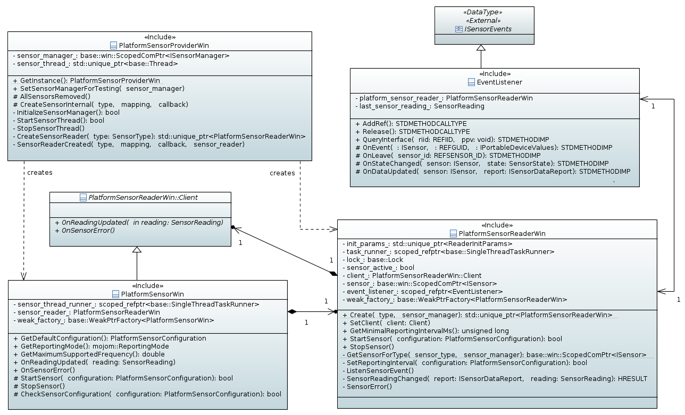

# Chromium Sensor Backend Modernization on Windows

## 1. Summary

Windows has two sets of sensor APIs:

- [ISensor API](https://docs.microsoft.com/en-us/windows/desktop/sensorsapi/about-the-sensor-api): The COM sensor API on Windows, which is now deprecated.
- [Windows.Devices.Sensors WinRT API](https://docs.microsoft.com/en-us/uwp/api/windows.devices.sensors): The WinRT sensor API on Windows.

This document outlines the current ISensor based Chromium sensor backend on
Windows and the newly proposed Windows.Devices.Sensors based
implementation. It is laid out as follows:

1. Summary
2. General Chromium Sensor Backend Model
3. Current ISensor Chromium Sensor Backend Model on Windows
4. Proposed Windows.Devices.Sensors Chromium Sensor Backend Model on Windows
5. Chromium Feature Flag
6. Metrics
7. Incremental Change Plan
8. Appendix

Note: This document has sections that read like a future looking document,
(e.g. "will do this..." and "proposed design...") as the
Windows.Devices.Sensors parts have not been implemented. Once they are
implemented, those sections will be updated to present tense and have the
corresponding sample code removed.

## 2. General Chromium Sensor Backend Model

For context, the Chromium sensor backend is abstracted into these
interfaces:

- SensorProvider – Sensor factory class responsible for discovering
  sensors on system, querying capabilities, and creating new sensor
  instances.
- Sensor – Sensor device wrapper class used to control the sensor.
- SensorClient – Event class that observes sensor reading changes
  and error conditions.

These interfaces are ultimately what the
[W3C sensor interface](https://www.w3.org/TR/generic-sensor/)
communicates with - each platform has its own implementation.

## 3. Current ISensor Chromium Sensor Backend Model on Windows

The following diagram shows the ISensor based Chromium backend
implementation on Windows:



The implementation contains three main classes:

- PlatformSensorProviderWin
  - Windows implementation of the SensorProvider interface. It
    is responsible for the creation of PlatformSensorWin and
    PlatformSensorReaderWin. It also manages ISensorManager
    (overall manager for the ISensor API) and the sensor thread where
    all COM objects are created.
- PlatformSensorWin
  - Windows implementation of the Sensor and SensorClient
  interface, manages the state of PlatformSensorReaderWin.
- PlatformSensorReaderWin
  - Wrapper class around an ISensor instance.

The following diagram shows the typical usage flow:


Support for the SensorTypes defined by the Mojo interface
on Windows is summarized below:

| SensorType                        | Sensor GUID                               |
| --------------------------------- | ----------------------------------------- |
| AMBIENT_LIGHT                     | SENSOR_TYPE_AMBIENT_LIGHT                 |
| ACCELEROMETER                     | SENSOR_TYPE_ACCELEROMETER_3D              |
| LINEAR_ACCELEROMETER              | *                                         |
| GYROSCOPE                         | SENSOR_TYPE_GYROMETER_3D                  |
| MAGNETOMETER                      | SENSOR_TYPE_COMPASS_3D                    |
| ABSOLUTE_ORIENTATION_EULER_ANGLES | SENSOR_TYPE_INCLINOMETER_3D               |
| ABSOLUTE_ORIENTATION_QUATERNION   | SENSOR_TYPE_AGGREGATED_DEVICE_ORIENTATION |

*The LINEAR_ACCELEROMETER sensor type is provided by
implementing a low-pass-filter over the values returned by the
ACCELEROMETER in order to remove the contribution of the gravitational
force.

The "Sensor GUID" column specifies the names of the sensor type GUIDs
used to provide data for a SensorType. Any SensorType not mentioned by
this table are not supported on Windows.

## 4. Proposed Windows.Devices.Sensors Chromium Sensor Backend Model on Windows

The overall sensor backend design on Windows will remain the same
(as detailed in section 3). The classes which take a direct dependency
on the ISensor API will have their interfaces abstracted out and
reimplemented with Windows.Devices.Sensors:

- The PlatformSensorProviderWin class:
  - platform_sensor_provider_win.h
  - platform_sensor_provider_win.cc
- The PlatformSensorReaderWin class:
  - platform_sensor_reader_win.h
  - platform_sensor_reader_win.cc

This allows the other classes, which are agnostic to the underlying API,
to interchangeability use the ISensor vs. Windows.Devices.Sensors
implementation. This is advantageous as the two implementations will need
to live side by side.

The Windows.Devices.Sensors APIs do not currently support thresholding,
but is coming in a future release of Windows. This means a (slight)
performance degredation will occur if the Windows.Devices.Sensors APIs are
used as is since the ISensor implementation is utilizing thresholding while
Windows.Devices.Sensors can only support streaming. So the Chromium backend
will switch to use the ISensor implementation on versions of Windows that
do not have WinRT thresholding support and will use the Windows.Devices.Sensors
implementation for those that do.

This section is split into two main parts:

- Modifying the Chromium sensor backend on Windows to support adapting
  between the ISensor and Windows.Devices.Sensors path.
- Outlining the new Windows.Devices.Sensors implementation.

### 4.1 Support For Adapting Between ISensor and Windows.Devices.Sensors Sensor Implementations

Please refer to [platform_sensor_provider.cc](platform_sensor_provider.cc ).

### 4.2 Proposed Windows.Devices.Sensors Sensor Implementation

The overall Windows.Devices.Sensors design is the same as the current design
detailed in section 3 except the classes that take a dependency on the ISensor
API will be reimplemented with these new classes:

- PlatformSensorProviderWinrt
  - Windows.Devices.Sensors based implementation of PlatformSensorProvider,
    functional equivalent of PlatformSensorProviderWin.
- PlatformSensorReaderWinrt
  - Wrapper class around the actual Windows.Devices.Sensors APIs, functional
    equivalent of PlatformSensorReaderWin.

#### 4.2.1 PlatformSensorReaderWinrt

The existing PlatformSensorReaderWin class will be pulled out into
its own interface:

```cpp
class PlatformSensorReaderWinBase {
 public:
  static std::unique_ptr<PlatformSensorReaderWin> Create(
      mojom::SensorType type);

  // Following methods are thread safe.
  virtual void SetClient(Client* client) = 0;
  virtual unsigned long GetMinimalReportingIntervalMs() const = 0;
  virtual bool StartSensor(const PlatformSensorConfiguration& configuration) = 0;
  virtual void StopSensor() = 0;

  // Must be destructed on the same thread that was used during construction.
  virtual ~PlatformSensorReaderWin() = default;
}
```

The existing (ISensor) PlatformSensorReaderWin class and new
(Windows.Devices.Sensors) PlatformSensorReaderWinrt class will inherit from
this interface so both classes can be interchangeably used with the
ISensor/Windows.Devices.Sensors agnostic PlatformSensorWin, which simply
consumes the PlatformSensorReaderWinBase interface.

Since there are several Windows.Devices.Sensors sensor functions which are
identical between the different sensor types, an abstract class will
encapsulate the common functionality.

`platform_sensor_reader_winrt.h`:

```cpp

// Base class for PlatformSensorReaderWinrt*, contains common helper
// functions used between all WinRT sensors. Derived classes will
// specialize into a specific sensor and are expected to pass in
// the correct WinRT interfaces into the template.
//
// See PlatformSensorReaderWinrtLightSensor as an example for
// what WinRT interfaces should be passed in.
template <wchar_t const* runtime_class_id,
          class ISensorWinrtStatics,
          class ISensorWinrtClass,
          class ISensorReadingChangedHandler,
          class ISensorReadingChangedEventArgs>
class PlatformSensorReaderWinrtBase : public PlatformSensorReaderWin {
 public:
  bool Initialize();

  // Sets the client to notify changes about.
  void SetClient(Client* client) override;

  // Allows tests to specify their own implementation of the underlying sensor.
  void InitForTests(Microsoft::WRL::ComPtr<ISensorWinrtClass> sensor) {
    sensor_ = sensor;

    sensor_->get_MinimumReportInterval(&minimum_report_interval_);
  }

  bool StartSensor(const PlatformSensorConfiguration& configuration) override;
  unsigned long GetMinimalReportingIntervalMs() const override;
  void StopSensor() override;

 protected:
  virtual HRESULT OnReadingChangedCallback(
      ISensorWinrtClass* sensor,
      ISensorReadingChangedEventArgs* reading_changed_args) = 0;

  // Helper function which converts the DateTime format the WinRT API
  // uses to second time ticks the client expects.
  HRESULT ConvertSensorReadingTimeStamp(
      ABI::Windows::Foundation::DateTime date_time_to_convert,
      double* time_ticks_seconds);

  // Following class members are protected by lock, because SetClient,
  // StartSensor and StopSensor are called from another thread by
  // PlatformSensorWin that can modify internal state of the object.
  base::Lock lock_;
  // Null if there is no client to notify, non-null otherwise.
  Client* client_;
  // base::nullopt if the sensor has not been started, non-empty otherwise.
  base::Optional<EventRegistrationToken> reading_callback_token_;

  UINT32 minimum_report_interval_{};
  Microsoft::WRL::ComPtr<ISensorWinrtClass> sensor_;
};
```

Each sensor type will derive from the PlatformSensorReaderWinrtBase
abstract class. Below is an example for the light sensor:

`platform_sensor_reader_winrt.h`:

```cpp
class PlatformSensorReaderWinrtLightSensor final
    : public PlatformSensorReaderWinrtBase<
          RuntimeClass_Windows_Devices_Sensors_LightSensor,
          ABI::Windows::Devices::Sensors::ILightSensorStatics,
          ABI::Windows::Devices::Sensors::ILightSensor,
          Microsoft::WRL::Implements<
              Microsoft::WRL::RuntimeClassFlags<Microsoft::WRL::ClassicCom>,
              ABI::Windows::Foundation::ITypedEventHandler<
                  ABI::Windows::Devices::Sensors::LightSensor*,
                  ABI::Windows::Devices::Sensors::
                      LightSensorReadingChangedEventArgs*>,
              Microsoft::WRL::FtmBase>,
          ABI::Windows::Devices::Sensors::ILightSensorReadingChangedEventArgs> {
 public:
  static std::unique_ptr<PlatformSensorReaderWin> Create();

  PlatformSensorReaderWinrtLightSensor();

 protected:
  HRESULT OnReadingChangedCallback(
      ABI::Windows::Devices::Sensors::ILightSensor* sensor,
      ABI::Windows::Devices::Sensors::ILightSensorReadingChangedEventArgs*
          reading_changed_args) override;

 private:
  float last_reported_lux_{};

  DISALLOW_COPY_AND_ASSIGN(PlatformSensorReaderWinrtLightSensor);
};
```

The implementation for PlatformSensorReaderWinrtBase and
PlatformSensorReaderWinrtLightSensor have been deferred to section 8.1
and 8.2 of the appendix for brevity.

Lastly, PlatformSensorReaderWinrt::Create will choose which derived
PlatformSensorReaderWin class to instantiate based on the requested
sensor type:

```cpp
std::unique_ptr<PlatformSensorReaderWin> PlatformSensorReaderWinrt::Create(
    mojom::SensorType type) {
    case mojom::SensorType::AMBIENT_LIGHT:
      return PlatformSensorReaderWinrtLightSensor::Create();
    case mojom::SensorType::ACCELEROMETER:
      return PlatformSensorReaderWinrtAccelerometer::Create();
    ...
    default:
      NOTIMPLEMENTED();
      return nullptr;
  }
}
```

Required mocks for unit testing:

- Implement the mock Windows.Devices.Sensors interface classes.
- At the start of the unit test, inject the mock Windows.Devices.Sensors class
  to use via `InitForTests()`.

Unit test cases for this class are detailed in section 7.

## 5. Chromium Feature Flag

The new Windows.Devices.Sensors sensor implementation will be hidden under a new
[Chromium feature flag](https://www.chromium.org/developers/how-tos/run-chromium-with-flags).
If this flag is enabled and the system meets the Windows version, then
the Windows.Devices.Sensors path will be used for sensors. Otherwise, the
ISensor path will be used.

While the modernization changes are being made, this flag will be kept
as `base::FEATURE_DISABLED_BY_DEFAULT`. Afterwards, experimentation will
be used to enable this flag by default for a subset of the population.
Once we have confidence the new implementation is reliable, then the
flag will be moved to `base::FEATURE_ENABLED_BY_DEFAULT` for everyone.

## 6. Metrics

Below are the two main areas where reliability issues may occur, metrics
will be put in place to measure them:

- Measure sensor creation failures:
  - Captures HRESULTs thrown from Windows.Devices.Sensors sensor creation
    failure: `GetDefault()`.
  - Metric will come in form of a [sparse histogram](https://chromium.googlesource.com/chromium/src.git/+/HEAD/tools/metrics/histograms/README.md#When-To-Use-Sparse-Histograms)
    where the labels are the HRESULT error and the values are the number of
    times the label has been hit.
- Measure sensor start failures:
  - Captures HRESULTs thrown from Windows.Devices.Sensors sensor start
    failure: `add_ReadingChanged()`.
  - Metric will come in form of a [sparse histogram](https://chromium.googlesource.com/chromium/src.git/+/HEAD/tools/metrics/histograms/README.md#When-To-Use-Sparse-Histograms)
    where the labels are the HRESULT error and the values are the number
    of times the label has been hit.

This metric will be compared with the existing ISensor failure rate to define
the measure for success.

No performance metrics will be put in Chromium. The reason is twofold:

- Potential changes in CPU usage from the Windows sensor stack is not
  measured.
- The Windows sensor team has recorded the end to end performance
  (sensor stack + Chromium) of these two implementations using Windows
  Performance Analyzer:
  - Current ISensor implementation.
  - The new Windows.Devices.Sensors implementation, but with the Chromium
    backend applying thresholding (since the Windows.Devices.Sensors APIs
    don't currently support builtin thresholding).

The performance delta of the Windows.Devices.Sensors implementation was a
+0.47% total system CPU increase. This should drop to a zero or negative delta
with the real Windows.Devices.Sensors implementation that supports builtin
thresholding.

## 7. Incremental Change Plan

The modernization changes will be broken down into several incremental
changes to keep change lists to a reviewable size:

#### Change list 3: Define the interface for PlatformSensorReaderWinBase and implement PlatformSensorReaderWinrtBase

- Feature Work:
  - Extract the PlatformSensorReaderWin interface into its own file as
    defined in section 4.2.2.
  - Create and implement PlatformSensorReaderWinrtBase as defined in
    section 8.2.
- Testing:
  - Add unit tests for PlatformSensorReaderWinrtBase:
    - Validate `ConvertSensorReadingTimeStamp()` correctly converts
      Windows.Devices.Sensors DateTime to base::TimeTick.
    - Validate `GetMinimalReportingIntervalMs()` returns the correct
      minimum report interval.
    - Validate `StartSensor()` and `StopSensor()` registers and
      unregisters for Windows.Devices.Sensors reading change notifications.
    - Validate a client notification occurs when a new sample is
      reported.

#### Change list 4: Implement PlatformSensorReaderWinrtLightSensor

- Feature Work:
  - Create and implement PlatformSensorReaderWinrtLightSensor as
    defined in section 8.3.
- Testing
  - Add unit tests for PlatformSensorReaderWinrtLightSensor:
    - Create a mock ILightSensor class.
    - Validate PlatformSensorReaderWinrtLightSensor correctly
      parses new Windows.Devices.Sensors samples and the client
      receives the expected lux level.

#### Change list 5-8: Implement the rest of the sensors

- Feature Work:
  - Same as CL 4 but implementing the accelerometer, gyroscope,
    magnetometer, and absolute orientation classes.
- Testing
  - Same as CL 4 but implementing unit tests for the accelerometer,
    gyroscope, magnetometer, and absolute orientation classes.

Each sensor class will have its own corresponding CL, so this
section actually represents four separate CLs.

#### Change list 9: Add metrics

- Feature Work:
  - Add metrics as defined in section 6 following these
    [steps](https://chromium.googlesource.com/chromium/src.git/+/HEAD/tools/metrics/histograms/README.md#Enum-Histograms).
- Testing
  - Create unit tests for new histograms, see [HistogramTester](https://cs.chromium.org/chromium/src/base/test/metrics/histogram_tester.h?q=HistogramTester&sq=package:chromium&dr=CSs&l=25)
    as an example.
  - Run histogram tests as defined [here](https://chromium.googlesource.com/chromium/src.git/+/HEAD/tools/metrics/histograms/README.md#Testing).

#### Change list 10: Roll out new Windows.Devices.Sensors implementation to users

- Feature Work:
  - Use experimentation process to roll out the new implementation
    (e.g. only enable for 5% of canary population). *Will need guidance from Chromium on how this process is done.*
- Testing
  - Build Chromium and manually verify the reported samples are the
    expected values.

#### Change list 11: Enable Windows.Devices.Sensors implementation by default

- Feature Work:
  - Change the feature flag to enabled by default so it is enabled for
    all users.

## 8. Appendix

### 8.1 PlatformSensorReaderWinrtBase Implementation

`platform_sensor_reader_winrt.h`:

Located in section 4.2.2 above.

`platform_sensor_reader_winrt.cpp`:

```cpp

template <wchar_t const* runtime_class_id,
          class ISensorWinrtStatics,
          class ISensorWinrtClass,
          class ISensorReadingChangedHandler,
          class ISensorReadingChangedEventArgs>
void PlatformSensorReaderWinrtBase<
    runtime_class_id,
    ISensorWinrtStatics,
    ISensorWinrtClass,
    ISensorReadingChangedHandler,
    ISensorReadingChangedEventArgs>::SetClient(Client* client) {
  base::AutoLock autolock(lock_);

  client_ = client;
}

template <wchar_t const* runtime_class_id,
          class ISensorWinrtStatics,
          class ISensorWinrtClass,
          class ISensorReadingChangedHandler,
          class ISensorReadingChangedEventArgs>
HRESULT PlatformSensorReaderWinrtBase<runtime_class_id,
                                      ISensorWinrtStatics,
                                      ISensorWinrtClass,
                                      ISensorReadingChangedHandler,
                                      ISensorReadingChangedEventArgs>::
    ConvertSensorReadingTimeStamp(
        ABI::Windows::Foundation::DateTime date_time_to_convert,
        double* time_ticks_seconds) {
  // Convert the DateTime into SYSTEMTIME through a series of
  // intermediary conversions.
  ULARGE_INTEGER date_time_converted{};
  date_time_converted.QuadPart = date_time_to_convert.UniversalTime;

  FILETIME file_time{};
  file_time.dwHighDateTime = date_time_converted.HighPart;
  file_time.dwLowDateTime = date_time_converted.LowPart;

  SYSTEMTIME system_time{};
  if (!FileTimeToSystemTime(&file_time, &system_time)) {
    return HRESULT_FROM_WIN32(GetLastError());
  }

  // Convert the SYSTEMTIME into base::Time
  base::Time::Exploded exploded{};
  exploded.year = system_time.wYear;
  exploded.month = system_time.wMonth;
  exploded.day_of_week = system_time.wDayOfWeek;
  exploded.day_of_month = system_time.wDay;
  exploded.hour = system_time.wHour;
  exploded.minute = system_time.wMinute;
  exploded.second = system_time.wSecond;
  exploded.millisecond = system_time.wMilliseconds;

  base::Time converted_time{};
  if (!base::Time::FromUTCExploded(exploded, &converted_time)) {
    return E_FAIL;
  }

  // Lastly, convert the base::Time into base::TimeTicks()
  base::TimeTicks ticks_now = base::TimeTicks::Now();
  base::Time time_now = base::Time::NowFromSystemTime();
  base::TimeDelta delta = time_now - converted_time;

  *time_ticks_seconds = ((ticks_now - delta) - base::TimeTicks()).InSecondsF();

  return S_OK;
}

template <wchar_t const* runtime_class_id,
          class ISensorWinrtStatics,
          class ISensorWinrtClass,
          class ISensorReadingChangedHandler,
          class ISensorReadingChangedEventArgs>
bool PlatformSensorReaderWinrtBase<
    runtime_class_id,
    ISensorWinrtStatics,
    ISensorWinrtClass,
    ISensorReadingChangedHandler,
    ISensorReadingChangedEventArgs>::Initialize() {
  ComPtr<ISensorWinrtStatics> sensor_statics;
  HRESULT hr =
      base::win::GetActivationFactory<ISensorWinrtStatics, runtime_class_id>(
          &sensor_statics);

  if (FAILED(hr))
    return false;

  if (FAILED(sensor_statics->GetDefault(&sensor_)))
    return false;

  // GetDefault() returns null if the sensor does not exist
  if (!sensor_)
    return false;

  // OK if this fails, sensor will fallback to 0 which the consumer
  // handles gracefully
  hr = sensor_->get_MinimumReportInterval(&minimum_report_interval_);
  if (FAILED(hr)) {
    LOG(WARNING) << "Failed to query sensor minimum report interval: "
                 << logging::SystemErrorCodeToString(hr);
  }

  return true;
}

template <wchar_t const* runtime_class_id,
          class ISensorWinrtStatics,
          class ISensorWinrtClass,
          class ISensorReadingChangedHandler,
          class ISensorReadingChangedEventArgs>
unsigned long PlatformSensorReaderWinrtBase<
    runtime_class_id,
    ISensorWinrtStatics,
    ISensorWinrtClass,
    ISensorReadingChangedHandler,
    ISensorReadingChangedEventArgs>::GetMinimalReportingIntervalMs() const {
  return minimum_report_interval_;
}

template <wchar_t const* runtime_class_id,
          class ISensorWinrtStatics,
          class ISensorWinrtClass,
          class ISensorReadingChangedHandler,
          class ISensorReadingChangedEventArgs>
bool PlatformSensorReaderWinrtBase<runtime_class_id,
                                   ISensorWinrtStatics,
                                   ISensorWinrtClass,
                                   ISensorReadingChangedHandler,
                                   ISensorReadingChangedEventArgs>::
    StartSensor(const PlatformSensorConfiguration& configuration) {
  base::AutoLock autolock(lock_);

  if (!reading_callback_token_) {
    EventRegistrationToken event_token;

    unsigned int interval =
        (1 / configuration.frequency()) * base::Time::kMillisecondsPerSecond;

    auto hr = sensor_->put_ReportInterval(interval);

    if (FAILED(hr)) {
      LOG(ERROR) << "Failed to set report interval: "
                 << logging::SystemErrorCodeToString(hr);

      return false;
    }

    auto reading_changed_handler = Callback<ISensorReadingChangedHandler>(
        this, &PlatformSensorReaderWinrtBase::OnReadingChangedCallback);

    hr = sensor_->add_ReadingChanged(reading_changed_handler.Get(),
                                     &event_token);

    if (FAILED(hr)) {
      LOG(ERROR) << "Failed to add reading callback handler: "
                 << logging::SystemErrorCodeToString(hr);

      return false;
    }

    reading_callback_token_ =
        base::make_optional<EventRegistrationToken>(event_token);
  }

  return true;
}

template <wchar_t const* runtime_class_id,
          class ISensorWinrtStatics,
          class ISensorWinrtClass,
          class ISensorReadingChangedHandler,
          class ISensorReadingChangedEventArgs>
void PlatformSensorReaderWinrtBase<
    runtime_class_id,
    ISensorWinrtStatics,
    ISensorWinrtClass,
    ISensorReadingChangedHandler,
    ISensorReadingChangedEventArgs>::StopSensor() {
  base::AutoLock autolock(lock_);

  if (reading_callback_token_) {
    HRESULT hr =
        sensor_->remove_ReadingChanged(reading_callback_token_.value());

    if (FAILED(hr)) {
      LOG(ERROR) << "Failed to remove ALS reading callback handler: "
                 << logging::SystemErrorCodeToString(hr);
    }

    reading_callback_token_ = base::nullopt;
  }
}
```

### 8.2 PlatformSensorReaderWinrtLightSensor Implementation

`platform_sensor_reader_winrt.h`:

Located in section 4.2.2 above.

`platform_sensor_reader_winrt.cpp`:

```cpp
// static
std::unique_ptr<PlatformSensorReaderWin>
PlatformSensorReaderWinrtLightSensor::Create() {
  auto light_sensor = std::make_unique<PlatformSensorReaderWinrtLightSensor>();
  if (!light_sensor->Initialize())
    return nullptr;

  return light_sensor;
}

PlatformSensorReaderWinrtLightSensor::PlatformSensorReaderWinrtLightSensor() { }

HRESULT PlatformSensorReaderWinrtLightSensor::OnReadingChangedCallback(
    ILightSensor* light_sensor,
    ILightSensorReadingChangedEventArgs* reading_changed_args) {
  SensorReading reading;
  ComPtr<ILightSensorReading> light_sensor_reading;

  HRESULT hr = reading_changed_args->get_Reading(&light_sensor_reading);

  if (FAILED(hr)) {
    LOG(ERROR) << "Failed to get the sensor reading: "
               << logging::SystemErrorCodeToString(hr);
    return hr;
  }

  float lux{};
  hr = light_sensor_reading->get_IlluminanceInLux(&lux);

  if (FAILED(hr)) {
    LOG(ERROR) << "Failed to get the lux level: "
               << logging::SystemErrorCodeToString(hr);
    return hr;
  }

  DateTime timestamp{};
  hr = light_sensor_reading->get_Timestamp(&timestamp);

  if (FAILED(hr)) {
    LOG(ERROR) << "Failed to get the sensor reading timestamp: "
               << logging::SystemErrorCodeToString(hr);
    return hr;
  }

  double time_ticks_seconds{};
  hr = ConvertSensorReadingTimeStamp(timestamp, &time_ticks_seconds);
  if (FAILED(hr)) {
    LOG(ERROR) << "Failed to convert sensor reading timestamp format: "
               << logging::SystemErrorCodeToString(hr);
    return hr;
  }

  reading.als.value = lux;
  reading.als.timestamp = time_ticks_seconds;

  // The WinRT API currently only supports streaming so it is possible
  // to get sequential sensor readings with identical lux values. In
  // this case, the client should not be notified of a reading change.
  if ((lux != last_reported_lux_) && client_) {
    client_->OnReadingUpdated(reading);

    last_reported_lux_ = lux;
  }

  return S_OK;
}
```
