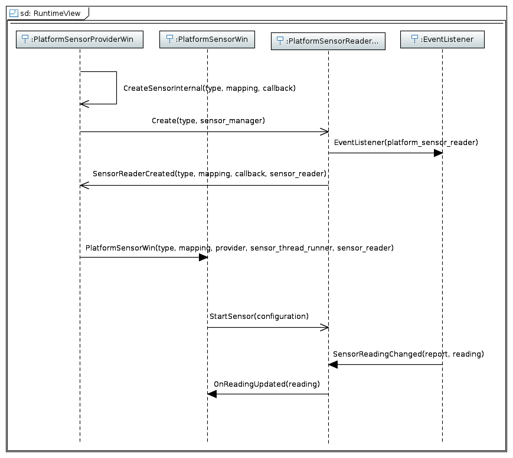

# Chromium Sensor Backend Modernization on Windows

## 1. Summary

Windows has two sets of sensor APIs:

- [ISensor API](https://docs.microsoft.com/en-us/windows/desktop/sensorsapi/about-the-sensor-api):
  The Win32 sensor API on Windows, which is now deprecated.
- [Windows.Devices.Sensors WinRT API](https://docs.microsoft.com/en-us/uwp/api/windows.devices.sensors):
  The WinRT sensor API on Windows.

This document outlines both the ISensor and Windows.Devices.Sensors
based implementation of Chromium's
[W3C sensor interface](https://www.w3.org/TR/generic-sensor/) on Windows:

1. Summary
2. General Chromium Sensor Backend Model
3. ISensor Chromium Sensor Backend Model on Windows
4. Windows.Devices.Sensors Chromium Sensor Backend Model on Windows
5. Chromium Feature Flag
6. Metrics
7. Incremental Change Plan

Note: This document has sections that read like a future looking document,
(e.g. "will do this..." and "proposed design...") as those
Windows.Devices.Sensors sections have not been implemented. Once they are
implemented, those sections will be updated to present tense or removed.

## 2. General Chromium Sensor Backend Model

For context, the Chromium sensor backend is abstracted into these
interfaces:

- SensorProvider – Sensor factory class responsible for discovering
  sensors on system, querying capabilities, and creating new sensor
  instances.
- Sensor – Sensor device wrapper class used to control the sensor.
- SensorClient – Event class that observes sensor reading changes
  and error conditions.

These interfaces are ultimately what the
[W3C sensor interface](https://www.w3.org/TR/generic-sensor/)
communicates with - each platform has its own implementation.

## 3. ISensor Chromium Sensor Backend Model on Windows

The following diagram shows the ISensor based Chromium backend
implementation on Windows:

The implementation contains three main classes:

- PlatformSensorProviderWin
  - Windows implementation of the SensorProvider interface. It
    is responsible for the creation of PlatformSensorWin and
    PlatformSensorReaderWin. It also manages ISensorManager
    (overall manager for the ISensor API) and the sensor thread where
    all COM objects are created.
- PlatformSensorWin
  - Windows implementation of the Sensor and SensorClient
  interface, manages the state of PlatformSensorReaderWin.
- PlatformSensorReaderWin
  - Wrapper class around an ISensor instance.

The following diagram shows the typical usage flow:

Support for the SensorTypes defined by the Mojo interface
on Windows is summarized below:

| SensorType                        | Sensor GUID                               |
| --------------------------------- | ----------------------------------------- |
| AMBIENT_LIGHT                     | SENSOR_TYPE_AMBIENT_LIGHT                 |
| ACCELEROMETER                     | SENSOR_TYPE_ACCELEROMETER_3D              |
| LINEAR_ACCELEROMETER              | *                                         |
| GYROSCOPE                         | SENSOR_TYPE_GYROMETER_3D                  |
| MAGNETOMETER                      | SENSOR_TYPE_COMPASS_3D                    |
| ABSOLUTE_ORIENTATION_EULER_ANGLES | SENSOR_TYPE_INCLINOMETER_3D               |
| ABSOLUTE_ORIENTATION_QUATERNION   | SENSOR_TYPE_AGGREGATED_DEVICE_ORIENTATION |

*The LINEAR_ACCELEROMETER sensor type is provided by
implementing a low-pass-filter over the values returned by the
ACCELEROMETER in order to remove the contribution of the gravitational
force.

The "Sensor GUID" column specifies the names of the sensor type GUIDs
used to provide data for a SensorType. Any SensorType not mentioned by
this table are not supported on Windows.

## 4. Windows.Devices.Sensors Chromium Sensor Backend Model on Windows

The overall sensor backend design on Windows remains the same
(as detailed in section 3). The classes which take a direct dependency
on the ISensor API have their interfaces abstracted out and
reimplemented with Windows.Devices.Sensors:

- The PlatformSensorProviderWin class:
  - platform_sensor_provider_win.h
  - platform_sensor_provider_win.cc
- The PlatformSensorReaderWin class:
  - platform_sensor_reader_win.h
  - platform_sensor_reader_win.cc

This allows the other classes, which are agnostic to the underlying API,
to interchangeability use the ISensor vs. Windows.Devices.Sensors
implementation. This is advantageous as the two implementations live side
by side.

The Windows.Devices.Sensors APIs do not currently support thresholding,
but is coming in a future release of Windows. This means a (slight)
performance degredation will occur if the Windows.Devices.Sensors APIs are
used since the ISensor implementation does utilize thresholding. The Chromium
backend will switch to use the ISensor implementation on versions of Windows that
do not have WinRT thresholding support and will use the Windows.Devices.Sensors
implementation for those that do.

### 4.1 Support For Adapting Between ISensor and Windows.Devices.Sensors Sensor Implementations

Please refer to [platform_sensor_provider.cc](../platform_sensor_provider.cc).

### 4.2 Proposed Windows.Devices.Sensors Sensor Implementation

The overall Windows.Devices.Sensors design is the same as the current design
detailed in section 3 except the classes that take a dependency on the ISensor
API have been reimplemented with these new classes:

- PlatformSensorProviderWinrt
  - Windows.Devices.Sensors based implementation of PlatformSensorProvider,
    functional equivalent of PlatformSensorProviderWin.
- PlatformSensorReaderWinrt
  - Wrapper class around the actual Windows.Devices.Sensors APIs, functional
    equivalent of PlatformSensorReaderWin.

#### 4.2.1 PlatformSensorReaderWinrt

The existing PlatformSensorReaderWin class will be pulled out into
its own interface in [platform_sensor_reader_win_base.h](../platform_sensor_reader_win_base.h).

The existing (ISensor) PlatformSensorReaderWin32 class and new
(Windows.Devices.Sensors) PlatformSensorReaderWinrt class inherit from
this interface so both classes can be interchangeably used with the
ISensor/Windows.Devices.Sensors agnostic PlatformSensorWin, which simply
consumes the PlatformSensorReaderWinBase interface.

Since there are several Windows.Devices.Sensors sensor functions which are
identical between the different sensor types, an abstract class
encapsulates the common functionality. Please refer to
[platform_sensor_reader_winrt.h](../platform_sensor_reader_winrt.h).

## 5. Chromium Feature Flag

The new Windows.Devices.Sensors sensor implementation will be hidden under a new
[Chromium feature flag](https://www.chromium.org/developers/how-tos/run-chromium-with-flags).
If this flag is enabled and the system meets the Windows version, then
the Windows.Devices.Sensors path will be used for sensors. Otherwise, the
ISensor path will be used.

While the modernization changes are being made, this flag will be kept
as `base::FEATURE_DISABLED_BY_DEFAULT`. Afterwards, experimentation will
be used to enable this flag by default for a subset of the population.
Once we have confidence the new implementation is reliable, then the
flag will be moved to `base::FEATURE_ENABLED_BY_DEFAULT` for everyone.

## 6. Metrics

Below are the two main areas where reliability issues may occur, metrics
will be put in place to measure them:

- Measure sensor creation failures:
  - Captures HRESULTs thrown from Windows.Devices.Sensors sensor creation
    failure: `GetDefault()`.
  - Metric will come in form of a [sparse histogram](https://chromium.googlesource.com/chromium/src.git/+/HEAD/tools/metrics/histograms/README.md#When-To-Use-Sparse-Histograms)
    where the labels are the HRESULT error and the values are the number of
    times the label has been hit.
- Measure sensor start failures:
  - Captures HRESULTs thrown from Windows.Devices.Sensors sensor start
    failure: `add_ReadingChanged()`.
  - Metric will come in form of a [sparse histogram](https://chromium.googlesource.com/chromium/src.git/+/HEAD/tools/metrics/histograms/README.md#When-To-Use-Sparse-Histograms)
    where the labels are the HRESULT error and the values are the number
    of times the label has been hit.

This metric will be compared with the existing ISensor failure rate to define
the measure for success.

No performance metrics will be put in Chromium. The reason is twofold:

- Potential changes in CPU usage from the Windows sensor stack is not
  measured.
- The Windows sensor team has recorded the end to end performance
  (sensor stack + Chromium) of these two implementations using Windows
  Performance Analyzer:
  - Current ISensor implementation.
  - The new Windows.Devices.Sensors implementation, but with the Chromium
    backend applying thresholding (since the Windows.Devices.Sensors APIs
    don't currently support builtin thresholding).

The performance delta of the Windows.Devices.Sensors implementation was a
+0.47% total system CPU increase. This should drop to a zero or negative delta
with the real Windows.Devices.Sensors implementation that supports builtin
thresholding.

## 7. Incremental Change Plan

The modernization changes will be broken down into several incremental
changes to keep change lists to a reviewable size:

### Change list 8: Roll out new Windows.Devices.Sensors implementation to users

- Feature Work:
  - Use experimentation process to roll out the new implementation
    (e.g. only enable for 5% of canary population). *Will need guidance from Chromium on how this process is done.*
- Testing
  - Build Chromium and manually verify the reported samples are the
    expected values.

### Change list 9: Enable Windows.Devices.Sensors implementation by default

- Feature Work:
  - Change the feature flag to enabled by default so it is enabled for
    all users.
