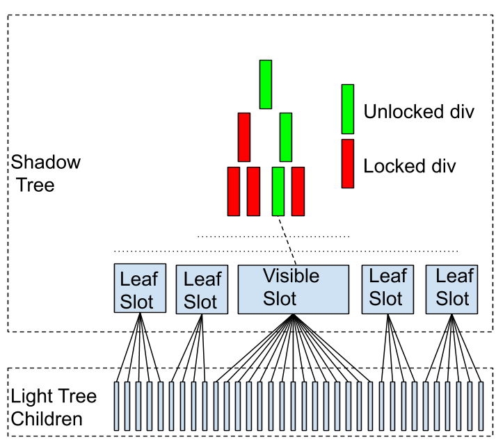

# Virtual Scroller Notes

This is Blink's implementation of the [`<virtual-scroller>`](https://github.com/WICG/virtual-scroller) element.

## Status

This is a prototype with many known issues.

## Principles

- Avoid operations that are O(number of children)
- Ensure that we only perform operations that cause DOM, style or rendering work in the browser
  that is O(number of visible elements).
- Avoid forcing layout from JS.

## Current Implementation Strategy

The prototype uses a custom element implemented in JS.
It only handles vertical block layout,
so this talks only about height.
This custom element manages the display-locking status of its child items.
It considers a range of pixels to be the "unlocked range".
This range is determined from the window size.

TODO(crbug.com/983052): Be smarter about determining the buffer size,
given that the window can be resized.

Items which are within the unlocked range are left unlocked.
All other items are locked
so that they do not incur style and rendering costs for their contents.
They are locked with a height that is our best guess at their rendered height.
This guess is based on
- a fixed default
- a previously measured height of this item
- an average of previous observed heights of items

The virtual scroller listens to observers to know when it needs to reconsider which items should be locked.
It keeps a resize observer on itself since if it is resized,
items may need to be newly locked or unlocked.
It keeps an intersection observer on all unlocked child items.
Along with the buffer around the screen,
this allows it to know when the state has changed such that we may need to lock or unlock different items.

TODO(crbug.com/983050): Observe one item above and below the unlocked items too,
without this, if the edge item is larger than the window,
we can scroll empty space into the visible region.

TODO(crbug.com/983046): Keep an intersection observer on the scroller.
This allows us to know whether the scroller is offscreen.
In that case we lock all elements
and pause all activity.
This includes if the scroller is contained in a locked element
(e.g. nested in another virtual scroller).

The virtual scroller keeps a mutation observer on itself
so that it can react to elements being added, removed or moved around.
When dealing with mutations,
elements which are newly added are treated differently
to elements which are removed and re-added.
Newly added elements are immediately locked.
This allows a large number of elements to be added,
without a large rendering/style cost for these elements.

The virtual scroller does not listen directly for scroll events
and does not know or care whether it is in a scrollable region.
It is tempting to try discover whether the scroller is contained in a scrolling region
and then listen for scroll events,
however the scroller may be contained in any number of nested scrollable regions
and DOM changes can cause it to be reparented.
Also, we only need to change state when an item enters or leaves the visible range
but scroll events may occur much more frequently than that.

The virtual scroller takes no action directly in response to these events.
It simply ensures that a `requestAnimationFrame` (RAF) callback will run this frame
(max one per frame).
This callback is the "sync" callback.
It will attempt to react to the new state of the world
and try to ensure that the scroller is in sync with it.
This is where we determine which elements to lock or unlock.

When determining which items should be locked and which should be unlocked,
the virtual scroller uses `getBoundingClientRect`
to get the coordinates of its items,
relative to the root viewport.
It binary searches on the array of items
to find the element at the top and bottom of the visible range.
At the end of the sync,
these and the elements in between them will be unlocked
and all other elements will be locked.
The scroller knows which elements are currently unlocked
and does the minimal amount of locking and unlocking
to bring it to the desired state.
Also the intersection observers will be updated to match this range of elements.

It is very possible that the range of elements we have unlocked
is too big or too small for the viewport.
We cannot know the rendered size of these elements
until we have unlocked and measured them.
In order to avoid extra forced layouts,
we simply queue another sync callback for the next frame.
We continue to queue sync callbacks until one of them makes no changes.

Internally, the virtual scroller slots all children into a single slot.
It changes the locked state of the light tree children directly.

## Known issues specific to the current prototype

### Display locking items directly

The current prototype changes the locked state of the light tree children directly.
This means that the scroller's actions can be detected from outside.
It also means that an author cannot (in general) safely use display locking
on the children of a virtual scroller.

Other approaches do not have this issue,
because they slot the items into more than one slot,
however, this requires either manipulating the `slot` attribute on the items
or [imperative slotting](https://www.chromestatus.com/feature/5711021289242624).

### Binary searching the items

The first problem with this is that it requires forced layout (see below).

The second (potential) problem is that
while JS presents an `Array` interface for the children of the virtual scroller,
the reality is that in Blink,
the elements are stored in a linked list
with some extra logic to remember the most recent indexed access
and use that to speed up subsequent index accesses
(e.g. accessing `[n+1]` after `[n]` is fast).
This makes the binary search actually O(number of children)
because the C++ code must traverse a linked list.
However C++ traversing a link list is very fast
so this tends not to be noticeable.

### Locked elements still have a cost

While the descendants of locked elements are skipped for style and layout,
the locked elements themselves are still traversed
and participate in style and layout.
In the scroller,
the elements are locked with a size
and behave just as an empty div with that size.
This means that when we add many children to the virtual scroller,
even though most of them are locked,
there can still be quite a large style and rendering cost
from the locked elements in aggregate.

## Known issues common to many approaches

### Intersection observers are slow

Intersection observers signal the intersection state *after* it has happened.
This means that by only reacting to intersection observers,
the scroller may react late to scrolls and jumps.
Once a scroll begins,
it's likely that the element will keep up,
since it is not using the details of the events to compute the state of the scroller.

### Forced layouts to measure item sizes

After unlocking, the scroller needs to know the rendered size of an element.
In order to do that it must call `getBoundingClientRect`.
This forces the browser to have clean style and layout
for all unlocked elements in the document
(whether this is expensive depends on what has changed since the last time layout).
It may be better to perform these measurements in a
[post animation frame callback](https://github.com/WICG/requestPostAnimationFrame/blob/master/explainer.md)
when that feature becomes available
because this callback guarantees that style and layout are clean,
so measuring elements should be inexpensive.

## Alternative approaches

### Unlocked tree of divs with `<slot>`s for leaves (rejected)

We could avoid the O(number of children) run of locked divs
by building a tree of divs (e.g. a binary tree)
and locking all of the slots except those containing the visible items.

*PROBLEM:* This breaks margin collapsing between items
and maybe other layout or style features.
In order to make margin collapsing work correctly
we would need to make all of the divs in this tree have style `display: contents`
but for layout, this would have exactly the same performance problem as placing them all as siblings in one slot.

### One visible slot in the middle (rejected)

We could assign all of the visible items to a single slot,
ensuring they behave correctly with respect to margin collapsing
and keep all other items in other slots.

We need to ensure that elements are slotted in their light-tree order
for find-in-page, accessibility etc to work correctly.
The simplest form of this is a three-slot approach
with one slot for the invisible items at the top,
another slot for the visible items in the middle
and a third slot for the invisible items at the bottom.
The top and bottom slot remain locked always
and items are moved into the visible slot when they should be visible.
The top and bottom slots are inside a locked div.
These divs are locked with a size estimated to be the correct aggregate size for their slotted elements.

*PROBLEM:* Gradually scrolling down moves items one at a time
from the bottom slot, to the visible slot and then into the top slot
but long-range jumps require moving O(number of children) items between slots.
E.g. if the top items are visible and we jump to make the bottom items visible,
then we have to assign almost all of the items that were in the bottom slot to the top slot.

### Roaming visible slot (not preferred)

This is similar to [One visible slot in the middle](#One-visible-slot-in-the-middle) approach
but rather than a top and bottom slot,
item assignment is divided over many slots.
Each item has a natural "leaf" slot that it should be assigned to.
All of the leaf slots are kept locked.
There is a single visible slot that contains the currently unlocked items
and it roams around between the leaf slots
to ensure that order is correct for find-in-page etc.
If we keep the number of items per slot low,
then long jumps never cause a large number of items to be reassigned,
at worst we need to reassign the currently visible items back to their leaf slots,
move the visible slot to a new place
and fill it with newly visible items.

It's possible that there will be so many slots
that once again we run into the problem of large numbers of empty divs.
So we may need to maintain a tree of divs and `<slot>`s.
Most of this tree would be locked
but the path from the visible slot to the root would be unlocked.

It looks like this:

Original diagram [here](https://docs.google.com/drawings/d/1oZ8U16GzkxO3GaYLDygPsrmXiHO7SLNFXvVUK6WkG4I/edit)

*CHALLENGES:* This approach does not seem to have any insurmountable problems,
however it is not simple:
- We need to ensure that the tree remains balanced in the face of mutations of the virtual scrollers contents.
- A tree may introduce a large number of tree-only elements.
  With a binary tree, this would be equal to the number of items in the scroller.
  It might be worth using a larger branching factor, to reduce this cost.
  E.g. in a 10-way tree the overhead is only 1/9 the number of leaves.
- There is a lot of re-slotting of items.
- The visible slot may contain a large number of elements (if elements are small)
  and Blink has some [optimizations](https://cs.chromium.org/chromium/src/third_party/blink/renderer/core/html/html_slot_element.cc?q=symbol:HTMLSlotElement::NotifySlottedNodesOfFlatTreeChange)
  that only work when slots contain <= 16 elements.
- Adding slots and/or assigning elements to slots currently involves operations that are O(number of children).
  Adding N slots can take O(N^2) time.
  This was previously not a concern in Blink
  because, in general, the style and layout costs dominated.
  However display locking eliminates these costs,
  leaving the slotting costs as the bottleneck when there are large numbers of items.

### One slot per item (most promising alternative)

This is similar to [Roaming visible slot](#Roaming-visible-slot).
We have a tree of divs with slots as leaves
but in this approach we have exactly one slot per item.
For any item that should be unlocked,
we ensure that all of its tree ancestors are unlocked
and have style `display: contents`.
All other nodes in the tree have style `display: block; contain: style layout`,
to allow them to be locked.

This has the effect of making all of the visible items siblings,
from the perspective of layout,
so that margin collapsing, etc. works correctly.
It also ensures that not only are the invisible items and tree divs locked
but they are *inside* locked ancestors,
so do not incur *any* costs.

There is no need to maintain spacer divs above and below the visible region.
Instead, when we lock any tree element,
we set its locked size to be its current visible size.
If its contents don't change then this element has the correct aggregate size for its contents.
If this element's parent is unlocked then this correct size will be used in sizing the parent.

Mutations to the tree require size updates to propagate up the ancestor chain.
E.g. inserting an element causes all of the elements ancestors to grow by our best guess at its size.
So, the initial state of the tree
(which comes from an initial insert)
is that everything is an estimate or sum of estimates,
with the sizes getting more accurate
as more elements are rendered, measured and re-locked with correct sizes.

It's likely that the sizes above will be off by some amount due to margins
but they should be good enough for maintaining a usable scrollbar.

*CHALLENGES:* This approach does not seem to have any insurmountable problems,
however it is not so simple.
It has a subset of the challenges of [Roaming visible slot](#Roaming-visible-slot):

- Needs a balanced tree.
- Possible large number of tree-only elements.
- Slot performance issues.
