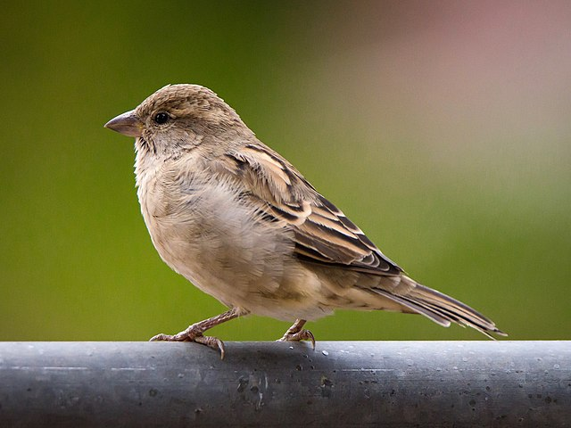
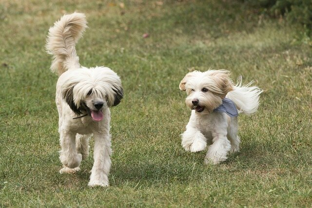
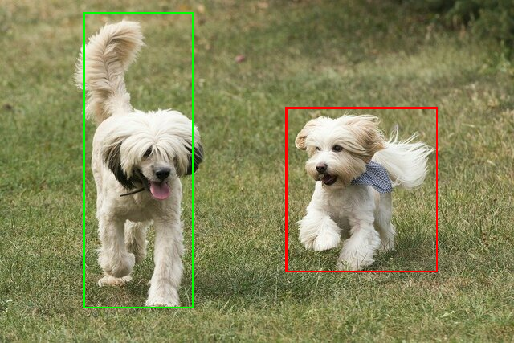
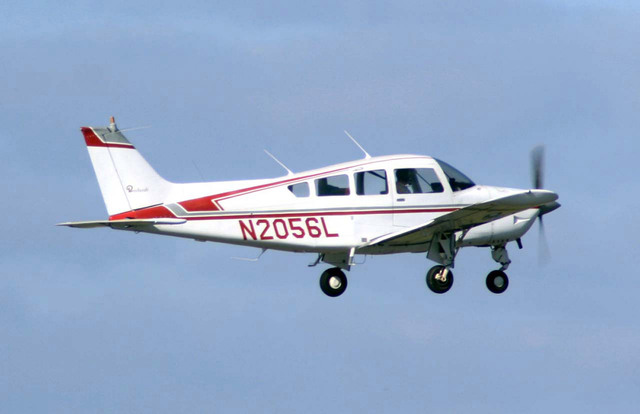
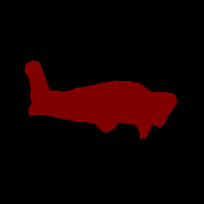

# CLI Demos for C++ Vision Task APIs

This folder contains simple command-line tools for easily trying out the C++
Vision Task APIs.

## Image Classifier

#### Prerequisites

You will need:

* a TFLite image classification model (e.g. [aiy/vision/classifier/birds_V1][1],
a bird classification model available on TensorFlow Hub),
* a PNG, JPEG or GIF image to run classification on, e.g.:



#### Usage

In the console, run:

```bash
# Download the model:
curl \
 -L 'https://tfhub.dev/google/lite-model/aiy/vision/classifier/birds_V1/3?lite-format=tflite' \
 -o /tmp/aiy_vision_classifier_birds_V1_3.tflite

# Run the classification tool:
bazel run -c opt \
 tensorflow_lite_support/examples/task/vision/desktop:image_classifier_demo -- \
 --model_path=/tmp/aiy_vision_classifier_birds_V1_3.tflite \
 --image_path=\
$(pwd)/tensorflow_lite_support/examples/task/vision/desktop/g3doc/sparrow.jpg \
 --max_results=3
```

#### Results

In the console, you should get:

```
Results:
  Rank #0:
   index       : 671
   score       : 0.91406
   class name  : /m/01bwb9
   display name: Passer domesticus
  Rank #1:
   index       : 670
   score       : 0.00391
   class name  : /m/01bwbt
   display name: Passer montanus
  Rank #2:
   index       : 495
   score       : 0.00391
   class name  : /m/0bwm6m
   display name: Passer italiae
```

## Object Detector

#### Prerequisites

You will need:

* a TFLite object detection model (e.g. [ssd_mobilenet_v1][2], a generic object
detection model available on TensorFlow Hub),
* a PNG, JPEG or GIF image to run detection on, e.g.:



#### Usage

In the console, run:

```bash
# Download the model:
curl \
 -L 'https://tfhub.dev/tensorflow/lite-model/ssd_mobilenet_v1/1/metadata/1?lite-format=tflite' \
 -o /tmp/ssd_mobilenet_v1_1_metadata_1.tflite

# Run the detection tool:
bazel run -c opt \
 tensorflow_lite_support/examples/task/vision/desktop:object_detector_demo -- \
 --model_path=/tmp/ssd_mobilenet_v1_1_metadata_1.tflite \
 --image_path=\
$(pwd)/tensorflow_lite_support/examples/task/vision/desktop/g3doc/dogs.jpg \
 --output_png=/tmp/detection-output.png \
 --max_results=2
```

#### Results

In the console, you should get:

```
Results saved to: /tmp/detection-output.png
Results:
 Detection #0 (red):
  Box: (x: 355, y: 133, w: 190, h: 206)
  Top-1 class:
   index       : 17
   score       : 0.73828
   class name  : dog
 Detection #1 (green):
  Box: (x: 103, y: 15, w: 138, h: 369)
  Top-1 class:
   index       : 17
   score       : 0.73047
   class name  : dog
```

And `/tmp/detection-output.jpg` should contain:



## Image Segmenter

#### Prerequisites

You will need:

* a TFLite image segmentation model (e.g. [deeplab_v3][3], a generic
segmentation model available on TensorFlow Hub),
* a PNG, JPEG or GIF image to run segmentation on, e.g.:



#### Usage

In the console, run:

```bash
# Download the model:
curl \
 -L 'https://tfhub.dev/tensorflow/lite-model/deeplabv3/1/metadata/1?lite-format=tflite' \
 -o /tmp/deeplabv3_1_metadata_1.tflite

# Run the segmentation tool:
bazel run -c opt \
 tensorflow_lite_support/examples/task/vision/desktop:image_segmenter_demo -- \
 --model_path=/tmp/deeplabv3_1_metadata_1.tflite \
 --image_path=\
$(pwd)/tensorflow_lite_support/examples/task/vision/desktop/g3doc/plane.jpg \
 --output_mask_png=/tmp/segmentation-output.png
```

#### Results

In the console, you should get:

```
Category mask saved to: /tmp/segmentation-output.png
Color Legend:
 (r: 000, g: 000, b: 000):
  index       : 0
  class name  : background
 (r: 128, g: 000, b: 000):
  index       : 1
  class name  : aeroplane

# (omitting multiple lines for conciseness) ...

 (r: 128, g: 192, b: 000):
  index       : 19
  class name  : train
 (r: 000, g: 064, b: 128):
  index       : 20
  class name  : tv
Tip: use a color picker on the output PNG file to inspect the output mask with
this legend.
```

And `/tmp/segmentation-output.jpg` should contain the segmentation mask:



[1]: https://tfhub.dev/google/lite-model/aiy/vision/classifier/birds_V1/3
[2]: https://tfhub.dev/tensorflow/lite-model/ssd_mobilenet_v1/1/metadata/2
[3]: https://tfhub.dev/tensorflow/lite-model/deeplabv3/1/metadata/2
