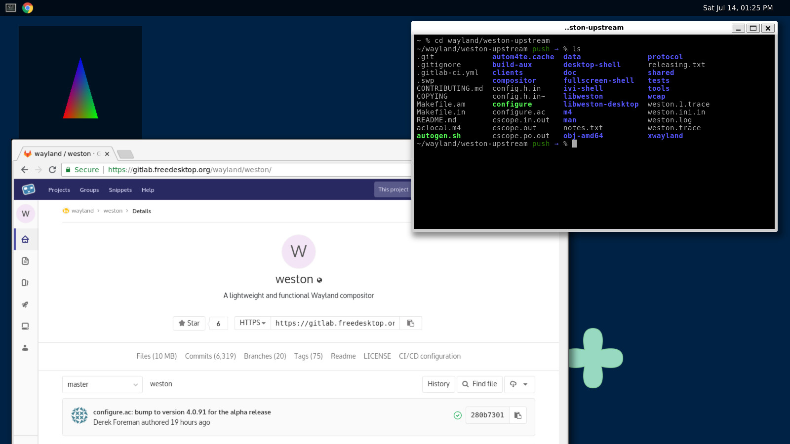

Weston
======

Weston is the reference implementation of a Wayland compositor, as well as a
useful environment in and of itself.

Out of the box, Weston provides a very basic desktop, or a full-featured
environment for non-desktop uses such as automotive, embedded, in-flight,
industrial, kiosks, set-top boxes and TVs. It also provides a library allowing
other projects to build their own full-featured environments on top of Weston's
core.

The core focus of Weston is correctness and reliability. Weston aims to be lean
and fast, but more importantly, to be predictable. Whilst Weston does have known
bugs and shortcomings, we avoid unknown or variable behaviour as much as
possible, including variable performance such as occasional spikes in frame
display time.

A small suite of example or demo clients are also provided: though they can be
useful in themselves, their main purpose is to be an example or test case for
others building compositors or clients.

If you are after a more mainline desktop experience, the
[GNOME](https://www.gnome.org) and [KDE](https://www.kde.org) projects provide
full-featured desktop environments built on the Wayland protocol. Many other
projects also exist providing Wayland clients and desktop environments: you are
not limited to just what you can find in Weston.

Reporting issues and contributing
=================================

Weston's development is
[hosted on freedesktop.org GitLab](https://gitlab.freedesktop.org/wayland/weston/).
Please also see [the contributing document](CONTRIBUTING.md), which details how
to make code or non-technical contributions to Weston.

Building Weston
===============

Weston is built using [Meson](https://mesonbuild.com/). Weston often depends
on the current release versions of
[Wayland](https://gitlab.freedesktop.org/wayland/wayland) and
[wayland-protocols](https://cgit.freedesktop.org/wayland/wayland-protocols).

If necessary, the latest Meson can be installed as a user with:

	$ pip3 install --user meson

Weston's Meson build does not do autodetection and it defaults to all
features enabled, which means you likely hit missing dependencies on the first
try. If a dependency is avoidable through a build option, the error message
should tell you what option can be used to avoid it. You may need to disable
several features if you want to avoid certain dependencies.

	$ git clone https://gitlab.freedesktop.org/wayland/weston.git
	$ cd weston
	$ meson build/ --prefix=...
	$ ninja -C build/ install
	$ cd ..

The `meson` command populates the build directory. This step can
fail due to missing dependencies. Any build options you want can be added on
that line, e.g. `meson build/ --prefix=... -Dsimple-dmabuf-drm=intel`.
All the build options can be found in the file
[meson_options.txt](meson_options.txt).

Once the build directory has been successfully populated, you can inspect the
configuration with `meson configure build/`. If you need to change an
option, you can do e.g.
`meson configure build/ -Dsimple-dmabuf-drm=intel`.

Every push to the Weston master repository and its forks is built using GitLab
CI. [Reading the configuration](.gitlab-ci.yml) may provide a useful example of
how to build and install Weston.

More [detailed documentation on building Weston](https://wayland.freedesktop.org/building.html)
is available on the Wayland site. There are also more details on
[how to run and write tests](https://wayland.freedesktop.org/testing.html).

For building the documentation see [weston-doc](#weston-doc).

Running Weston
==============

Once Weston is installed, most users can simply run it by typing `weston`. This
will launch Weston inside whatever environment you launch it from: when launched
from a text console, it will take over that console. When launched from inside
an existing Wayland or X11 session, it will start a 'nested' instance of Weston
inside a window in that session.

Help is available by running `weston --help`, or `man weston`, which will list
the available configuration options and display backends. It can also be
configured through a file on disk; more information on this can be found through
`man weston.ini`.

In some special cases, such as when running remotely or without logind's session
control, Weston may not be able to run directly from a text console. In these
situations, you can instead execute the `weston-launch` helper, which will gain
privileged access to input and output devices by running as root, then granting
access to the main Weston binary running as your user. Running Weston this way
is not recommended unless necessary.

Weston-doc
==========

For documenting weston we use [sphinx](http://www.sphinx-doc.org/en/master/)
together with [breathe](https://breathe.readthedocs.io/en/latest/) that
understands XMLs databases generated by doxygen. So far, this is a compromise
until better tools are available in order to remove the doxygen
dependency. You should be able to install both sphinx and breathe extension
using pip3 command, or your package manager.
Doxygen should be available using your distribution package manager.

Once those are set-up, run `meson` with `-Ddoc=true` option in order to enable
building the documentation. Installation will place the documentation in the
prefix's path under datadir (i.e., `share/doc`).

Adding and improving documentation
----------------------------------

For re-generating the documentation a special `docs` target has been added.
Although first time you build (and subsequently install) weston, you'll see the
documentation being built, updates to the spinx documentation files or to the
source files will only be updated when using `docs` target!

Example:

~~~~
$ ninja install # generates and installs the documentation
# time passes, hack hack, add doc in sources or rST files
$ ninja install # not sufficient, docs will not be updated
$ ninja docs && ninja install # run 'docs' then install
~~~~

Improving/adding documentation can be done by modifying rST files under
`doc/sphinx/` directory or by modifying the source code using doxygen
directives.

Libweston
=========

Libweston is an effort to separate the re-usable parts of Weston into
a library. Libweston provides most of the boring and tedious bits of
correctly implementing core Wayland protocols and interfacing with
input and output systems, so that people who just want to write a new
"Wayland window manager" (WM) or a small desktop environment (DE) can
focus on the WM part.

Libweston was first introduced in Weston 1.12, and is expected to
continue evolving through many Weston releases before it achieves a
stable API and feature completeness.

Libweston's primary purpose is exporting an API for creating Wayland
compositors. Libweston's secondary purpose is to export the weston_config API
so that third party plugins and helper programs can read `weston.ini` if they
want to. However, these two scopes are orthogonal and independent. At no point
will the compositor functionality use or depend on the weston_config
functionality.

API/ABI (in)stability and parallel installability
-------------------------------------------------

As libweston's API surface is huge, it is impossible to get it right
in one go. Therefore developers reserve the right to break the API/ABI and bump
the major version to signify that. For git snapshots of the master branch, the
API/ABI can break any time without warning.

Libweston major can be bumped only once during a development cycle. This should
happen on the first patch that breaks the API or ABI. Further breaks before the
next Weston major.0.0 release do not cause a bump. This means that libweston
API and ABI are allowed to break also after an alpha release, up to the final
release. However, breaks after alpha should be judged by the usual practices
for allowing minor features, fixes only, or critical fixes only.

To make things tolerable for libweston users despite API/ABI breakages,
different libweston major versions are designed to be perfectly
parallel-installable. This way external projects can easily depend on a
particular API/ABI-version. Thus they do not have to fight over which
ABI-version is installed in a user's system. This allows a user to install many
different compositors each requiring a different libweston ABI-version without
tricks or conflicts.

Note, that versions of Weston itself will not be parallel-installable,
only libweston is.

For more information about parallel installability, see
http://ometer.com/parallel.html

Versioning scheme
-----------------

In order to provide consistent, easy to use versioning, libweston
follows the rules in the Apache Portable Runtime Project
http://apr.apache.org/versioning.html.

The document provides the full details, with the gist summed below:
 - Major - backward incompatible changes.
 - Minor - new backward compatible features.
 - Patch - internal (implementation specific) fixes.

Weston and libweston have separate version numbers in meson.build. All
releases are made by the Weston version number. Libweston version number
matches the Weston version number in all releases except maybe pre-releases.
Pre-releases have the Weston micro version 91 or greater.

A pre-release is allowed to install a libweston version greater than the Weston
version in case libweston major was bumped. In that case, the libweston version
must be Weston major + 1.

Pkg-config files are named after libweston major, but carry the Weston version
number. This means that Weston pre-release 2.1.91 may install libweston-3.pc
for the future libweston 3.0.0, but the .pc file says the version is still
2.1.91. When a libweston user wants to depend on the fully stable API and ABI
of a libweston major, he should use (e.g. for major 3):

	PKG_CHECK_MODULES(LIBWESTON, [libweston-3 >= 3.0.0])

Depending only on libweston-3 without a specific version number still allows
pre-releases which might have different API or ABI.

Forward compatibility
---------------------

Inspired by ATK, Qt and KDE programs/libraries, libjpeg-turbo, GDK,
NetworkManager, js17, lz4 and many others, libweston uses a macro to restrict
the API visible to the developer - REQUIRE_LIBWESTON_API_VERSION.

Note that different projects focus on different aspects - upper and/or lower
version check, default to visible/hidden old/new symbols and so on.

libweston aims to guard all newly introduced API, in order to prevent subtle
breaks that a simple recompile (against a newer version) might cause.

The macro is of the format 0x$MAJOR$MINOR and does not include PATCH version.
As mentioned in the Versioning scheme section, the latter does not reflect any
user visible API changes, thus should be not considered part of the API version.

All new symbols should be guarded by the macro like the example given below:

~~~~
#if REQUIRE_LIBWESTON_API_VERSION >= 0x0101

bool
weston_ham_sandwich(void);

#endif
~~~~

In order to use the said symbol, the one will have a similar code in their
configure.ac:

~~~~
PKG_CHECK_MODULES(LIBWESTON, [libweston-1 >= 1.1])
AC_DEFINE(REQUIRE_LIBWESTON_API_VERSION, [0x0101])
~~~~

If the user is _not_ interested in forward compatibility, they can use 0xffff
or similar high value. Yet doing so is not recommended.

Libweston design goals
----------------------

The high-level goal of libweston is to decouple the compositor from
the shell implementation (what used to be shell plugins).

Thus, instead of launching 'weston' with various arguments to choose the
shell, one would launch the shell itself, e.g. 'weston-desktop',
'weston-ivi', 'orbital', etc. The main executable (the hosting program)
will implement the shell, while libweston will be used for a fundamental
compositor implementation.

Libweston is also intended for use by other project developers who want
to create new "Wayland WMs".

Details:

- All configuration and user interfaces will be outside of libweston.
  This includes command line parsing, configuration files, and runtime
  (graphical) UI.

- The hosting program (main executable) will be in full control of all
  libweston options. Libweston should not have user settable options
  that would work behind the hosting program's back, except perhaps
  debugging features and such.

- Signal handling will be outside of libweston.

- Child process execution and management will be outside of libweston.

- The different backends (drm, fbdev, x11, etc) will be an internal
  detail of libweston. Libweston will not support third party
  backends. However, hosting programs need to handle
  backend-specific configuration due to differences in behaviour and
  available features.

- Renderers will be libweston internal details too, though again the
  hosting program may affect the choice of renderer if the backend
  allows, and maybe set renderer-specific options.

- plugin design ???

- xwayland ???

- weston-launch is still with libweston even though it can only launch
  Weston and nothing else. We would like to allow it to launch any compositor,
  but since it gives by design root access to input devices and DRM, how can
  we restrict it to intended programs?

There are still many more details to be decided.

For packagers
-------------

Always build Weston with --with-cairo=image.

The Weston project is (will be) intended to be split into several
binary packages, each with its own dependencies. The maximal split
would be roughly like this:

- libweston (minimal dependencies):
	+ headless backend
	+ wayland backend

- gl-renderer (depends on GL libs etc.)

- drm-backend (depends on libdrm, libgbm, libudev, libinput, ...)

- x11-backend (depends of X11/xcb libs)

- xwayland (depends on X11/xcb libs)

- fbdev-backend (depends on libudev...)

- rdp-backend (depends on freerdp)

- weston (the executable, not parallel-installable):
	+ desktop shell
	+ ivi-shell
	+ fullscreen shell
	+ weston-info, weston-terminal, etc. we install by default
	+ screen-share

- weston demos (not parallel-installable)
	+ weston-simple-* programs
	+ possibly all the programs we build but do not install by
	  default

- and possibly more...

Everything should be parallel-installable across libweston major
ABI-versions (libweston-1.so, libweston-2.so, etc.), except those
explicitly mentioned.

Weston's build may not sanely allow this yet, but this is the
intention.
