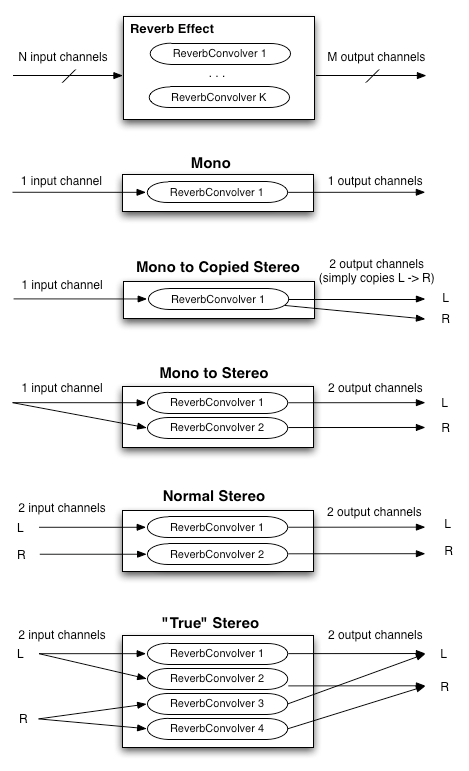
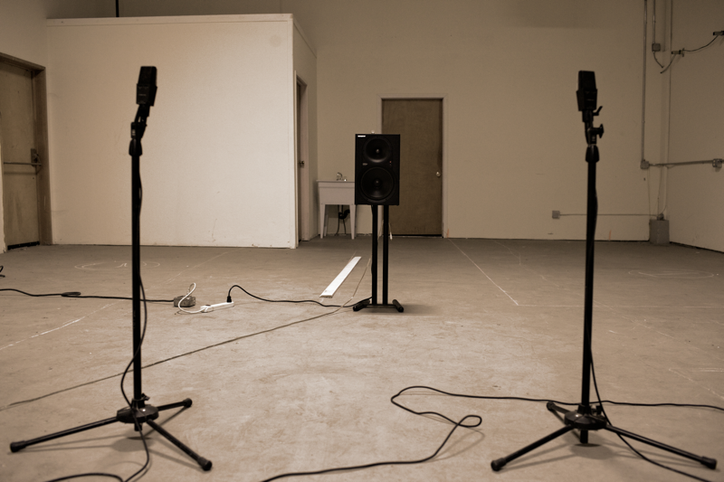
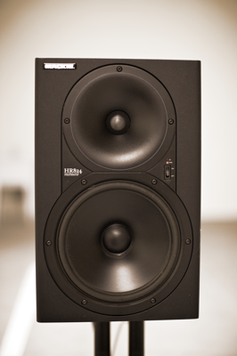
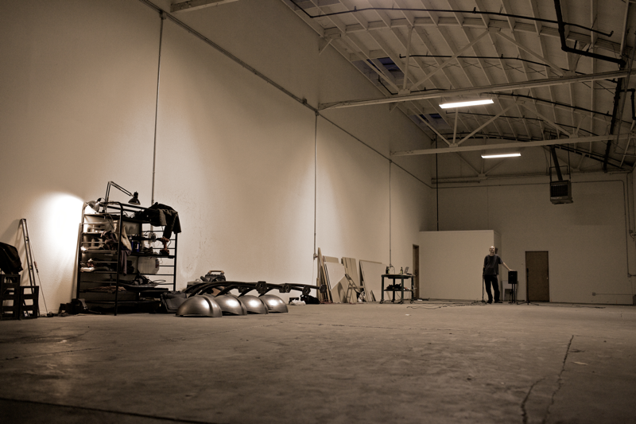

# Convolution Reverb

A [convolution reverb](http://en.wikipedia.org/wiki/Convolution_reverb) can be used
to simulate an acoustic space with very high quality. It can also be
used as the basis for creating a vast number of unique and interesting
special effects.  This technique is widely used in modern professional
audio and motion picture production, and is an excellent choice to
create room effects in a game engine.

Creating a well-optimized real-time convolution engine is one of the
more challenging parts of the Web Audio API implementation.  When
convolving an input audio stream of unknown (or theoretically
infinite) length, the
[overlap-add](http://en.wikipedia.org/wiki/Overlap-add_method)
approach is used, chopping the input stream into pieces of length L,
performing the convolution on each piece, then re-constructing the
output signal by delaying each result and summing.


## Overlap-Add Convolution


  
  
Direct convolution is far too computationally expensive due to the
extremely long impulse responses typically used.  Therefore an
approach using [FFTs](http://en.wikipedia.org/wiki/FFT) must be used.
But naively doing a standard overlap-add FFT convolution using an FFT
of size N with L=N/2, where N is chosen to be at least twice the
length of the convolution kernel (zero-padding the kernel) to perform
each convolution operation in the diagram above would incur a
substantial input to output pipeline latency on the order of L
samples.  Because of the enormous audible delay, this simple method
cannot be used.  Aside from the enormous delay, the size N of the FFT
could be extremely large.  For example, with an impulse response of 10
seconds at 44.1Khz, N would equal 1048576 (2^20).  This would take a
very long time to evaluate.  Furthermore, such large FFTs are not
practical due to substantial phase errors.


## Optimizations and Tricks

There exist several clever tricks which break the impulse response
into smaller pieces, performing separate convolutions, then combining
the results (exploiting the property of linearity).  The best ones use
a divide and conquer approach using different size FFTs and a direct
convolution for the initial (leading) portion of the impulse response
to achieve a zero-latency output.  There are additional optimizations
which can be done exploiting the fact that the tail of the reverb
typically contains very little or no high-frequency energy.  For this
part, the convolution may be done at a lower sample-rate...

Performance can be quite good, easily done in real-time without
creating undo stress on modern mid-range CPUs.  A multi-threaded
implementation is really required if low (or zero) latency is required
because of the way the buffering / processing chunking works.
Achieving good performance requires a highly optimized FFT algorithm.

### Multi-channel convolution

It should be noted that a convolution reverb typically involves two
convolution operations, with separate impulse responses for the left
and right channels in the stereo case.  For 5.1 surround, at least
five separate convolution operations are necessary to generate output
for each of the five channels.

### Impulse Responses

Similar to other assets such as JPEG images, WAV sound files, MP4
videos, shaders, and geometry, impulse responses can be considered as
multi-media assets.  As with these other assets, they require work to
produce, and the high-quality ones are considered valuable.  For
example, a company called Audio Ease makes a fairly expensive ($500 -
$1000) product called
[Altiverb](http://www.audioease.com/Pages/Altiverb/AltiverbMain.html)
containing several nicely recorded impulse responses along with a
convolution reverb engine.


# Convolution Engine Implementation
    
    
## FFTConvolver (short convolutions)

The `FFTConvolver` is able to do short convolutions with
the FFT size N being at least twice as large as the length of the
short impulse response.  It incurs a latency of N/2 sample-frames.
Because of this latency and performance considerations, it is not
suitable for long convolutions.  Multiple instances of this building
block can be used to perform extremely long convolutions.
    

    

## ReverbConvolver (long convolutions)

The `ReverbConvolver` is able to perform extremely long
real-time convolutions on a single audio channel.  It uses multiple
`FFTConvolver` objects as well as an input buffer and an
accumulation buffer.  Note that it's possible to get a multi-threaded
implementation by exploiting the parallelism.  Also note that the
leading sections of the long impulse response are processed in the
real-time thread for minimum latency.  In theory it's possible to get
zero latency if the very first FFTConvolver is replaced with a
DirectConvolver (not using a FFT).
    


    
## Reverb Effect (with matrixing)



# Recording Impulse Responses


The most
[modern](http://pcfarina.eng.unipr.it/Public/Papers/226-AES122.pdf)
and accurate way to record the impulse response of a real acoustic
space is to use a long exponential sine sweep. The test-tone can be as
long as 20 or 30 seconds, or longer.


Several recordings of the test tone played through a speaker can be
made with microphones placed and oriented at various positions in the
room.  It's important to document speaker placement/orientation, the
types of microphones, their settings, placement, and orientations for
each recording taken.

Post-processing is required for each of these recordings by performing
an inverse-convolution with the test tone, yielding the impulse
response of the room with the corresponding microphone placement.
These impulse responses are then ready to be loaded into the
convolution reverb engine to re-create the sound of being in the room.

# Tools

Two command-line tools have been written:

`generate_testtones` generates an exponential sine-sweep
test-tone and its inverse.  Another tool `convolve` was
written for post-processing.  With these tools, anybody with recording
equipment can record their own impulse responses.  To test the tools
in practice, several recordings were made in a warehouse space with
interesting acoustics.  These were later post-processed with the
command-line tools.  </p>

```shell
    % generate_testtones -h
    Usage: generate_testtone
    	[-o /Path/To/File/To/Create] Two files will be created: .tone and .inverse
    	[-rate &lt;sample rate&gt;] sample rate of the generated test tones
    	[-duration &lt;duration&gt;] The duration, in seconds, of the generated files
    	[-min_freq &lt;min_freq&gt;] The minimum frequency, in hertz, for the sine sweep

    % convolve -h
    Usage: convolve input_file impulse_response_file output_file
```


# Recording Setup


Audio Interface: Metric Halo Mobile I/O 2882 







Microphones: AKG 414s, Speaker: Mackie HR824


# The Warehouse Space


